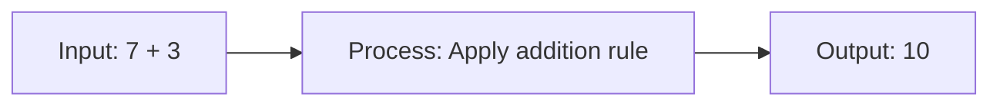
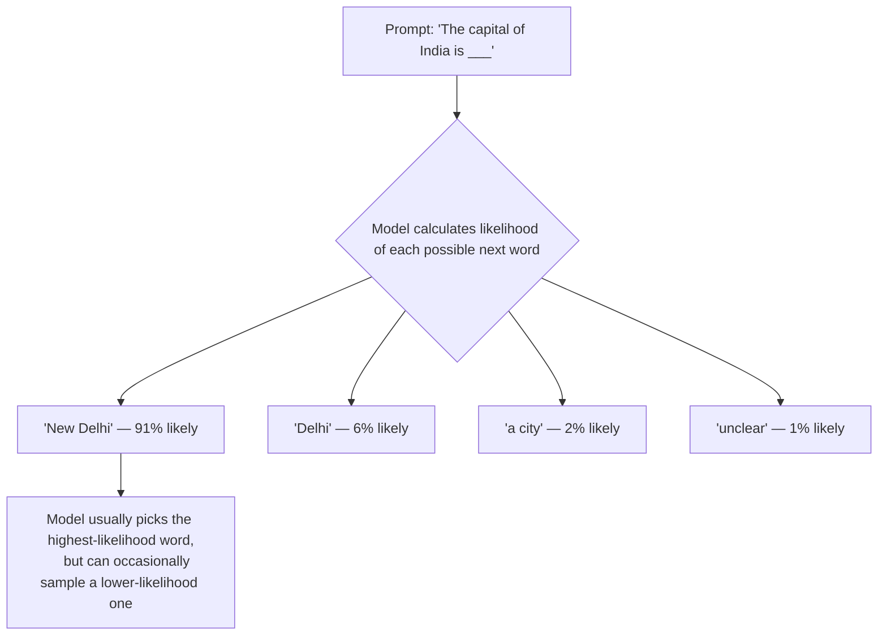

# Unit 1 — How Machines Think
## Topic 1: Understanding Computation

*(Covers: What is computation · Deterministic systems · Probabilistic systems · Why AI gives different answers to the same question)*

---

## 1. Learning Objectives

By the end of this topic, you will be able to:

1. **Explain** what computation means and why every piece of software — including AI — is fundamentally a computation.
2. **Differentiate** between deterministic and probabilistic systems using clear, real-world examples.
3. **Identify** whether a given system (a calculator, an ATM, a recommendation engine, an LLM) is deterministic or probabilistic.
4. **Describe** why a Large Language Model (LLM) like Claude can give different answers to the exact same question.
5. **Analyze** a simple everyday process and classify it correctly as deterministic or probabilistic, justifying your answer.
6. **Evaluate** why understanding this distinction matters when you are responsible for specifying, building, or overseeing an AI-powered system.

---

## 2. Overview

Before you can specify what an AI system should do, build it, or judge whether it's working correctly, you need to understand what is actually happening "under the hood" when a machine processes information. That is what **computation** means — it is simply the process of taking an input, following a set of steps, and producing an output.

Every piece of software you have ever used — a calculator app, a UPI payment, Google Maps, Instagram's feed, or an AI chatbot — is computation. But not all computation behaves the same way. Some systems are **deterministic**: give them the same input a hundred times, and you get the exact same output every time (like a calculator). Others are **probabilistic**: give them the same input multiple times, and the output can vary (like a dice roll, or an AI model's response).

This distinction is the single most important mental model you will carry through this entire program. As an AI-Native Engineer, your job will be to **specify what you want, let the AI implement it, and verify the result** — the "70/30 rule" you'll learn about in Week 2. You cannot verify AI output properly if you don't first understand *why* it behaves differently from the deterministic software you may have assumed all computers produce. This topic lays that foundation, before we touch a single line of code.

---

## 3. Description

### 3.1 What Is Computation?

**Definition:** Computation is the process of transforming an **input** into an **output** by following a defined set of steps.

In the simplest possible terms:

```
INPUT  →  [ a set of steps / rules ]  →  OUTPUT
```

Think about a simple calculator. You press `7 + 3`. The calculator follows the rule "add the two numbers" and produces `10`. That entire process — taking your key-presses, applying a rule, and showing a result — is computation.

**Why this concept exists:** Before electronic computers existed, the word "computer" literally meant *a person who computes* — someone who followed steps by hand to solve mathematical problems (for example, in the early 20th century, teams of human "computers," many of them women, calculated rocket trajectories and astronomical tables by hand). Machines were built to do this same job — following steps to transform inputs into outputs — but millions of times faster and without human fatigue or error. Understanding this history matters because it tells you something important: **a computer does not "think." It follows instructions.** Even today's most advanced AI models are, underneath everything, performing computation — just an extraordinarily large and clever form of it.

**Key Terminology:**

| Term | Simple Meaning |
|---|---|
| **Input** | The information you give to a system before it starts working (e.g., two numbers, a question typed into a chatbot). |
| **Output** | The result the system produces after processing the input (e.g., a sum, a chatbot's reply). |
| **Process / Algorithm** | The defined set of steps the system follows to turn input into output. (We cover algorithms in detail later in this unit.) |
| **State** | The information a system is "holding onto" while it works — for example, a calculator temporarily holding the number 7 while waiting for you to press `+`. |

**A Simple Diagram:**



This input → process → output pattern is the same whether the "process" is a five-line calculator program or a billion-parameter AI model. The *complexity* of the process is wildly different — but the basic shape of computation never changes.

---

### 3.2 Deterministic Systems

**Definition:** A **deterministic system** is one where the **same input always produces the same output**, every single time, with no variation.

**Why this matters:** Most traditional software — banking systems, calculators, railway booking engines, UPI transaction processing — is built to be deterministic *on purpose*. Imagine if your bank's system calculated your account balance differently each time you checked it! Determinism gives us **predictability, reliability, and trust** — properties that are non-negotiable in systems handling money, health records, or safety.

**Everyday examples of deterministic systems:**

- A calculator: `12 × 4` will always equal `48`.
- An ATM: entering the correct PIN will always let you in; entering ₹500 as a withdrawal amount will always ask the machine to dispense ₹500 (assuming sufficient balance).
- A traffic signal timer: after 30 seconds, it always turns from red to green.
- Sorting a list of exam roll numbers: given the same list, a sorting program will always produce the same sorted order.

**Rules / properties of deterministic systems:**

1. Same input → same output, always.
2. No hidden randomness is involved in producing the result.
3. Behaviour can be fully predicted and tested in advance — if you know the rule, you can predict the answer before running it.
4. Errors, when they occur, are *repeatable* — which makes them much easier to debug (you can reproduce the bug every time).

---

### 3.3 Probabilistic Systems

**Definition:** A **probabilistic system** is one where the **same input can produce different outputs**, because the system involves an element of chance or a "best guess" based on likelihood rather than a fixed rule.

**Why this exists:** Not every real-world problem has one single "correct" answer that can be computed with a fixed rule. Think about predicting tomorrow's weather, recommending a movie you might like, or writing a paragraph in natural language — there isn't one mathematically "correct" output. Probabilistic systems are built to handle exactly this kind of uncertainty, by working with **likelihoods** ("this is 80% likely to be the best answer") rather than fixed rules ("this is definitely the answer").

**Everyday examples of probabilistic systems:**

- Rolling a dice: same action (rolling), different outcomes (1 through 6) each time.
- A cricket match score predictor: given the same match situation, it gives you a *probability* (e.g., "68% chance India wins"), not a certainty.
- A weather forecast: "70% chance of rain" — it is a likelihood, not a guarantee.
- An AI chatbot: ask it the same question twice, and you may get two differently-worded (sometimes differently-reasoned) answers.

**Comparison Table — Deterministic vs Probabilistic Systems**

| Aspect | Deterministic System | Probabilistic System |
|---|---|---|
| Same input, same output? | Always yes | Not guaranteed |
| Based on | Fixed rules / logic | Likelihoods / probabilities |
| Predictability | Fully predictable | Predictable only in *pattern*, not in exact result |
| Example | Calculator, ATM, sorting program | Dice roll, weather forecast, AI model |
| Debugging | Easy — bug is reproducible | Harder — bug may not reproduce the same way twice |
| Typical use in software | Payments, records, safety-critical logic | Recommendations, predictions, natural language generation |

> **Important Note:** Probabilistic does **not** mean "random and meaningless." It means the system is working with *likelihoods learned from patterns in data*, and is designed to pick the most probable (or a sufficiently probable) output — which is very different from a system that just picks answers by pure chance.

---

### 3.4 Why AI Gives Different Answers to the Same Question

Now we connect the dots. A Large Language Model (an **LLM**, like Claude) generates text by predicting, **one word (technically, one "token") at a time**, what is most likely to come next, based on patterns it learned from enormous amounts of text during training. Instead of picking the single most likely next word every single time, it samples from a **probability distribution** — a ranked list of possible next words, each with a likelihood attached.

Here's a simplified mental picture of what happens when Claude generates the next word after "The capital of India is":



This is exactly why asking Claude the same question twice can give you two different (but both reasonable) answers — the model is sampling from probabilities, not looking up one fixed rule in a table. This behaviour is controlled by a setting called **temperature** (low temperature → more predictable, near-deterministic output; high temperature → more varied, creative output). We will study temperature and sampling in full mathematical detail in **Week 3 (What AI Is — and Isn't)** and **Week 7 (Probability, Statistics and AI Confidence)** — for now, simply understand: **an LLM's core behaviour is probabilistic by design, not by accident or flaw.**

**Best Practices (for someone who will specify and oversee AI systems):**

- Never assume an AI system will behave exactly the same way twice — always test with the same input **multiple times** during evaluation.
- For tasks that genuinely require a fixed, repeatable answer (e.g., "calculate 18% GST on ₹2,000"), use deterministic code (a calculator function), **not** an LLM's own arithmetic.
- For tasks that are inherently creative or open-ended (e.g., "write a friendly UPI payment failure message"), probabilistic variation is a *feature*, not a bug.

**Common Beginner Mistakes:**

- Assuming AI is "broken" or "wrong" simply because it gave a different phrasing on a second try.
- Using an LLM to perform exact numerical calculations without verification (LLMs can make arithmetic errors because they are predicting likely text, not running a guaranteed calculation).
- Believing all software behaves probabilistically "because it's a computer" — most everyday software (UPI, ATMs, railway booking) is still deterministic.

---

## 4. Real World Application

Understanding deterministic vs probabilistic systems is not academic — it directly shapes real engineering decisions:
- **E-commerce / Food Delivery:** Calculating your bill total (deterministic — fixed formula) versus recommending "you might also like these dishes" (probabilistic — based on likelihood patterns from past orders).
- **Railway Booking Systems:** Confirming a berth once payment succeeds is deterministic (a fixed rule); predicting "your waitlisted ticket has a 74% chance of confirmation" is probabilistic.
---

## 5. Key Takeaways

- **Computation** = input → defined steps → output. Every piece of software, from a calculator to Claude, is fundamentally computation.
- **Deterministic systems**: same input always gives the same output. Used where predictability and trust are critical (banking, ATMs, records).
- **Probabilistic systems**: same input can give different outputs, based on likelihood rather than a fixed rule. Used where there's no single "correct" answer (recommendations, forecasts, natural language).
- LLMs like Claude generate text by predicting the next most likely word/token from a probability distribution — this is **why the same question can get different-sounding answers**.
- "Probabilistic" ≠ "random and meaningless" — it means likelihood-driven, learned from patterns in data.
- Never use a probabilistic AI model for tasks that require guaranteed, repeatable precision (like exact monetary calculations) — use deterministic code for that instead.
- Real-world AI systems are almost always **hybrid**: a deterministic core (database facts, business rules) wrapped in a probabilistic layer (natural language generation).
- **Interview tip:** If asked "why does an LLM give different answers to the same prompt?", the strongest answer references *token-by-token probability sampling*, not just "AI is random."
- This deterministic vs probabilistic distinction is the foundation for everything that follows in this program — especially specification-writing (Week 2) and evaluating AI reliability (Week 7–8).

---

## 6. Reference Links

- [Anthropic Documentation — How Claude Works](https://docs.claude.com/) — official documentation on model behaviour and API usage.
- [Google Machine Learning Crash Course — Framing an ML Problem](https://developers.google.com/machine-learning/crash-course) — beginner-friendly grounding in probabilistic prediction.
- [GeeksforGeeks — Deterministic vs Non-Deterministic Algorithms](https://www.geeksforgeeks.org/) — supplementary reading on determinism in computing.
- [NIST AI Risk Management Framework](https://www.nist.gov/itl/ai-risk-management-framework) — for later reference on why predictability/reliability matters in AI system oversight.
