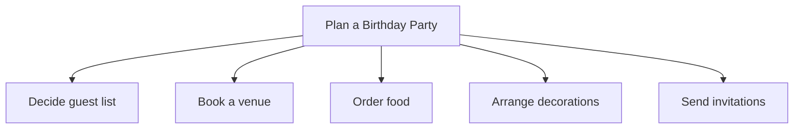
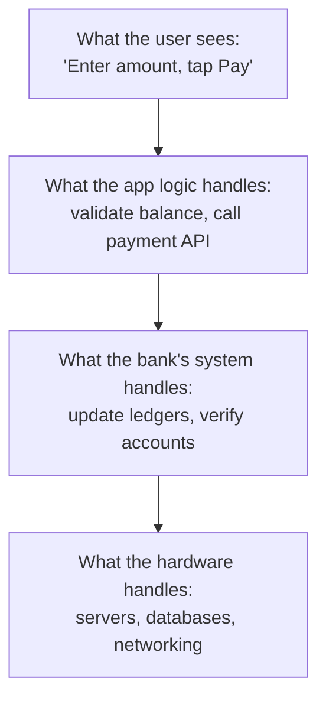

# Unit 1 — How Machines Think
## Topic 2: Problem-Solving Foundations

*(Covers: Decomposition — breaking a big problem into smaller solvable parts · Abstraction — hiding complexity at the right level)*

---

## 1. Learning Objectives

By the end of this topic, you will be able to:

1. **Explain** what decomposition and abstraction mean, in your own words.
2. **Identify** the smaller sub-problems hidden inside a large, messy real-world problem.
3. **Describe** why abstraction is necessary for humans to build (and use) complex systems like AI applications.
4. **Differentiate** between decomposition (breaking a problem apart) and abstraction (hiding unnecessary detail).
5. **Apply** decomposition and abstraction to a real-life scenario, such as building a simple food-ordering app.
6. **Evaluate** a poorly broken-down problem statement and suggest how to decompose it better.

---

## 2. Overview

Every big problem feels overwhelming the moment you look at it as a whole. "Build an app that lets students book railway tickets" sounds huge and scary. But no engineer — human or AI — solves a big problem in one single leap. They break it down first. This is called **decomposition**: splitting a large problem into smaller, manageable pieces that are each easy enough to solve on their own.

Once you have smaller pieces, you also need a second skill: **abstraction** — the ability to hide the messy inner details of a piece and only show what matters at that moment. When you use a UPI app to pay your friend ₹200, you don't need to know how the bank's servers verify your account balance — you only see "Payment Successful." That hidden complexity is abstraction at work.

These two ideas — decomposition and abstraction — are the true starting point of **computational thinking**, the skill of thinking about problems in a way that a machine (or an AI system) can eventually help solve. As an AI-Native Engineer, you will spend your entire career doing this: taking a vague business request, decomposing it into smaller specifiable pieces, and abstracting away detail so that both humans and AI systems can work with it cleanly. Get this foundation right, and everything else in this program — writing specifications, building with AI, evaluating results — becomes far easier.

---

## 3. Description

### 3.1 Decomposition — Breaking a Big Problem into Smaller Solvable Parts

**Definition:** Decomposition is the process of breaking a large, complex problem down into smaller, more manageable sub-problems, each of which is easier to understand and solve than the whole.

**Why this concept exists:** Human brains (and, as it turns out, AI systems too) struggle to hold a huge, tangled problem in mind all at once. It's like trying to eat an entire thali in one bite — impossible and messy. But eat it one dish at a time, and it's completely manageable. Decomposition applies that same idea to problem-solving.

**Key Terminology:**

| Term | Simple Meaning |
|---|---|
| **Problem** | Something you are trying to solve or build (e.g., "let users book a railway ticket online"). |
| **Sub-problem** | A smaller, self-contained piece of the bigger problem (e.g., "check seat availability" is one sub-problem inside railway booking). |
| **Decomposition** | The act of splitting a problem into sub-problems. |

**Everyday Example — Decomposing "Plan a Birthday Party":**

Instead of thinking "I need to plan an entire birthday party" as one giant task, you naturally break it down:

Each of these five boxes is now a small, solvable task on its own — and importantly, some of them can even be worked on separately (by different people) at the same time.

**Decomposing a Software Problem — "Build a Railway Ticket Booking Website":**

1. Let the user search for trains between two stations.
2. Show available seats for a chosen train.
3. Let the user enter passenger details.
4. Process the payment.
5. Confirm the booking and send a ticket.

Notice that each of these five points is now small enough that you (or an AI system helping you) could actually start specifying it in detail — something that would have been impossible with the vague, giant statement "build a railway booking website."

**Rules for good decomposition:**

1. Each sub-problem should be **independent enough** to be worked on and tested on its own.
2. Sub-problems should be **small enough** to fully understand, but not so small that you end up with hundreds of meaningless fragments.
3. The sub-problems, put back together, must **fully solve** the original problem — decomposition should not "lose" any part of the original request.

**Common Beginner Mistakes:**

- Decomposing too shallowly — leaving sub-problems still too big and vague (e.g., "handle payments" without saying what that involves).
- Decomposing too deeply — breaking things into such tiny fragments that you lose sight of the overall goal.
- Forgetting to check that the sub-problems, combined, actually solve the whole original problem.

---

### 3.2 Abstraction — Hiding Complexity at the Right Level

**Definition:** Abstraction is the practice of hiding unnecessary internal detail and showing only the information that is relevant at a given level, so that a person (or system) can work with an idea without being overwhelmed by everything happening underneath it.

**Why this concept exists:** If every time you wanted to withdraw cash from an ATM, you had to understand the electronics, the bank's server communication, and the cash-dispensing mechanics — nobody would ever use an ATM. Abstraction lets you interact with a simple interface ("Enter PIN → Enter Amount → Take Cash") while all the complicated machinery stays hidden underneath.

**Everyday Examples of Abstraction:**

- **Driving a car:** You press the accelerator and the car moves faster. You do not need to understand fuel injection, the combustion engine, or engine control units. That complexity is abstracted away behind a simple pedal.
- **A mobile recharge app:** You select ₹199 plan and tap "Pay." You don't see the backend logic validating your operator, checking your number, or talking to the telecom's servers.
- **An AI chatbot:** You type "What is the refund policy?" and get an answer. You don't see the retrieval system, the model's internal calculations, or the API request happening behind the scenes.

**Levels of Abstraction — A Simple Diagram:**

Each layer hides the complexity of the layer below it. A user only ever interacts with the top layer.

**Comparison Table — Decomposition vs Abstraction**

| Aspect | Decomposition | Abstraction |
|---|---|---|
| What it does | Splits a big problem into smaller pieces | Hides unnecessary detail, shows only what matters |
| Main question it answers | "What are the parts of this problem?" | "What detail can I safely ignore right now?" |
| Direction | Breaks a whole apart | Simplifies a part (or a whole) for a viewer |
| Example | Splitting "book a railway ticket" into search, select, pay, confirm | Showing "Payment Successful" instead of database/ledger details |
| Used together? | Yes — you decompose a problem, then abstract each part so it's usable at the right level of detail | Yes — same as left |

**Best Practices:**

- Always decompose *before* you try to abstract — you can't hide detail sensibly until you know what the actual parts are.
- Choose the "right level" of abstraction for your *audience*. A user needs a simple interface; a developer maintaining the system needs more visible detail.
- When specifying tasks for an AI system to implement (a skill you'll build in Week 2), decide clearly what detail the AI needs to know and what it can safely treat as "already handled" (abstracted away).

**Common Mistakes:**

- Over-abstracting: hiding details that the user or developer actually needs to make a good decision (e.g., hiding *why* a payment failed).
- Under-abstracting: exposing so much internal detail that the system becomes confusing and hard to use.

> **Important Note:** Decomposition and abstraction are not one-time steps — expert engineers (and AI-native engineers) repeat this cycle constantly: decompose a task, abstract the pieces, notice a piece is still too complex, decompose it further, and so on.

---

## 4. Real World Application

- **Railway / Travel Booking:** IRCTC's booking flow is decomposed into search → select train → passenger details → payment → confirmation. Each screen abstracts away the backend complexity (seat allocation algorithms, waitlist logic) from the traveller.
- **Banking / UPI:** A UPI payment app decomposes "send money" into "select contact," "enter amount," "authenticate with PIN," and "confirm." The complex bank-to-bank settlement is abstracted away completely from the user.
- **E-commerce:** An online shopping app decomposes "buy a product" into browse → add to cart → checkout → payment → order tracking, with each step hiding unrelated backend detail (inventory checks, fraud detection) from the shopper.
- **Healthcare:** A hospital's patient management system decomposes "admit a patient" into registration, bed assignment, doctor allocation, and billing — each handled by a different department, working from an abstracted "patient record" that hides internal departmental processes from each other.
- **AI-Native Systems:** When building a RAG-based document assistant (which you'll study in Week 14), engineers decompose the system into "retrieve relevant documents," "format the prompt," and "generate the answer" — and each part is abstracted so a developer working on retrieval doesn't need to understand exactly how the language model generates text.

---

## 5. Worked Example

**Scenario:** You are asked to build "a food delivery app" — a genuinely huge, vague problem. Let's decompose it and then decide what to abstract at the user level.

**Step 1 — Decompose the big problem into sub-problems:**

1. Let the user browse restaurants and menus.
2. Let the user add items to a cart.
3. Calculate the final bill (items + delivery fee + taxes).
4. Process payment.
5. Assign a delivery partner and track the order.
6. Let the user rate the order after delivery.

**Step 2 — Check the decomposition is complete:** Do these six pieces, combined, cover the entire original problem ("a food delivery app")? Yes — nothing important is missing, and no piece is so large that it still feels overwhelming.

**Step 3 — Apply abstraction to sub-problem 3 ("Calculate the final bill") for two different audiences:**

| Audience | What they see (abstracted view) | What is hidden underneath |
|---|---|---|
| End user (customer) | "Total: ₹342 (incl. taxes and delivery fee)" | Tax slab rules, delivery-distance pricing formulas, restaurant-specific service charges |
| Developer building the billing module | `total = item_cost + delivery_fee + gst_amount` and the individual rules for each | The user-facing display logic and app screens |

This shows how the *same* piece of the system is abstracted differently depending on who is looking at it — a core skill you will rely on constantly as an AI-Native Engineer when deciding what to expose to an AI model in a prompt versus what business logic to keep in your own code.

---

## 6. Key Takeaways

- **Decomposition** = breaking a big, overwhelming problem into smaller, solvable sub-problems.
- **Abstraction** = hiding unnecessary detail so only the relevant information is visible at a given level.
- Decomposition answers "what are the parts?"; abstraction answers "what detail can I ignore right now?"
- Good decomposition produces sub-problems that are independent, appropriately sized, and together cover the whole original problem.
- Abstraction should match the audience — end users need simplicity; developers need enough detail to build and debug.
- Over-abstracting hides useful information; under-abstracting overwhelms with unnecessary detail — both are mistakes.
- These two skills are the foundation of computational thinking and directly prepare you for writing AI specifications in Week 2.
- **Interview tip:** If asked to design any system, always start by saying "First, let me decompose this problem," then discuss what to abstract for the end user versus the engineering team.
- Real production systems (UPI, IRCTC, food delivery apps, RAG pipelines) are all built using repeated cycles of decomposition and abstraction.

---

## 7. Reference Links

- [GeeksforGeeks — Computational Thinking](https://www.geeksforgeeks.org/) — supplementary reading on decomposition and abstraction as core computing skills.
- [Google Machine Learning Crash Course — Problem Framing](https://developers.google.com/machine-learning/crash-course) — beginner-friendly grounding in breaking down problems before building solutions.
- [TutorialsPoint — Computational Thinking Concepts](https://www.tutorialspoint.com/) — supplementary reading with simple examples.
