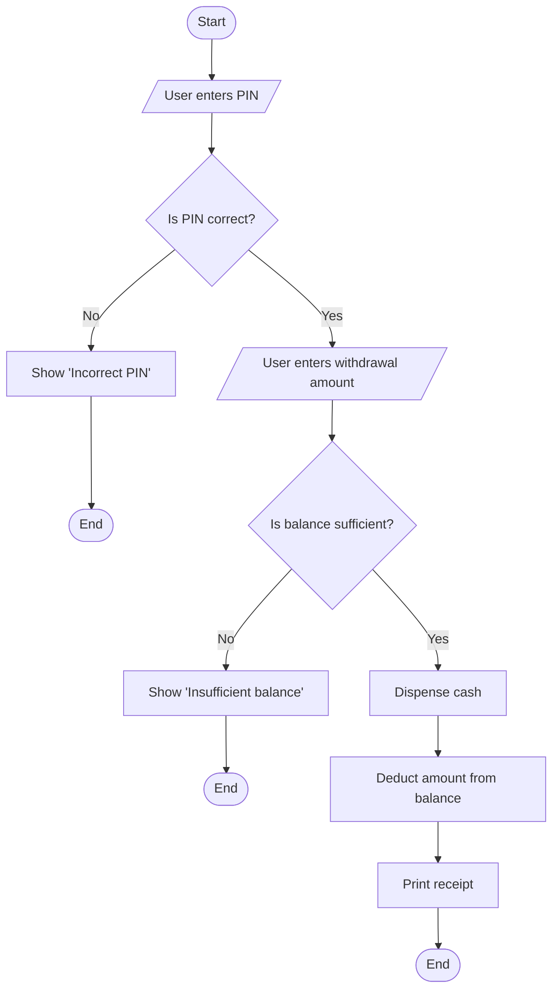
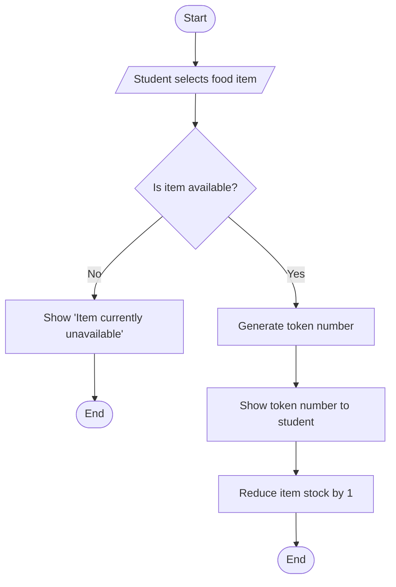

# Unit 1 — How Machines Think
## Topic 3: Expressing Logic

*(Covers: Pseudocode — writing logic in plain English before writing code · Flowcharts — visualising logic with standard shapes and arrows)*

---

## 1. Learning Objectives

By the end of this topic, you will be able to:

1. **Explain** what pseudocode is and why engineers write it before writing real code.
2. **Describe** the standard flowchart shapes and what each one represents.
3. **Create** simple pseudocode for a small everyday decision-making process.
4. **Create** a basic flowchart to visualise the same logic.
5. **Differentiate** between pseudocode and a flowchart, and identify when each is more useful.
6. **Evaluate** whether a given piece of pseudocode or flowchart logic is clear, complete, and correctly ordered.

---

## 2. Overview

Once you have decomposed a big problem into smaller pieces (Topic 2), you need a way to describe *exactly* how each piece should work — step by step — before you (or an AI system) writes any actual code. This is where **pseudocode** and **flowcharts** come in. They are two different ways of expressing logic in a form that is precise enough to act on, but simple enough that anyone — a teammate, a manager, or even an AI model — can understand it without needing to know a programming language.

Pseudocode expresses logic as structured, plain-English steps. Flowcharts express the same logic visually, using boxes, diamonds, and arrows. Neither of these actually runs on a computer — they are *thinking tools*, used to plan and communicate logic clearly before implementation begins.

This matters enormously in the AI-Native world you are entering. When you write a specification for an AI system to implement (Week 2), you are essentially writing very precise pseudocode-like instructions. When you review AI-generated code or explain a workflow to a non-technical stakeholder, a flowchart often communicates the logic faster than code ever could. Mastering both is a core communication skill for anyone who will specify, build, or oversee AI-powered software.

---

## 3. Description

### 3.1 Pseudocode — Writing Logic in Plain English Before Writing Code

**Definition:** Pseudocode is a way of describing the steps of a solution using plain, structured language that resembles code in structure, but does not follow the strict syntax rules of any real programming language.

**Why this concept exists:** Real programming languages (like Python, which you'll learn from Week 11 onward) are strict — a missing colon or a wrong indentation can break everything. But when you are still *thinking through* a problem, that strictness gets in the way of clear thinking. Pseudocode lets you focus purely on the *logic* — what should happen, and in what order — without worrying about exact syntax.

**Key Terminology:**

| Term | Simple Meaning |
|---|---|
| **Pseudocode** | Plain-language steps describing a solution's logic, not tied to any specific programming language. |
| **Step** | One instruction or action in the sequence (e.g., "check if balance is sufficient"). |
| **Condition** | A yes/no check that decides which path the logic should follow (e.g., "IF balance ≥ amount"). |
| **Loop** | A repeated block of steps (e.g., "FOR each item in the cart, add its price to the total"). |

**Example — Pseudocode for an ATM Cash Withdrawal:**

```
START
  Ask user to enter PIN
  IF PIN is correct:
      Ask user to enter withdrawal amount
      IF account balance >= withdrawal amount:
          Dispense cash
          Deduct amount from balance
          Print receipt
      ELSE:
          Show message "Insufficient balance"
  ELSE:
      Show message "Incorrect PIN"
END
```

Notice this reads almost like English, but it is *structured* — it has a clear start, clear conditions (`IF...ELSE`), and a clear end. This precision is exactly what you'll need later when writing specifications for AI systems (Week 2) — a vague sentence like "handle the withdrawal properly" is not enough; pseudocode forces you to think through every branch of what "properly" actually means.

**Rules for good pseudocode:**

1. Use simple, structured keywords consistently: `START`, `END`, `IF...ELSE`, `FOR EACH`, `WHILE`.
2. Write one clear action per line/step — don't cram multiple actions together.
3. Cover *all* realistic paths, including failure cases (e.g., what happens if the PIN is wrong, or the balance is too low).
4. Keep language simple enough that a non-programmer teammate could still follow it.

**Common Beginner Mistakes:**

- Writing pseudocode so vague it doesn't actually specify the logic (e.g., "check the balance and do the needful" — what exactly happens if the balance is insufficient?).
- Forgetting edge cases and failure paths (what if the ATM has no cash left? What if the user cancels midway?).
- Accidentally writing pseudocode in strict programming syntax, defeating its purpose of being language-independent.

---

### 3.2 Flowcharts — Visualising Logic with Standard Shapes and Arrows

**Definition:** A flowchart is a diagram that represents a process or logic visually, using standard shapes connected by arrows to show the order in which steps happen.

**Why this concept exists:** Some people (and some situations, like explaining a process to a large team or a non-technical stakeholder) understand a *picture* of logic far faster than they understand written steps. Flowcharts turn pseudocode-style logic into a visual map that is easy to scan and follow.

**Standard Flowchart Shapes:**

| Shape | Meaning |
|---|---|
| **Oval / Rounded shape** | Start or End of the process. |
| **Rectangle** | A process or action step (e.g., "Deduct amount from balance"). |
| **Diamond** | A decision point / condition (e.g., "Is balance sufficient?") — always has two or more exit paths (Yes/No). |
| **Arrow** | Shows the direction of flow — which step happens next. |
| **Parallelogram** | Input or Output (e.g., "User enters PIN," "Print receipt"). |

**Example — The Same ATM Logic as a Flowchart:**



Compare this to the pseudocode in Topic 3.1 — it describes the *exact same logic*, just in a different, visual form.

**Comparison Table — Pseudocode vs Flowchart**

| Aspect | Pseudocode | Flowchart |
|---|---|---|
| Format | Plain structured text | Visual diagram (shapes + arrows) |
| Best for | Detailed step-by-step logic, especially with lots of conditions | Quickly communicating the overall shape of a process |
| Easy to share with | Technical teammates, in documentation | Non-technical stakeholders, in presentations |
| Effort to update | Usually quicker to edit as text | Can be slower to redraw when logic changes |
| Use in AI specifications | Very useful — mirrors how you describe expected behaviour to an AI system | Useful for reviewing/validating overall AI system logic at a glance |

**Best Practices:**

- Always show *every* decision path in a flowchart — a diamond with only one arrow leaving it is usually a mistake (a Yes/No decision must show both outcomes).
- Keep flowcharts readable — if a flowchart needs more than about 15–20 shapes, consider whether the problem should be decomposed further (Topic 2) into smaller flowcharts.
- Use pseudocode and flowcharts *together*: sketch the logic as a flowchart to see the big picture, then write detailed pseudocode for each box that needs precise logic.

**Common Beginner Mistakes:**

- Missing an exit path from a decision diamond (forgetting to show what happens on "No").
- Making a flowchart so detailed it becomes as hard to read as code — remember, the whole point is clarity.
- Confusing a rectangle (action) with a diamond (decision) — a decision box must always ask a yes/no (or multi-choice) question.

---

## 4. Real World Application

- **Banking / FinTech:** Before developers build a UPI failure-handling flow, they write pseudocode and flowcharts covering every case: insufficient balance, wrong PIN, bank server timeout, daily limit exceeded.
- **Healthcare:** Hospitals use flowcharts to define triage logic — "Is the patient's condition critical? → Yes: send to emergency; No: check symptoms further" — before this logic is ever coded into a hospital management system or an AI-assisted triage tool.
- **Railway Booking:** IRCTC's waitlist confirmation logic (checking berth availability, cancellations, quota rules) is planned as pseudocode/flowcharts long before a single line of code is written.
- **E-commerce:** A return/refund policy is often mapped out as a flowchart first ("Is the item damaged? → Yes: full refund; No: check return window…") so customer support staff, developers, and even an AI chatbot can follow the exact same logic.
- **AI-Native Systems:** When you write a specification for an AI agent (Week 14) — for example, "check the user's order status, and if delayed by more than 2 days, offer a discount coupon" — you are, in effect, writing pseudocode-style instructions. Being fluent in pseudocode makes you dramatically better at specifying precise, unambiguous behaviour for AI systems to implement.

---

## 5. Worked Example

**Scenario:** A college canteen wants a simple token-based ordering system: a student selects a food item, and the system tells them whether it's available and, if so, generates a token number.

**Step 1 — Write the pseudocode:**

```
START
  Student selects a food item
  IF item is available:
      Generate a token number
      Show token number to student
      Reduce item stock by 1
  ELSE:
      Show message "Item currently unavailable"
END
```

**Step 2 — Draw the flowchart for the same logic:**



**Step 3 — Verify both express identical logic:** Walk through both the pseudocode and the flowchart with the same test case ("student selects Idli, and 5 Idli plates remain") and confirm they produce the same outcome — a token is generated, shown, and stock is reduced by 1. This cross-checking habit — verifying that your pseudocode and flowchart agree — is exactly the discipline you'll use later to verify that AI-generated code actually matches your intended specification.

---

## 6. Key Takeaways

- **Pseudocode**: plain, structured English steps describing logic — a "thinking tool," not real code.
- **Flowchart**: a visual diagram using ovals (start/end), rectangles (actions), diamonds (decisions), and arrows (flow direction).
- Pseudocode is best for precise step-by-step detail; flowcharts are best for quickly communicating the big picture.
- Every decision (diamond) in a flowchart must show all its possible outcomes (e.g., both Yes and No paths).
- Good pseudocode covers every realistic case, including failures and edge conditions — not just the "happy path."
- Pseudocode and flowcharts are often used together: flowchart for the big picture, pseudocode for the precise detail.
- **Interview tip:** Interviewers often ask you to "walk through your logic" before coding — being fluent in pseudocode lets you do this confidently and correctly.
- Writing clear pseudocode is one of the most transferable skills for AI-Native Engineering — it is nearly identical to the discipline of writing a good specification for an AI system (Week 2).

---

## 7. Reference Links

- [GeeksforGeeks — Pseudocode and Flowcharts](https://www.geeksforgeeks.org/) — supplementary reading with examples of standard flowchart symbols.
- [TutorialsPoint — Introduction to Algorithms and Pseudocode](https://www.tutorialspoint.com/) — beginner-friendly explanation of pseudocode conventions.
- [W3Schools — Algorithms Introduction](https://www.w3schools.com/) — simple, visual explanations useful for beginners.
