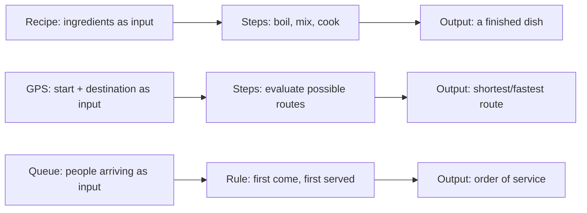

# Unit 1 — How Machines Think
## Topic 4: Algorithmic Thinking

*(Covers: Algorithmic thinking — what makes a set of steps an algorithm · Algorithms in everyday life — recipes, GPS routes, sorting queues · The four properties of a good algorithm — finite, definite, input, output)*

---

## 1. Learning Objectives

By the end of this topic, you will be able to:

1. **Explain** what an algorithm is and how it differs from a random set of instructions.
2. **Identify** algorithms in everyday, non-computing situations.
3. **Describe** the four essential properties every good algorithm must have.
4. **Evaluate** a given set of steps and determine whether it qualifies as a proper algorithm.
5. **Create** a simple, valid algorithm for an everyday task.
6. **Differentiate** between an algorithm and the pseudocode/flowchart used to express it (recall Topic 3).

---

## 2. Overview

You now know how to break a problem into parts (decomposition), hide unnecessary detail (abstraction), and express logic clearly (pseudocode and flowcharts). Now we arrive at the central concept that ties all of computing together: the **algorithm**.

An algorithm is simply a precise, well-defined sequence of steps that solves a problem or completes a task. What makes algorithmic thinking powerful is that it isn't limited to computers — you already use algorithms every single day, often without realising it: following a recipe, navigating using Google Maps, or standing in a queue at a railway ticket counter.

Understanding what qualifies as a "proper" algorithm — and what doesn't — is essential once you start working with AI systems. When you write a specification for an AI to implement (Week 2), you are effectively asking it to follow (or generate) an algorithm. When you evaluate whether an AI-generated solution is correct, you're checking whether its underlying steps meet the same standards a hand-written algorithm would need to meet. This topic gives you the vocabulary and judgment to do that with confidence — the bridge between "thinking like a problem-solver" (Topics 1–3) and formally specifying tasks for AI systems to execute.

---

## 3. Description

### 3.1 Algorithmic Thinking — What Makes a Set of Steps an Algorithm

**Definition:** An algorithm is a finite sequence of well-defined, unambiguous steps that takes some input and produces a specific output, solving a particular problem.

**Why this concept exists:** Not every "list of steps" qualifies as an algorithm. "Try to cook something nice" is not an algorithm — it's vague, has no clear stopping point, and doesn't guarantee a specific outcome. "Boil 2 cups of water, add 1 tsp of salt, add 100g of rice, cook for 12 minutes, then drain" *is* an algorithm — every step is precise and it clearly ends with a specific, predictable result. Algorithmic thinking is the discipline of expressing solutions this precisely, so that anyone (or anything — including a computer or an AI) following the same steps in the same order will reach the same correct result.

**Key Terminology:**

| Term | Simple Meaning |
|---|---|
| **Algorithm** | A precise, ordered set of steps that solves a problem and always terminates with a result. |
| **Unambiguous** | Having only one possible interpretation — no room for confusion about what a step means. |
| **Terminates** | Comes to a definite stop/end (as opposed to running forever). |

---

### 3.2 Algorithms in Everyday Life — Recipes, GPS Routes, Sorting Queues

Algorithmic thinking did not begin with computers — humans have used algorithms for thousands of years. Here are three everyday examples:

**1. A Cooking Recipe:**
A recipe is a textbook algorithm: it takes inputs (ingredients — rice, water, salt), follows a precise sequence of steps (boil, add, cook, drain), and produces a specific output (cooked rice) — every single time, if followed correctly.

**2. A GPS Navigation Route (e.g., Google Maps):**
When you ask Google Maps for directions from your hostel to the railway station, it runs a **shortest-path algorithm** internally. It takes an input (your start point and destination), evaluates many possible routes using clear rules (distance, traffic, road closures), and produces a specific output (the recommended route and estimated time).

**3. Sorting a Queue at a Railway Ticket Counter:**
The "first come, first served" rule at a ticket counter is itself a simple algorithm: take the input (people arriving over time), apply a clear rule (serve in order of arrival), and produce an output (an ordered sequence of service). Computers use very similar sorting algorithms to arrange lists of numbers, names, or roll numbers.



All three examples follow the exact same underlying shape: **input → defined steps → output** — which you'll recognise as the very definition of computation from Topic 1. Algorithms are simply the "steps" part of that picture, made precise and reliable.

---

### 3.3 The Four Properties of a Good Algorithm

Not every sequence of steps is a valid algorithm. For a set of steps to properly qualify as an algorithm, it must have **four essential properties**:

| Property | Simple Meaning | Example (Making Tea) |
|---|---|---|
| **Finite** | The algorithm must have a definite end — it cannot run forever. | The tea-making process ends once the tea is poured into the cup. It doesn't go on endlessly. |
| **Definite (unambiguous)** | Every step must be crystal clear, with only one possible interpretation. | "Add 1 teaspoon of sugar" is definite. "Add sugar to taste" is NOT definite — it's subjective and unclear. |
| **Input** | The algorithm must accept zero or more well-defined inputs. | Inputs: water, tea leaves, milk, sugar. |
| **Output** | The algorithm must produce at least one clear, expected output. | Output: a cup of tea. |

**Rules / properties in detail:**

1. **Finite:** If your steps could theoretically repeat forever without stopping (e.g., "keep checking if it's ready" with no limit), it's not a proper algorithm — every algorithm must guarantee it eventually finishes.
2. **Definite:** Every instruction must mean exactly one thing to anyone following it. Vague words like "quickly," "a little," or "as needed" break this property because different people (or machines) would interpret them differently.
3. **Input:** Even an algorithm that seems to need "nothing" usually has some input (e.g., "print the numbers 1 to 10" has the implicit input of the range 1–10).
4. **Output:** An algorithm that does work but produces no result at all isn't useful — the whole point of an algorithm is to produce something (an answer, an action, a decision).

**Example — Testing "Make Maggi Noodles" Against the Four Properties:**

```
1. Boil 2 cups of water.
2. Add the noodles and cook for 2 minutes.
3. Add the tastemaker (spice masala) and mix.
4. Cook for 1 more minute.
5. Serve hot.
```

- **Finite?** Yes — it clearly ends at step 5.
- **Definite?** Yes — each quantity and action is precise (2 cups, 2 minutes, etc.).
- **Input?** Yes — water, noodles, tastemaker.
- **Output?** Yes — a plate of cooked Maggi noodles.

This passes all four checks, so it is a valid algorithm.

**A Counter-Example (Fails the Test):**

```
1. Cook the noodles until they taste good.
2. Serve when ready.
```

- **Finite?** Unclear — "until they taste good" has no defined stopping point.
- **Definite?** No — "taste good" and "ready" are subjective, not precise.

This example fails, showing why casual, everyday instructions often don't qualify as true algorithms — and why, when specifying tasks for AI systems (Week 2), you must be far more precise than everyday speech.

**Best Practices:**

- When designing any algorithm (for a person or an AI to follow), explicitly check it against all four properties before considering it "done."
- Replace subjective words ("quickly," "properly," "a good amount") with precise, measurable instructions.
- Always double-check the "finite" property for anything involving repetition (loops) — an infinite loop is one of the most common bugs in real software.

**Common Beginner Mistakes:**

- Writing steps that sound complete but are actually ambiguous (e.g., "check if it's correct" — correct according to what rule?).
- Forgetting that "no explicit input" still usually means there is a hidden, implied input.
- Confusing "detailed" with "definite" — a step can be short and still perfectly definite (e.g., "add 5g salt"), while a long-winded step can still be vague.

---

## 4. Real World Application

- **Search Engines:** Google's search-ranking algorithm takes your search query (input), applies a precise, repeatable set of ranking rules, and produces an ordered list of results (output) — every search you run follows this same algorithmic process.
- **Banking:** Interest calculation on a savings account follows a strict algorithm: principal, rate, and time period as input; a fixed formula as the steps; final interest amount as output. Banks cannot allow ambiguity here — the four properties (especially "definite") are legally essential.
- **Railway/Travel:** Waitlist confirmation on IRCTC uses an algorithm based on cancellations, quotas, and booking order — precise and finite, so every passenger gets a fair, predictable, repeatable outcome.
- **E-commerce:** A "sort by price: low to high" feature on Amazon or Flipkart runs a sorting algorithm — input is the unsorted list of products, output is the sorted list, and the steps are precise and always terminate.
- **AI-Native Systems:** An AI agent that automatically re-orders low-stock inventory (Week 14) is, underneath its "intelligence," still built around algorithmic steps: check stock level (input) → compare against reorder threshold (defined rule) → place order if below threshold (output). Understanding algorithms helps you judge whether an AI agent's automated decision-making is following sound, predictable logic.

---

## 5. Worked Example

**Scenario:** Design a simple algorithm for a college library book-return process, and verify it against the four properties.

**Step 1 — Write the algorithm:**

```
START
1. Take the book from the student.
2. Scan the book's barcode.
3. IF the book is returned after the due date:
       Calculate a fine of ₹2 per late day.
       Collect the fine from the student.
4. Update the library system to mark the book as "available."
5. Give the student a return receipt.
END
```

**Step 2 — Verify the four properties:**

| Property | Check | Verdict |
|---|---|---|
| Finite | The process clearly ends at step 5 with a receipt. | ✅ Pass |
| Definite | Every action is precise — "₹2 per late day," "scan barcode," "mark as available." No vague words. | ✅ Pass |
| Input | The book, its barcode, the return date, the due date. | ✅ Pass |
| Output | An updated library record and a return receipt. | ✅ Pass |

**Step 3 — Reflect:** Because this algorithm passes all four checks, it could confidently be handed to a developer (or an AI system) to implement in code, with no ambiguity about what should happen in any situation — including the "late return" edge case, which is often the part beginners forget to specify.

---

## 6. Key Takeaways

- An **algorithm** is a finite, precise sequence of steps that takes input and produces output to solve a specific problem.
- Algorithms exist everywhere in daily life — recipes, GPS routes, queues — not just inside computers.
- Every valid algorithm must satisfy **four properties**: Finite, Definite, Input, Output — remember it as **F.D.I.O.**
- "Finite" means it must eventually stop; "Definite" means every step has exactly one clear meaning.
- Vague, subjective instructions ("cook until it tastes good") fail the "definite" test and are not true algorithms.
- Testing a set of steps against the four properties is a fast, reliable way to check if your logic is actually ready to be implemented (by a person or an AI).
- **Interview tip:** If asked "what is an algorithm," always mention the four properties by name — interviewers specifically listen for Finite, Definite, Input, Output.
- This concept directly prepares you for Week 2 (Specifying for AI) — a good specification is, in essence, an algorithm described precisely enough for an AI system to implement correctly.

---

## 7. Reference Links

- [GeeksforGeeks — Introduction to Algorithms](https://www.geeksforgeeks.org/) — properties and characteristics of algorithms with examples.
- [W3Schools — Algorithms](https://www.w3schools.com/) — beginner-friendly definitions and simple examples.
- [Google Machine Learning Crash Course](https://developers.google.com/machine-learning/crash-course) — for later context on how algorithms underpin machine learning systems.
