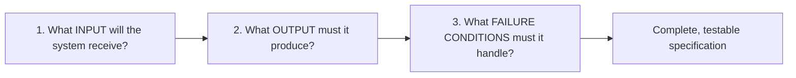

# Unit 2 — Specifying for AI
## Topic 1: What Makes a Good Specification

*(Covers: What makes a good specification — testable, bounded, observable, actionable · Bad spec vs good spec — 'make it better' vs 'rewrite at Grade 8 level, max 80 words' · How to identify the inputs, expected outputs, and failure conditions of a task)*

---

## 1. Learning Objectives

By the end of this topic, you will be able to:

1. **Explain** what a specification is and why it is the single most important skill for someone who directs AI to do work.
2. **Identify** the four properties of a good specification — testable, bounded, observable, actionable.
3. **Differentiate** between a vague, weak specification and a precise, professional one.
4. **Describe** how to break any task down into its inputs, expected outputs, and failure conditions before asking AI to do it.
5. **Create** a well-formed specification for a simple real-world task.
6. **Evaluate** an existing specification and identify what is missing from it.

---

## 2. Overview

In Unit 1, you learned that computation is input → process → output, and that AI systems are probabilistic — they generate the most *likely* answer, not a guaranteed one. That single fact leads to the most important professional skill in this entire program: **if you don't tell an AI system precisely what you want, it will guess — and its guess may not match what you actually needed.**

A **specification** (often shortened to "spec") is a clear, precise description of what you want a system to do, written *before* you ask the AI to build or do anything. Think of it as the instructions you'd give to a very capable but very literal-minded assistant — one who will do exactly what you say, not what you meant.

This topic sits at the heart of the "AI-Native Engineer" job description. In the real workflow — **spec → build → evaluate → oversee** — writing the specification comes first, and it is entirely a *human* responsibility. The AI cannot write a good spec for you, because only you know what "good" actually means for your problem, your users, and your organisation. Every mistake caused by "the AI did the wrong thing" traces back, almost always, to a specification that was incomplete, ambiguous, or untestable. Getting this right is what separates a professional AI-native engineer from someone who just types casual requests into a chatbot.

---

## 3. Description

### 3.1 What Is a Specification?

**Definition:** A specification is a written description of a task that states exactly what input the system will receive, what output it must produce, and what should happen when something goes wrong — precise enough that two different people (or two different AI systems) reading it would build the *same* thing.

**Why this concept exists:** Human language is naturally vague. If you tell a friend, "get me something to eat," they might bring you biryani, a sandwich, or a packet of biscuits — all technically valid. That looseness is fine between friends, but it fails badly when you're directing a powerful, literal system that will act on your exact words. A specification removes the vagueness *before* the work begins, not after you're disappointed with the result.

### 3.2 The Four Properties of a Good Specification

A specification is only useful if it has all four of these properties. Miss even one, and you open the door to a result you didn't want.

| Property | Simple Meaning | Ask Yourself |
|---|---|---|
| **Testable** | You can check, with a clear yes/no, whether the output meets the requirement. | "Can I write a test that proves this was done correctly?" |
| **Bounded** | The task has clear limits — a maximum length, a specific scope, a defined set of inputs it must handle. | "Does this say how big, how long, or how much?" |
| **Observable** | You can actually see or measure the output to judge it — it isn't hidden or purely subjective. | "Can I look at the result and judge it against the spec?" |
| **Actionable** | The instruction tells the system what to *do*, not just what outcome you vaguely wish for. | "Does this tell the system a concrete action to take?" |

**Analogy:** Imagine giving directions to a delivery rider in Bengaluru traffic. "Go somewhere near Koramangala" is not testable, bounded, observable, or actionable — the rider has no way to know if they've succeeded. "Deliver to Flat 302, Sunrise Apartments, 80 Feet Road, Koramangala 4th Block, by 8:00 PM" gives the rider everything they need: a testable destination, a bounded time limit, an observable address, and an actionable instruction.

### 3.3 Bad Spec vs Good Spec

Let's look at the classic beginner mistake side by side.

**Bad specification:** *"Make it better."*

This fails all four properties:
- Not testable — "better" according to what measure?
- Not bounded — better by how much, in what way?
- Not observable — there's no way to check against a fixed standard.
- Not actionable — it tells the AI nothing about what action to take.

**Good specification:** *"Rewrite this paragraph at a Grade 8 reading level, using simple sentences, keeping the meaning unchanged, in no more than 80 words."*

This passes all four:
- **Testable** — you can run a readability check and count words.
- **Bounded** — a hard limit of 80 words is given.
- **Observable** — you can read the result and compare it against "Grade 8 level" and the word count.
- **Actionable** — "rewrite," "use simple sentences," and "keep the meaning unchanged" are concrete actions.

**More before/after examples, across different everyday domains:**

| Domain | Bad Spec (vague) | Good Spec (testable, bounded, observable, actionable) |
|---|---|---|
| Food delivery app | "Make the order confirmation message nicer." | "Rewrite the order confirmation SMS to be under 160 characters, include the order ID and expected delivery time, and use a friendly but professional tone." |
| College attendance system | "Warn students who are missing too much class." | "Send an email alert to any student whose attendance falls below 75% in a subject, listing the subject name and current attendance percentage, sent every Friday at 6 PM." |
| UPI payment app | "Handle failed payments well." | "If a UPI payment fails, show the user the specific reason (insufficient balance, bank server down, or incorrect PIN) within 3 seconds, and offer a 'retry' button." |

### 3.4 Identifying Inputs, Expected Outputs, and Failure Conditions

Every good specification, no matter the domain, can be broken into three parts. Ask these three questions about *any* task before specifying it:

1. **Input** — What information does the system start with? (e.g., a customer's order details, a scanned ID card, a student's marks.)
2. **Expected output** — What exact result must come out the other end? (e.g., a confirmation SMS, an approval/rejection decision, a formatted report.)
3. **Failure conditions** — What could go wrong, and what should happen in each case? (e.g., missing data, an out-of-range value, a system timeout.) A specification that only describes the "happy path" — when everything goes right — is an incomplete specification. Real systems fail in real ways, and your spec must say what "correct failure behaviour" looks like too.

**Worked breakdown — Railway ticket refund task:**

| Part | Detail |
|---|---|
| Input | Ticket PNR number, cancellation date, ticket fare, class of travel |
| Expected Output | Refund amount calculated per Indian Railways cancellation rules, displayed to the user within 5 seconds |
| Failure Conditions | Invalid PNR → show "PNR not found" error; cancellation after chart preparation → show "no refund eligible, contact TDR" message; system timeout → show "please retry" with no silent failure |

**Best Practices:**
- Always write the specification down in text — do not keep it "in your head." A written spec can be reviewed, tested, and reused.
- Write the failure conditions *before* you ask the AI to build anything — most real-world bugs come from unhandled failure cases, not the happy path.
- Keep specifications as short as possible while still being complete — a bloated spec is as hard to verify as a vague one.

**Common Beginner Mistakes:**
- Writing goals instead of specifications (e.g., "improve user experience" instead of a concrete, testable instruction).
- Forgetting to define what "done" looks like — without an observable success criterion, you cannot verify the AI's output.
- Specifying only the happy path and being surprised when edge cases produce bad results.

**Important Note:** A specification is not the same as a wish. A wish describes a feeling you want ("users should feel the app is trustworthy"). A specification describes an action and a measurable outcome ("display the total amount debited in bold, immediately after every UPI transaction"). Part of your job as an AI-native engineer is translating wishes into specifications.

---

## 4. Real World Application

- **Banking/FinTech:** Specifying exactly how a UPI failure message should be worded, when it should appear, and what information it must contain — ambiguity here can cause real customer confusion and complaints.
- **Healthcare:** Specifying that an AI triage assistant must always display "Please consult a doctor" alongside any symptom assessment, with the sentence appearing in a fixed, observable location on the screen.
- **Education:** Specifying an AI feedback tool for essays — bounded to 150 words of feedback, testable against a rubric, observable in the returned text, and actionable ("point out the top 3 grammar issues").
- **E-commerce:** Specifying that a return-eligibility checker must classify an order as "eligible," "not eligible," or "needs manual review," covering every possible order status as a failure condition.
- **Railway Booking:** Specifying refund calculation rules precisely enough that the AI-assisted support chatbot gives the same refund answer as the official railway policy, every time.
- **AI Chatbots/Copilots:** Specifying the exact tone, length, and content boundaries for a customer support bot so its answers stay professional and on-policy across thousands of conversations.

---

## 5. Worked Example

**Scenario:** You are asked to write a specification for an AI tool that generates a short weekly summary email for college students, listing pending assignments.

**Step 1 — Identify the Input:**
A list of assignments with: subject name, due date, and submission status (submitted/pending).

**Step 2 — Identify the Expected Output:**
A plain-text email, no more than 120 words, listing only *pending* assignments sorted by due date (soonest first), with the subject line "Your Pending Assignments This Week."

**Step 3 — Identify the Failure Conditions:**
- If there are zero pending assignments → send a short congratulatory message instead of an empty list.
- If a due date is missing or invalid → exclude that assignment and add a note: "1 assignment could not be checked — please verify manually."
- If the assignment list itself fails to load → do not send any email, and instead alert the system administrator.

**Final Specification (testable, bounded, observable, actionable):**

> "Generate a plain-text weekly email, subject line 'Your Pending Assignments This Week,' listing only assignments marked 'pending,' sorted by due date (soonest first), maximum 120 words. If zero assignments are pending, send: 'Great job — you have no pending assignments this week!' If any assignment has a missing or invalid due date, exclude it from the list and append: '[N] assignment(s) could not be checked — please verify manually.' If the assignment data fails to load entirely, do not send the email and log an alert for the system administrator instead."

Notice how this single paragraph is now testable (you can check the word count, the sorting, and the exact fallback sentences), bounded (120-word limit, specific subject line), observable (you can read the generated email and compare it line by line), and actionable (every instruction tells the system exactly what to do).

---

## 6. Key Takeaways

- A **specification** is a precise, written description of a task — input, output, and failure conditions — given to an AI system before it starts working.
- A good specification is **testable, bounded, observable, and actionable** (remember: TBOA).
- "Make it better" is a wish, not a specification. "Rewrite at Grade 8 level, max 80 words" is a specification.
- Every task specification should cover three parts: **input → expected output → failure conditions.**
- Specifying only the "happy path" and ignoring failure conditions is one of the most common and costly beginner mistakes.
- Writing specifications is a 100% human responsibility in the "AI implements, you specify and verify" workflow — the AI cannot write its own requirements.
- **Interview tip:** If asked "how do you ensure AI produces reliable output?", the strongest answer starts with "by writing a precise, testable specification before any AI call is made" — not with a technical fix after the fact.
- This skill is the direct foundation for the 70/30 rule and the AI-use rules you'll study next in this unit, and for the professional discipline you'll practice throughout the entire program.

---

## 7. Reference Links

- [Anthropic Documentation — Prompt Engineering Overview](https://docs.claude.com/) — official guidance on writing clear, well-specified instructions for an AI model.
- [Google Machine Learning Crash Course — Framing an ML Problem](https://developers.google.com/machine-learning/crash-course) — on defining clear, measurable problem statements.
- [GeeksforGeeks — Software Requirement Specification (SRS)](https://www.geeksforgeeks.org/) — supplementary reading on the traditional software-engineering discipline that specification-writing is built on.
