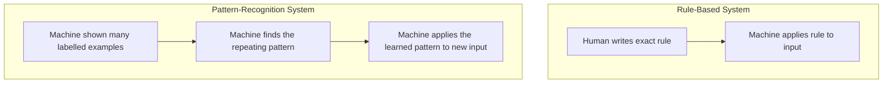

# Unit 2 — Specifying for AI
## Topic 2: How Machines Recognise Patterns

*(Covers: Pattern recognition — how machines find rules in repeated data)*

---

## 1. Learning Objectives

By the end of this topic, you will be able to:

1. **Explain** what pattern recognition means in the context of machines and AI.
2. **Describe** how repeated examples in data allow a machine to infer a general rule.
3. **Differentiate** between a machine "memorising" specific examples and a machine "learning" a general pattern.
4. **Identify** everyday examples of pattern recognition, both human and machine.
5. **Analyze** why the quality and variety of examples shown to a machine directly affects the quality of the pattern it learns.

---

## 2. Overview

In Topic 1 of this unit, you learned to write precise specifications by telling a machine exactly what to do, step by step. But some of the most powerful modern AI systems — including the LLMs you will use throughout this program — aren't told explicit step-by-step rules at all. Instead, they are shown a huge number of examples and asked to find the **pattern** hiding inside them.

**Pattern recognition** is the process by which a machine looks at many repeated examples of data and works out a general rule that explains them — without a human writing that rule down directly. This is fundamentally different from the rule-based, deterministic computation you studied in Unit 1 (like a calculator following `sum = a + b`). Here, nobody hand-writes the rule; the machine discovers it by noticing what repeats.

Understanding this matters because it explains *where AI's abilities come from* and *where its limits are*. If you know a model learned its behaviour from patterns in examples, you immediately understand why it can be excellent at common, well-represented situations and shaky on rare, unusual ones — a theme you will meet again as the "jagged frontier" in Unit 3. This topic is your bridge between "writing precise instructions" (Topic 1) and "understanding how AI systems actually behave" (the rest of this program).

---

## 3. Description

### 3.1 What Is Pattern Recognition?

**Definition:** Pattern recognition is the process of examining many pieces of data, noticing what repeats or correlates, and forming a general rule that predicts new, unseen cases.

**Key Terminology:**

| Term | Simple Meaning |
|---|---|
| **Data** | Examples or facts fed into a system (e.g., thousands of past emails, photos, or sentences). |
| **Pattern** | A repeating relationship or regularity found across many examples (e.g., "emails containing 'free money' are usually spam"). |
| **Rule / Model** | The general relationship the machine has inferred from the pattern, which it can now apply to brand-new, unseen data. |
| **Training** | The process of showing a machine many examples so it can discover the pattern. (We study this in depth in Unit 3.) |

### 3.2 A Simple Human Analogy

You already do pattern recognition every day, without calling it that. If you've eaten at your college canteen for a few months, you probably know that Wednesdays usually serve a particular dish, or that the queue is shortest right after the first period. Nobody wrote you a rule — you noticed the *pattern* by observing repeated days. Machines learn in a conceptually similar way: instead of being told a fixed rule, they are shown enormous numbers of repeated examples and they work out the regularities themselves.

### 3.3 How This Differs From Fixed Rules

Recall the deterministic calculator example from Unit 1: a human programmer wrote the exact rule (`sum = a + b`). Pattern recognition works differently — the "rule" is *inferred* from data, not hand-written.

**A concrete illustration — recognising spam emails:**

Imagine you show a machine 10,000 emails, each already labelled "spam" or "not spam" by humans. The machine doesn't get told "if the email contains the word 'lottery,' it is spam." Instead, it examines all 10,000 examples and notices that emails labelled "spam" repeatedly share certain features — words like "free," "winner," "click now," unusual sender addresses, excessive exclamation marks. From these *repeated* patterns across many examples, it builds a general rule it can apply to a brand-new email it has never seen before.

### 3.4 Memorising vs Learning a Pattern

A crucial distinction: a machine that only "memorises" the exact 10,000 training emails is not useful — it can only judge those exact emails again. A machine that has genuinely learned the *underlying pattern* can correctly judge a completely new, 10,001st email it has never encountered. This is the entire point of pattern recognition: generalising from examples to new, unseen situations.

**Comparison Table — Memorising vs Genuinely Learning a Pattern**

| Aspect | Memorising | Learning the Pattern |
|---|---|---|
| Works on training examples? | Yes | Yes |
| Works on brand-new, unseen examples? | No — fails badly | Yes — generalises correctly |
| What it has actually captured | Specific answers | The underlying regularity/rule |
| Real-world usefulness | Very low | High — this is the actual goal |

> **Important Note:** The quality and variety of the examples a machine is shown directly decides the quality of the pattern it learns. If you only ever showed it spam emails written in English, it may fail badly on spam written in Hindi or Tamil — not because it is "broken," but because it never saw that pattern. This idea — that AI is only as good as the patterns present in what it was shown — is central to understanding both the abilities *and* the limitations of AI systems you'll study throughout this program.

**Best Practices:**
- When evaluating any AI-based tool, ask: "What kind of examples was this likely trained or shown on?" This tells you where it will likely perform well or poorly.
- Never assume a pattern-recognition system will automatically generalise perfectly to situations very different from what it has seen.

**Common Beginner Mistakes:**
- Assuming a machine that performs well on familiar examples will automatically perform equally well on rare or unusual ones.
- Confusing "the machine memorised the training data" with "the machine understood the concept" — these are very different, and only the second one is genuinely useful.

---

## 4. Real World Application

- **Banking/FinTech:** Fraud-detection systems learn the pattern of what a typical, legitimate UPI transaction looks like from millions of past transactions, so they can flag unusual ones (e.g., an unusually large transfer at 3 AM to a new account) as suspicious.
- **Healthcare:** AI systems that assist in reading X-rays are shown thousands of labelled scans (healthy vs. showing a condition) and learn the visual patterns that repeat in each category.
- **Agriculture (Indian context):** AI crop-disease detection apps learn patterns from thousands of leaf photos labelled "healthy" or "diseased," letting a farmer photograph a new leaf and get an instant pattern-based assessment.
- **E-commerce:** Recommendation engines learn the pattern of "customers who bought X also tend to buy Y" from millions of past orders.
- **Vernacular AI Translation:** Translation models learn patterns of how phrases in Hindi typically correspond to phrases in Tamil from huge numbers of paired example sentences.
- **AI Chatbots:** A support chatbot's ability to understand differently-worded versions of the same question ("Where's my order?" vs. "When will my package arrive?") comes from having seen many repeated, similarly-patterned questions during training.

---

## 5. Worked Example

**Scenario:** A food-delivery company wants to build a system that predicts whether a customer's order is likely to be cancelled before delivery.

**Step 1 — Gather repeated examples:** The company collects data on 50,000 past orders, each labelled "completed" or "cancelled," along with details like order time, distance, payment method, and weather at the time.

**Step 2 — Let the machine find the pattern:** Instead of a human writing a fixed rule like "if distance > 10 km, cancel," the machine examines all 50,000 labelled examples and discovers repeating regularities — for instance, orders placed very late at night, paid via "cash on delivery," during heavy rain, are cancelled far more often than average.

**Step 3 — Apply the learned pattern to a new order:** When order number 50,001 comes in — placed at 1 AM, cash on delivery, during rain — the system recognises this combination matches the learned high-cancellation pattern and flags it for extra confirmation, even though it has never seen this *exact* order before.

**Step 4 — Recognise the limitation:** If the company suddenly expands to a new city with very different traffic and ordering habits, the previously learned pattern may not transfer well — because the machine never saw examples from that new pattern of behaviour. This is exactly why real AI systems are continuously re-evaluated and retrained on new data, a theme you will revisit in Units 7 and 8 on measuring AI performance.

---

## 6. Key Takeaways

- **Pattern recognition** is how a machine infers a general rule by examining many repeated examples, instead of following a rule a human wrote directly.
- This is fundamentally different from the deterministic, rule-based computation studied in Unit 1.
- The goal is **generalisation** — performing correctly on brand-new, unseen data — not merely memorising the training examples.
- A machine's pattern-recognition ability is only as good as the variety and quality of the examples it was shown.
- Rare or unusual situations that weren't well represented in the examples are exactly where pattern-recognition systems tend to struggle.
- **Interview tip:** If asked to explain machine learning in one sentence, "a system that learns general rules from repeated examples in data, rather than being explicitly programmed with those rules" is a strong, accurate answer.
- This concept directly sets up Unit 3's discussion of how LLMs are trained and why they have a "jagged frontier" of strong and weak areas.

---

## 7. Reference Links

- [Google Machine Learning Crash Course — What Is Machine Learning?](https://developers.google.com/machine-learning/crash-course) — beginner-friendly introduction to learning patterns from data.
- [Anthropic Documentation](https://docs.claude.com/) — background on how modern language models are built on pattern recognition over large text datasets.
- [DeepLearning.AI — AI For Everyone (free course)](https://www.deeplearning.ai/) — non-technical introduction to how AI systems learn from data.
