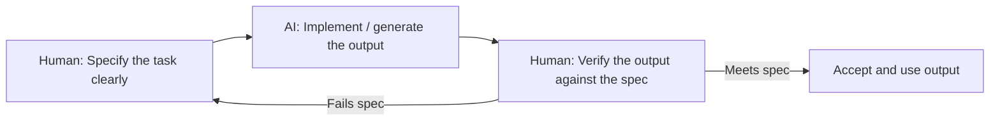

# Unit 2 — Specifying for AI
## Topic 3: The Professional Rules of AI Use

*(Covers: The 70/30 rule — AI implements, you specify and verify · When NOT to use AI — privacy, precision, legal accountability)*

---

## 1. Learning Objectives

By the end of this topic, you will be able to:

1. **Explain** the 70/30 rule and what it means for the division of responsibility between a human and an AI system.
2. **Describe** the human's role of specifying and verifying, as distinct from the AI's role of implementing.
3. **Identify** situations where AI should NOT be used, based on privacy, precision, or legal accountability concerns.
4. **Evaluate** a real scenario and decide whether AI use is appropriate, and if so, under what human oversight.
5. **Apply** professional judgment to justify a decision to use — or not use — AI for a given task.

---

## 2. Overview

You now know how to write a good specification (Topic 1) and understand that AI systems learn behaviour from patterns in data rather than fixed rules (Topic 2). This topic gives you the professional discipline that ties everything together: the **70/30 rule**, and the boundaries around when AI should not be used at all.

The 70/30 rule is the single most repeated principle in this entire program, because it defines your actual job as an AI-Native Engineer. It is *not* your job to write every line of output by hand. It is *also* not your job to blindly trust whatever the AI produces. Your job is to **specify precisely what is needed, let the AI do the (larger) implementation work, and then verify — carefully and skeptically — that what came back is actually correct.**

Just as important is knowing when to not hand a task to AI at all. Some tasks touch personal privacy, require perfect precision, or carry legal responsibility that cannot be outsourced to a probabilistic system. Learning to recognise these boundaries — *before* you build anything — is what separates a responsible AI-native professional from someone who uses AI carelessly. This topic gives you the judgment framework you'll apply for the rest of the program, and it directly previews the deeper "Judgment Framework" you'll study formally in Unit 9.

---

## 3. Description

### 3.1 The 70/30 Rule

**Definition:** The 70/30 rule describes the professional division of labour between an AI system and the human directing it: the AI does the majority of the implementation work (roughly "70%" — the actual generation, drafting, coding, or calculating), while the human retains full responsibility for the remaining "30%" — specifying exactly what is needed, and verifying that the result is correct, safe, and appropriate.

**Why this rule exists:** As you learned in Unit 1, AI systems are probabilistic — the same input can produce a different, sometimes wrong, output. If a human simply typed a request and accepted whatever came back without checking it, errors would flow directly into real systems, real customers, and real decisions. The 70/30 rule keeps a human firmly "in the loop" as the specifier and the final checker, no matter how capable the AI becomes.

**Breaking down the two human responsibilities:**

| Human Responsibility | What It Means | Example |
|---|---|---|
| **Specify** | Write a clear, testable, bounded, observable, actionable instruction (see Topic 1) before any AI call happens. | "Summarise this 10-page policy document in exactly 5 bullet points, each under 20 words." |
| **Verify** | Check the AI's output against the specification and against real-world correctness — never assume it is right by default. | Reading the 5 bullet points, confirming each is factually accurate against the original document, and confirming the word-count limit was followed. |

Notice the loop back to "Specify" — if verification fails, a professional does not just accept a flawed result; they refine the specification (or re-prompt) and try again. You will practice this exact loop in Unit 2's final topic on testing and iterating specifications.

**Best Practices:**
- Never treat AI output as "final" until it has been verified against your original specification.
- Spend real, deliberate effort on the "30%" — a rushed, vague specification is the single biggest cause of poor AI output.
- Build a habit of asking, before accepting any AI output: "What exactly was I checking for, and did I actually check it?"

**Common Beginner Mistakes:**
- Copy-pasting AI output directly into a real system without review, because it "looked right."
- Spending all your effort on getting a "good-sounding" prompt, but no effort on verifying the result afterward.
- Believing that a more advanced or newer AI model removes the need for human verification — it does not; the responsibility for correctness never transfers away from the human.

### 3.2 When NOT to Use AI

Even with a perfect specification and careful verification, some tasks should not be handed to an AI system at all — or should only be used with very tight human oversight. Three major boundary conditions:

**1. Privacy:** If a task requires processing sensitive personal data (medical records, financial details, government ID numbers, biometric data) in a way that could expose it to an external system without proper consent, safeguards, or legal basis, that is a serious red flag. Sending a patient's full medical history to a general-purpose AI tool without the right data-protection agreements in place can violate both the patient's trust and the law.

**2. Precision:** If a task requires a guaranteed, exact, repeatable answer — such as calculating a monetary transaction, dispensing medication dosage, or controlling safety-critical machinery — a probabilistic AI model should not be the final authority. As you learned in Unit 1, LLMs predict likely text; they are not a certified calculator or a safety-certified control system. Use deterministic code, not AI generation, for tasks that demand guaranteed precision — and even then, keep a human check in place for high-stakes outcomes.

**3. Legal Accountability:** If a decision carries legal consequences — denying someone a loan, rejecting a job candidate, determining eligibility for a government scheme, making a medical diagnosis — the *human and organisation* remain legally accountable for that decision, no matter which tool assisted in producing it. An AI system cannot be held legally responsible; a person or organisation always is. This means high-stakes, legally consequential decisions must always have a clearly identified accountable human making the final call.

**Comparison Table — Appropriate vs Inappropriate Uses of AI**

| Scenario | Appropriate for AI? | Why |
|---|---|---|
| Drafting a friendly reminder SMS for a food delivery order | Yes | Low stakes, easily verified, no sensitive data or legal consequence |
| Calculating exact GST on an invoice | No (use deterministic code) | Requires guaranteed precision, not a probabilistic best guess |
| Summarising a public news article | Yes | Low stakes, easily verified against the source |
| Diagnosing a patient's illness with no doctor review | No | High stakes, legal/medical accountability, requires human final decision |
| Suggesting draft interview questions for a job role | Yes, with human review | Assists a human decision-maker without replacing their judgment |
| Automatically rejecting loan applications with no human review | No | Legal accountability and fairness concerns require a human in the loop |

> **Important Note:** "When NOT to use AI" does not always mean "never use AI here." Often it means "AI can assist, but a human must make or confirm the final, accountable decision." Recognising this distinction — full automation vs. AI-assisted human decision-making — is a skill you will refine throughout this program, especially in Unit 9's Judgment Framework.

---

## 4. Real World Application

- **Banking/FinTech:** AI can draft a customer's fraud-alert message (implementation), but the actual "block this transaction" decision and the exact debited amount must remain deterministic and human-auditable.
- **Healthcare:** An AI can help summarise a patient's symptoms into a structured note for a doctor (assisting), but must never be the sole system making a diagnosis without a doctor's review (legal/precision boundary).
- **Education:** AI can generate draft feedback on a student's essay (implementation), but a teacher should verify it before it affects a grade (verification + accountability).
- **Recruitment/HR tech:** AI can help shortlist résumés against clearly specified criteria, but a human recruiter should make and be accountable for the final hiring decision, to avoid unchecked bias affecting people's careers.
- **Railway/Government Services:** AI chatbots can answer general queries about ticket policies (low stakes), but decisions on refunds involving legal entitlements should have a human-reviewed escalation path.
- **AI Copilots in Software Development:** A coding copilot can write a first draft of a function (the "70"), but the engineer must read, test, and verify it (the "30") before it is deployed to production.

---

## 5. Worked Example

**Scenario:** A college is considering using AI to handle student scholarship applications end-to-end — reading each application and directly approving or rejecting it with no human review.

**Step 1 — Apply the 70/30 rule:** Could AI assist with the "70%"? Yes — it could extract key details from each application (marks, family income, essay content) into a structured summary, saving reviewers significant time.

**Step 2 — Check the "when NOT to use AI" boundaries:**
- **Privacy:** Applications contain sensitive financial and family data — this must be handled under strict data-protection safeguards, not casually sent to a general AI tool.
- **Precision:** Eligibility often depends on exact income thresholds and marks cutoffs — these should be checked with deterministic rules, not an AI's probabilistic judgment.
- **Legal accountability:** Denying a scholarship has real consequences for a student's education and finances — the college, not the AI, is accountable for that decision, and would need to justify it if challenged.

**Step 3 — Reach a professional recommendation:**
> "Use AI to extract and summarise application data into a structured format (the implementation step), and use deterministic rules to check hard eligibility cutoffs. A human scholarship committee must review the summarised, rule-checked applications and make the final approve/reject decision. AI should never be the sole, final decision-maker for this task."

This worked example shows the full professional pattern: identify what AI can safely implement, check it against the three "when NOT to use AI" boundaries, and design a workflow where a human remains the accountable decision-maker for anything high-stakes.

---

## 6. Key Takeaways

- The **70/30 rule**: AI implements (the larger share of the work), the human specifies and verifies (the smaller but non-negotiable share).
- Verification is not optional — never accept AI output into a real system without checking it against your specification.
- Do not use AI as the sole, final authority when the task involves **privacy** of sensitive data, requires guaranteed **precision**, or carries **legal accountability**.
- "When NOT to use AI" frequently means "AI can assist, but a human must own the final decision" — not a blanket ban.
- Responsibility and legal accountability always rest with the human/organisation, never with the AI system itself.
- **Interview tip:** A strong answer to "how do you ensure responsible AI use?" references specify → implement → verify, plus explicitly naming privacy, precision, and legal accountability as boundary checks.
- These professional rules apply throughout the rest of this program, and are formalised further in Unit 9's Judgment Framework and Unit 5's ethics and governance material.

---

## 7. Reference Links

- [Anthropic Documentation — Responsible Use Guidance](https://docs.claude.com/) — official guidance on appropriate and responsible use of AI systems.
- [NIST AI Risk Management Framework](https://www.nist.gov/itl/ai-risk-management-framework) — authoritative framework on human oversight and accountability in AI systems.
- [MEITY AI Advisory Guidelines (India)](https://www.meity.gov.in/) — Indian government guidance relevant to responsible AI deployment.
