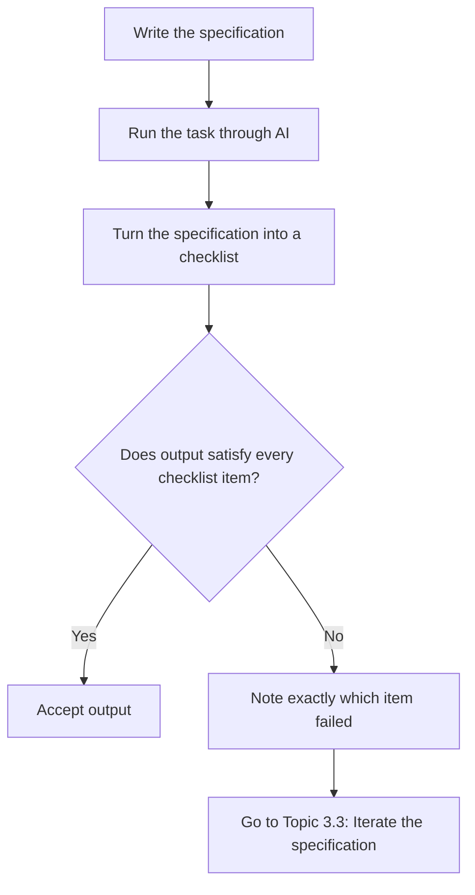

# Unit 2 — Specifying for AI
## Topic 4: Writing and Testing Specifications

*(Covers: Writing specifications across five domains — health, transport, education, food, scheduling · Testing a specification — how to verify the AI did exactly what you asked · Iterating a specification based on output gaps)*

---

## 1. Learning Objectives

By the end of this topic, you will be able to:

1. **Create** clear, testable specifications across multiple real-world domains.
2. **Implement** a simple process for testing whether AI output matches a written specification.
3. **Identify** gaps between what was specified and what the AI actually produced.
4. **Describe** how to iterate a specification to close those gaps.
5. **Evaluate** a full specify → test → iterate cycle on a real example.

---

## 2. Overview

You've learned what makes a specification good (Topic 1), how AI systems learn behaviour from patterns rather than fixed rules (Topic 2), and the professional discipline of specify-implement-verify (Topic 3). This final topic of Unit 2 puts everything into practice: writing real specifications across different domains, testing whether AI output actually satisfies them, and iterating when it doesn't.

This is where the "specify → build → evaluate → oversee" workflow becomes a repeatable habit rather than a one-time exercise. In real AI-native engineering work, you rarely get a perfect specification right on the very first attempt. The professional skill is not writing a flawless spec from scratch — it's building a *disciplined loop*: write the spec, test the output against it, notice exactly where it fell short, and sharpen the specification to close that gap. By the end of this topic, you will have practiced this loop across five different domains, which prepares you directly for the specification-and-evaluation work you'll do in your Unit 15 capstone project.

---

## 3. Description

### 3.1 Writing Specifications Across Five Domains

A well-written specification follows the same shape everywhere — input, expected output, failure conditions, and the four TBOA properties from Topic 1 (testable, bounded, observable, actionable) — but the *details* change with the domain. Below is one complete specification for each of five domains.

**1. Health:**
> "Given a patient's logged daily water intake (in millilitres) for the past 7 days, generate a one-line message reminding them if their average daily intake is below 2000 ml. The message must name the average intake and suggest one simple next step (e.g., 'drink one extra glass with lunch'). If any day's data is missing, state how many days were missing rather than guessing a value. This message assists patient awareness only — it must never claim to be medical advice, and must include the line 'Consult your doctor for medical guidance.'"

**2. Transport:**
> "Given a bus route number and the current time, tell the user the estimated minutes until the next bus arrives at their stop, rounded to the nearest minute. If no further buses are scheduled today, respond exactly: 'No more buses today on this route.' If the route number does not exist, respond exactly: 'Route not found — please check the number and try again.'"

**3. Education:**
> "Given a student's marks across 5 subjects (each out of 100), calculate the percentage and classify it as 'Distinction' (75%+), 'First Class' (60-74%), 'Pass' (40-59%), or 'Needs Improvement' (below 40%). Display the percentage rounded to one decimal place alongside the classification. If any subject's mark is missing or above 100, do not calculate a result — instead respond: 'Cannot calculate — please check subject marks.'"

**4. Food:**
> "Given a customer's selected dish and known allergies, check the dish's ingredient list and respond with either 'Safe based on known ingredients' or 'Contains [allergen name] — not recommended,' listing every matching allergen found. If the ingredient list for the dish is missing, respond: 'Ingredient information unavailable — please check with the restaurant directly.'"

**5. Scheduling:**
> "Given a list of a student's class timings for the day, generate a plain-text schedule sorted by start time, in the format 'HH:MM – Subject Name.' If two classes overlap in time, flag both with '⚠ Scheduling conflict' next to them rather than silently showing an incorrect schedule."

Notice that all five specifications share the same structure — a clear input, a precisely described output, and explicit failure-condition handling — even though the domains are completely different. This is the pattern you should follow for any specification you write from now on.

### 3.2 Testing a Specification

**Definition:** Testing a specification means deliberately checking whether the AI's actual output matches every part of what you specified — not just a quick glance, but a systematic comparison.

A simple, repeatable testing method is to turn your specification into a **checklist**, and tick off each item against the real output:

**Worked checklist example — testing the "Education" specification above, against a sample AI output:**

Suppose the AI was given marks [82, 91, 45, 60, 70] and returned: *"Percentage: 69.6%, Classification: First Class."*

| Checklist Item | Did the output satisfy it? |
|---|---|
| Percentage calculated correctly? (82+91+45+60+70 = 348 / 5 = 69.6%) | ✅ Yes |
| Rounded to one decimal place? | ✅ Yes ("69.6") |
| Correct classification band applied? (60-74% → "First Class") | ✅ Yes |
| Handles missing/invalid marks per the failure condition? | ⚠️ Not tested yet — need a separate test case with a missing mark |

This example shows an important testing habit: one successful test on the "happy path" is not enough. You must also specifically test the **failure conditions** you wrote into the specification — in this case, running the check again with a missing or invalid mark to confirm the AI correctly says "Cannot calculate."

**Best Practices:**
- Test the happy path AND every failure condition you specified — never assume failure-handling works just because the normal case worked.
- Re-run the same specification multiple times with the same input (remember Unit 1 — AI is probabilistic!) to check the output is *consistently* correct, not just correct once.
- Keep your test checklist in writing so it can be reused every time the specification or the AI model changes.

### 3.3 Iterating a Specification Based on Output Gaps

**Definition:** Iterating a specification means updating its wording to close a gap you discovered during testing — a case where the AI's output technically followed the letter of your instruction, but not what you actually needed.

**A concrete gap-closing example:**

Original specification: *"Summarise this customer complaint in one sentence."*

Tested output: The AI produced a one-sentence summary, but it was 55 words long — technically "one sentence" (grammatically), but far too long to be useful at a glance.

**Gap identified:** The specification was testable and actionable, but **not properly bounded** — "one sentence" did not control length the way the writer intended.

**Iterated (improved) specification:** *"Summarise this customer complaint in one sentence, no more than 20 words."*

Re-testing this new specification against the same complaint produces a much more useful, genuinely short summary — the gap is closed.

**The iteration loop, as a repeatable habit:**

1. Run the specification and collect real output.
2. Compare the output against your checklist, line by line.
3. For every failed or "technically-passed-but-not-useful" item, identify *which TBOA property* was actually missing (testable? bounded? observable? actionable?).
4. Rewrite only the part of the specification that addresses that gap — don't rewrite the whole thing from scratch each time.
5. Re-test the revised specification, ideally against multiple example inputs, before considering it finished.

**Common Beginner Mistakes:**
- Giving up on a specification after one failed test, instead of diagnosing exactly which property was missing and fixing just that part.
- Over-correcting — rewriting an entire specification from scratch when only one small clause needed tightening.
- Not re-testing after iterating — assuming the new specification works without verifying it, which is the same mistake as never testing at all.

**Important Note:** Iteration is a normal, expected, and professional part of specification-writing — it is not a sign that you did something wrong the first time. Even experienced AI-native engineers rarely get a complex specification perfectly right on the first attempt. What matters is having a disciplined process to find and close the gap quickly.

---

## 4. Real World Application

- **Health:** A hospital's patient-reminder tool is iterated after testing reveals it occasionally gives specific dosage suggestions — the specification is tightened to explicitly forbid any medical advice beyond the pre-approved reminder text.
- **Transport:** A bus-arrival chatbot's specification is iterated after testers discover it doesn't handle the last bus of the day correctly — a new failure condition is added and re-tested.
- **Education:** A college's AI-assisted grading-feedback tool is tested across many real student essays, and the specification is tightened after testers notice feedback sometimes exceeds the intended word limit.
- **Food:** A restaurant's AI allergy-checker specification is iterated after a tester notices it misses an allergen listed under an alternate ingredient name, prompting an explicit failure condition for "ingredient name not recognised."
- **Scheduling:** A university timetable assistant's specification is iterated after testing reveals it silently ignores overlapping classes instead of flagging them — the conflict-flagging failure condition is added.
- **AI-Native Software Teams:** Professional teams building production LLM features maintain a running "test suite" of specification checklists exactly like the ones in this topic, re-testing every time the underlying AI model or prompt changes.

---

## 5. Worked Example

**Scenario:** Full specify → test → iterate cycle for a food-delivery order-status message.

**Round 1 — Initial specification:**
> "Tell the customer the status of their order."

**Test:** Output was: *"Your order is being processed."* — Technically an answer, but not testable (what does "processed" mean exactly?), not bounded (no time estimate), and not actionable (customer doesn't know what to do next).

**Gap identified:** Missing testable detail, missing a bound (time estimate), missing an action.

**Round 2 — Iterated specification:**
> "Tell the customer their order status using one of these exact phrases: 'Order confirmed,' 'Preparing your food,' 'Out for delivery,' or 'Delivered.' Include the estimated delivery time in minutes. If the order is delayed by more than 15 minutes past the original estimate, add: 'Running a little late — thank you for your patience.'"

**Test:** Output was: *"Preparing your food. Estimated delivery: 32 minutes."* — This satisfies the exact-phrase requirement and includes the time estimate.

**Further test (failure condition):** Testers deliberately simulated a delay of 20 minutes past the estimate. Output correctly added: *"Running a little late — thank you for your patience."* ✅

**Round 3 — Final check:** Testers re-ran the same specification 5 times with identical input to confirm consistent output (since AI is probabilistic) — all 5 runs produced one of the four exact phrases with a correctly included time estimate, confirming the specification is now robust and ready to use.

This worked example demonstrates the complete professional loop you will use throughout this program: write, test (including failure conditions and repeated runs), identify the gap, iterate, and re-test until the specification reliably produces what you actually need.

---

## 6. Key Takeaways

- A good specification follows the same shape (input, output, failure conditions, TBOA) across every domain — health, transport, education, food, scheduling, and beyond.
- **Testing a specification** means checking real AI output against a checklist derived from the specification — including every failure condition, not just the happy path.
- Because AI is probabilistic (Unit 1), a specification should be tested multiple times with the same input to confirm consistent, not just one-time, correctness.
- **Iterating** means diagnosing exactly which property (testable, bounded, observable, actionable) was missing, and fixing only that part of the specification.
- Needing to iterate is normal and expected — it is a professional habit, not a sign of failure.
- The full professional loop is: **specify → test → identify gap → iterate → re-test.**
- **Interview tip:** Being able to describe a real specify-test-iterate example (like the food-delivery one above) is a strong way to demonstrate practical AI-native engineering skill in an interview.
- This exact loop is what you will formally practice at full scale in your Unit 15 capstone project's 5-case evaluation harness.

---

## 7. Reference Links

- [Anthropic Documentation — Testing and Evaluating Prompts](https://docs.claude.com/) — official guidance on evaluating whether AI output meets requirements.
- [Google Machine Learning Crash Course — Introduction to ML Evaluation](https://developers.google.com/machine-learning/crash-course) — foundational concepts in testing system output against expectations.
- [GeeksforGeeks — Software Testing Basics](https://www.geeksforgeeks.org/) — supplementary reading on the general discipline of testing outputs against requirements.
