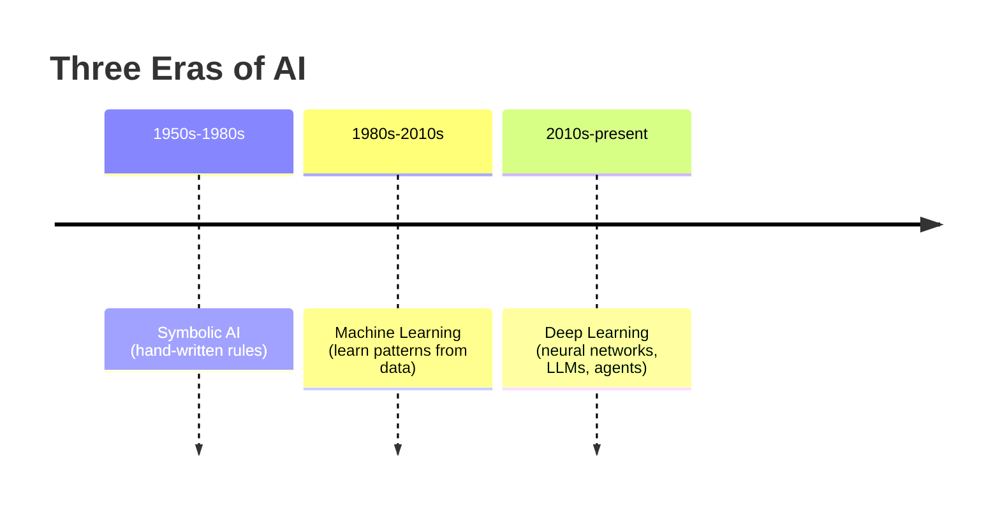
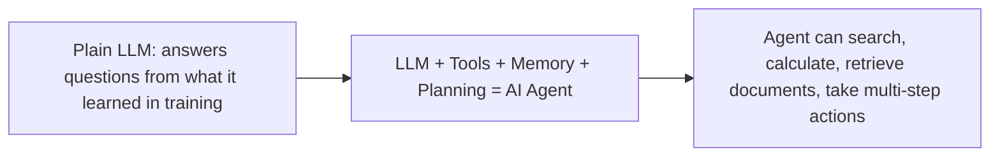

# Unit 3 — What AI Is — and Isn't
## Topic 1: A Brief History of AI

*(Covers: History of AI — symbolic AI to machine learning to deep learning · The rise of large language models (LLMs) · The move to AI agents)*

---

## 1. Learning Objectives

By the end of this topic, you will be able to:

1. **Explain** the three major eras of AI development — symbolic AI, machine learning, and deep learning.
2. **Describe** what makes a Large Language Model (LLM) different from earlier AI approaches.
3. **Identify** the key milestones that led to today's LLM-based tools (like Claude, ChatGPT, and Gemini).
4. **Differentiate** between an LLM that only answers questions and an AI agent that can take multi-step actions.
5. **Analyze** why the shift from symbolic AI to deep learning changed what AI could realistically be used for.
6. **Evaluate** where the current (2026) generation of AI agents fits in this historical progression.

---

## 2. Overview

You cannot understand where AI is going — or use it responsibly — without knowing where it came from. AI is not a single invention from one lab in one year. It is the result of roughly 70 years of trial, failure, and breakthrough, moving through three broad eras: **symbolic AI** (hand-written rules), **machine learning** (learning patterns from data), and **deep learning** (learning patterns using layered neural networks, which eventually produced LLMs).

This history matters for you as a future AI-Native Engineer because each era solved a different kind of problem — and each also had specific, well-documented limitations. When you specify a task for an AI system to do, and later verify whether it did that task correctly (the "specify → build → verify" loop from Unit 2), your judgment is sharper if you know *why* today's AI behaves the way it does, and what changed to make things like ChatGPT and Claude possible only in the last few years. This topic also introduces the newest chapter in this story — the move from AI that only *answers* to AI **agents** that can *act*, a shift you will study in depth in Unit 4 and Unit 14.

Length note: this section runs slightly longer than 250 words because it covers three connected historical eras, but every paragraph builds directly toward your working knowledge of 2026 AI systems.

---

## 3. Description

### 3.1 History of AI — Symbolic AI → Machine Learning → Deep Learning

**Definition:** The history of AI can be understood as three overlapping eras, each defined by a different answer to the question *"how do we make a machine behave intelligently?"*

**Era 1 — Symbolic AI (1950s–1980s): "Teach it every rule by hand."**
Early AI researchers tried to encode human knowledge as explicit `IF-THEN` rules — for example, a medical diagnosis system might contain a rule like *"IF fever AND cough AND breathlessness THEN suspect respiratory infection."* This is called **symbolic AI**, because knowledge is represented using human-readable symbols and logical rules, written by hand by experts.

- **Why it existed:** At the time, this was the only tool researchers had for capturing expert knowledge. It gave us early expert systems used in medicine and chemistry.
- **Why it broke down:** Real-world knowledge is enormous. You cannot hand-write rules for every possible sentence in every human language, every visual pattern in a photo, or every nuance of common sense. This limitation was severe enough that AI funding nearly dried up twice — periods historians call the **"AI winters."**

**Era 2 — Machine Learning (1980s–2010s): "Let the computer find the rules itself."**
Instead of a human writing the rules, **machine learning (ML)** lets the computer discover patterns directly from data. You show the system thousands of labelled examples (e.g., emails marked "spam" or "not spam"), and it learns the statistical pattern that separates the two, without a human writing an explicit rule.

- **Why it existed:** As data became more available (the internet, digitised records, sensors), it became more practical to let algorithms learn patterns than to hand-write rules for every case.
- **Key idea:** ML systems improve as you give them more (good-quality) data — a very different mindset from symbolic AI's fixed rule-books.

**Era 3 — Deep Learning (2010s–present): "Learn patterns using many layers, loosely inspired by the brain."**
**Deep learning** is a more powerful form of machine learning that uses **neural networks** with many stacked layers (hence "deep") to learn extremely complex patterns — such as recognising objects in photos, understanding speech, or predicting the next word in a sentence. Deep learning's big breakthrough moment was around 2012, when deep neural networks dramatically outperformed older methods on image recognition — and this success snowballed into the AI systems we use today, including LLMs.

**Key Terminology:**

| Term | Simple Meaning |
|---|---|
| **Symbolic AI** | AI built from hand-written `IF-THEN` rules written by human experts. |
| **Machine Learning (ML)** | AI that learns statistical patterns automatically from labelled data, instead of following hand-written rules. |
| **Neural Network** | A machine learning model structured in layers of simple "nodes," loosely inspired by neurons in the brain, capable of learning very complex patterns. |
| **Deep Learning** | Machine learning using neural networks with many layers — the technology behind LLMs, image recognition, and speech recognition. |

---

### 3.2 The Rise of Large Language Models (LLMs)

**Definition:** A **Large Language Model (LLM)** is a deep learning model trained on enormous amounts of text (books, websites, articles, code) to predict, one token at a time, what text is likely to come next — and in doing so, it learns to write, summarise, translate, reason about, and converse in human language.

**Why this is a big deal:** Earlier AI systems (even deep learning ones) were usually built for one narrow task — a model that recognised cats in photos couldn't also write an email. LLMs, trained on vast and varied text, turned out to be surprisingly **general-purpose**: the same model can draft an email, explain a concept, write code, and translate a sentence, without being separately built for each task. This generality is what made tools like Claude possible, and it's why, by 2026, LLMs sit at the centre of the "AI stack" you will study in Unit 4.

**Milestones worth knowing (conceptually, not as an exam-style timeline to memorise):**

- Researchers discovered that a specific neural network design (the **Transformer**, introduced in 2017) was extremely good at handling language, because it could pay attention to relationships between words across a whole sentence or document at once (this idea is called "attention").
- Scaling these Transformer models up — more data, more computing power, more parameters (a concept you'll explore properly in Topic 2 of this unit) — kept producing better results, more or less predictably. This "scaling" insight is a major reason LLMs improved so quickly between 2018 and today.
- By the early 2020s, LLMs became capable enough, and accessible enough (via simple chat interfaces and APIs), to move from research labs into everyday products — chatbots, coding assistants, customer support, and, increasingly, autonomous agents.

---

### 3.3 The Move to AI Agents

**Definition:** An **AI agent** is an AI system built around an LLM, given the ability to use **tools** (search the web, run code, query a database, call another software system), **remember** relevant context, and **plan a sequence of steps** to accomplish a goal — rather than just answering a single question in one shot.

**Why this matters:** A plain LLM chat is like a very knowledgeable person who can only talk to you — it cannot look anything up, click a button, or check a live database. An **agent** is that same knowledgeable "person," but now handed a phone, a laptop, and permission to actually go do things: search for today's train availability, calculate a value, retrieve a specific policy document, or send a follow-up message.

This is the newest and still-evolving chapter of AI history — you will study agent architecture (the **ReAct pattern**: Reason, Act, Observe, Repeat) in full technical detail in **Unit 14**. For now, understand the historical arc: **rules → learned patterns → deep learned patterns (LLMs) → LLMs equipped with tools and planning (agents).**

**Best Practices:**

- When reading about "AI" in the news or at work, ask: *is this symbolic, ML, deep learning, or an agent?* — the answer changes what the system can and cannot reliably do.
- Don't assume every "AI feature" you meet is an LLM — many production systems still use older, simpler ML techniques (e.g., a fraud-detection score) because they are cheaper, faster, and easier to audit for a narrow task.

**Common Beginner Mistakes:**

- Assuming AI = LLMs = ChatGPT/Claude. AI is a much broader field; LLMs are just the current most visible chapter.
- Believing deep learning "replaced" older techniques entirely — many real systems (like a bank's basic fraud check) still use simpler ML models because they are more predictable and explainable.
- Confusing an "AI agent" with simple automation (like an Excel macro) — an agent's defining trait is that it reasons about *what to do next*, not just replaying fixed steps.

**Important Note:** This history is not "finished." You are entering the field at a moment when agents are actively being redesigned, tested, and deployed in production — meaning some of what you learn in this program (especially in Unit 14) is genuinely current-generation industry practice, not settled textbook history.

---

## 4. Real World Application

- **Healthcare (India):** Early symbolic "expert systems" attempted rule-based diagnosis decades ago with limited success; today's deep-learning-based tools assist in reading X-rays and scans with much higher accuracy, and LLM-based agents are beginning to help triage patient queries in regional languages.
- **Banking / FinTech:** Fraud detection historically used classical machine learning (pattern-based scoring); today, LLM-based agents are being layered on top to explain *why* a transaction was flagged, in plain language, to a bank employee.
- **Agriculture:** Deep learning image models help identify crop disease from a photo taken on a farmer's phone — a task symbolic AI could never have handled, since you cannot hand-write rules for every possible leaf-disease pattern.
- **Customer Support / E-commerce:** Older chatbots used rigid decision-tree scripts (symbolic-AI-like); modern LLM-based chatbots can hold a natural conversation, and agent-based systems can actually check your order status and issue a refund.
- **Vernacular Translation:** Deep learning transformed machine translation quality for Indian languages — moving from clunky word-substitution systems to LLM-based translation that captures context and idiom far better.

---

## 5. Worked Example

**Scenario:** Classify the following four historical/real systems into their correct era, and justify.

| System | Era | Why? |
|---|---|---|
| A 1970s medical diagnosis program with hand-typed `IF-THEN` rules | **Symbolic AI** | Knowledge is explicitly written by human experts as logic rules; no learning from data. |
| A 1990s email spam filter that learns from thousands of labelled emails | **Machine Learning** | Learns statistical patterns from labelled data instead of following hand-written rules. |
| A 2020s app that identifies plant disease from a photo | **Deep Learning** | Uses a layered neural network trained on huge image datasets — too complex for hand rules or basic ML. |
| A 2026 assistant that reads your calendar, checks train availability, and books a ticket for you after you say "book my usual Friday train" | **AI Agent (built on an LLM)** | Goes beyond just answering — it uses tools (calendar, booking system), remembers context ("usual"), and plans multi-step actions. |

**Reasoning process:** Ask three questions for any system — *(1) Are the rules hand-written by a person, or learned from data?* If hand-written → symbolic AI. *(2) If learned from data, is it a simple statistical pattern, or a many-layered neural network?* Simple pattern → ML; many-layered network → deep learning. *(3) Does the system only respond, or does it also use tools and take multi-step action on its own?* If the latter → it's an agent.

---

## 6. Key Takeaways

- AI history moved through three broad eras: **symbolic AI** (hand-written rules) → **machine learning** (learn patterns from data) → **deep learning** (learn very complex patterns using layered neural networks).
- Symbolic AI failed to scale because real-world knowledge is too vast to hand-write as rules — this caused the historical "AI winters."
- **LLMs** are a deep learning breakthrough — general-purpose language models trained on huge amounts of text, made practical by the **Transformer** architecture (2017) and by scaling up data and compute.
- The newest chapter is the move from plain LLMs (answer-only) to **AI agents** (LLM + tools + memory + planning) that can take real multi-step actions.
- Many real production systems today still use older, simpler ML techniques where they fit better (cheaper, more predictable, easier to audit).
- **Interview tip:** Being able to explain *why* deep learning succeeded where symbolic AI failed (data availability + compute + neural network design) signals strong foundational understanding to interviewers.
- This history directly explains why LLMs are probabilistic (Unit 1) and sets up how agents work (Unit 4, Unit 14).

---

## 7. Reference Links

- [Anthropic Documentation — Claude Overview](https://docs.claude.com/) — official documentation on current-generation LLM capabilities.
- [Google Machine Learning Crash Course](https://developers.google.com/machine-learning/crash-course) — foundational ML concepts.
- [DeepLearning.AI — AI For Everyone](https://www.deeplearning.ai/) — accessible, non-technical overview of the AI eras.
- [GeeksforGeeks — History of Artificial Intelligence](https://www.geeksforgeeks.org/) — supplementary timeline reading.
