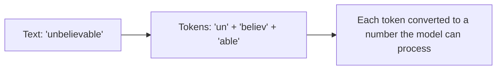
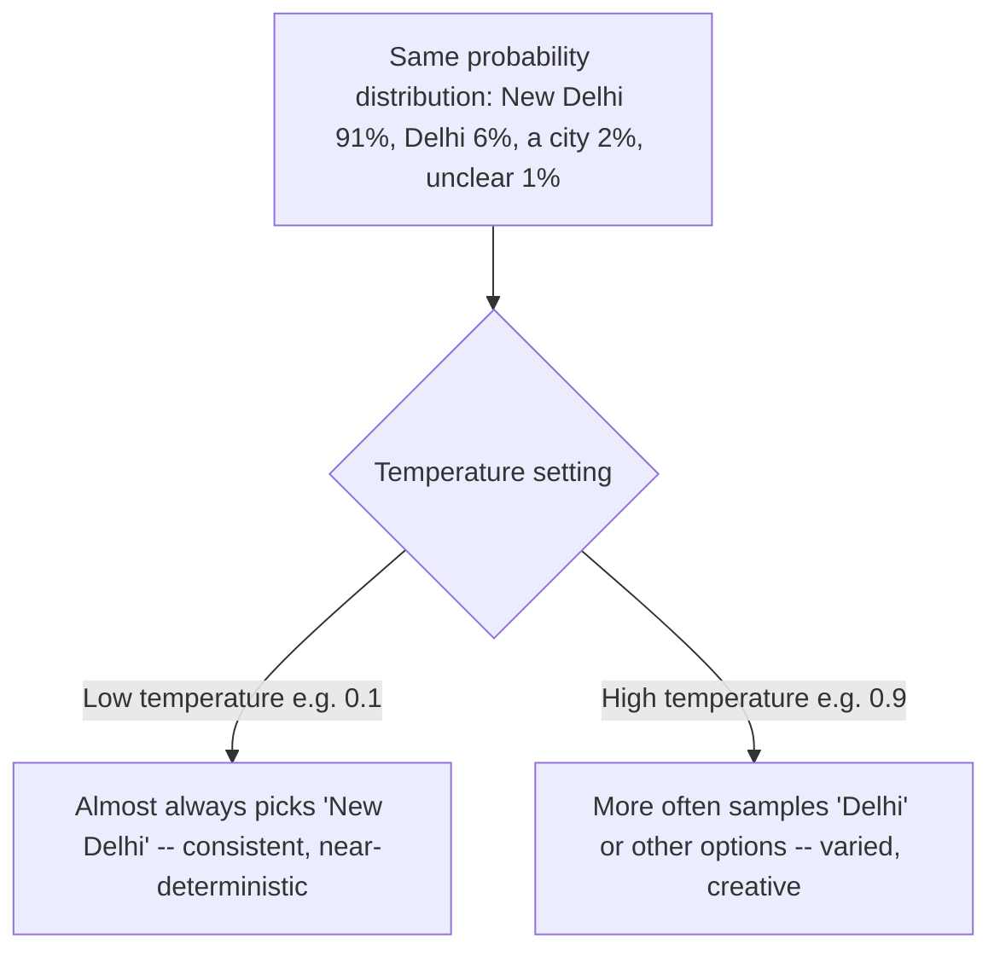

# Unit 3 — What AI Is — and Isn't
## Topic 2: How LLMs Work

*(Covers: How LLMs work — tokens, training, and inference · What parameters are and why they matter · Temperature and sampling — why the same question gives different answers)*

---

## 1. Learning Objectives

By the end of this topic, you will be able to:

1. **Explain** what a token is and why LLMs process text as tokens rather than whole words or sentences.
2. **Describe** the difference between training and inference in an LLM's lifecycle.
3. **Identify** what "parameters" are in a model, and explain why parameter count is often (but not always) linked to capability.
4. **Explain** how the temperature setting controls how predictable or varied an LLM's output is.
5. **Analyze** a given AI output to judge whether its variation is due to sampling behaviour or an actual error.
6. **Evaluate** when a low-temperature vs a high-temperature setting is the right choice for a real task.

---

## 2. Overview

In Unit 1, you learned that LLMs are probabilistic — they don't look up one fixed answer, they predict the most likely next piece of text. This topic goes one level deeper and explains the actual machinery behind that behaviour: **tokens** (how text is broken up), **training vs inference** (how a model learns, versus how it's used afterward), **parameters** (the model's internal "settings" learned during training), and **temperature** (the dial that controls how predictable or creative the output is).

Understanding this machinery is not optional trivia for an AI-Native Engineer — it directly shapes real decisions you will make when building AI-powered software. Should you set a low or high temperature for a customer-support bot? Why does a longer prompt cost more? Why can a model "run out of words" mid-answer? All of these questions have answers rooted in tokens, training, and parameters. This topic gives you the vocabulary and mental model to reason about LLM behaviour precisely — rather than treating the model as an unexplainable "black box" — which is essential once you start writing specifications (Unit 2) and evaluating AI reliability (Unit 7–8).

---

## 3. Description

### 3.1 Tokens, Training, and Inference

**Definition — Token:** A **token** is the small chunk of text an LLM actually reads and generates — it can be a whole short word (`cat`), part of a longer word (`under` + `stand` + `ing`), a punctuation mark, or even a piece of a number. LLMs do not see raw letters or whole sentences; they see a sequence of tokens, each represented internally as a number.

**Why tokens exist:** Breaking text into tokens (rather than whole words) lets a model handle any word it encounters — including misspellings, new slang, or words in other languages — by combining smaller known pieces, instead of needing a fixed dictionary of every possible whole word.

**Definition — Training:** **Training** is the (extremely expensive, one-time-per-model-version) process where an LLM reads enormous amounts of text and gradually adjusts its internal settings (parameters) so that it gets better and better at predicting the next token correctly. Think of training like a student going through years of schooling — a long, resource-intensive process that happens once, before the "final exam."

**Definition — Inference:** **Inference** is what happens every time *you* actually use the model — you send a prompt, and the already-trained model uses everything it learned during training to predict, token by token, the response. This is like the student, now fully educated, answering a question you ask them in an interview — fast, using knowledge already built up, without "re-studying" for your specific question.

| Aspect | Training | Inference |
|---|---|---|
| When it happens | Once (or occasionally, for a new model version) | Every single time you send a message |
| Cost | Extremely high (large-scale computing, huge datasets) | Much smaller per request, but adds up at scale |
| What changes | The model's internal parameters are adjusted | Nothing about the model changes — it just uses what it already learned |
| Analogy | A student studying for years | The same student answering your question in an interview |

> **Important Note:** When you chat with Claude, you are using **inference**. The model is not "learning" from your specific conversation in real time in the way training does — its underlying parameters do not change because you talked to it.

---

### 3.2 What Parameters Are and Why They Matter

**Definition:** **Parameters** are the internal numeric "settings" inside a neural network that were adjusted during training to capture patterns in the training data. You can loosely think of parameters as millions or billions of small dials, each nudged slightly during training until the model became good at predicting the next token.

**Why they matter:** Very roughly, more parameters give a model more "capacity" to capture subtle, complex patterns in language — which is part of why later, larger models tend to perform noticeably better on difficult reasoning, coding, and writing tasks than earlier, smaller ones. This is why you'll often hear model sizes described in **billions of parameters** in AI news and documentation.

**Important nuance (don't oversimplify):** Parameter count is **not the only thing that matters**. The quality and diversity of training data, the model's architecture (how the network's layers are designed), and additional training steps (like being taught to follow instructions safely and helpfully) all matter enormously too. A well-trained, well-designed smaller model can outperform a larger, poorly-trained one on real tasks. This is why, when comparing AI tools (a skill you'll practice in Unit 4), you should never judge a model purely by its parameter count.

**Analogy:** Think of parameters like the number of "trained muscle-memory patterns" a classically trained musician has built up after years of practice — more refined patterns generally mean more nuanced playing, but a musician with fewer, better-practised patterns can still outperform one with more, sloppier ones.

---

### 3.3 Temperature and Sampling

**Definition:** **Temperature** is a setting (usually a number, often between 0 and 1, sometimes higher) that controls how "adventurous" the model is allowed to be when it samples the next token from its probability distribution — the concept you first met in Unit 1.

Recall from Unit 1 that for any given prompt, the model calculates a likelihood for many possible next tokens (e.g., "New Delhi" — 91% likely, "Delhi" — 6% likely, and so on). **Temperature decides how strictly the model sticks to picking the highest-likelihood token versus occasionally choosing a lower-likelihood one.**

**Rules / properties:**

1. **Low temperature (closer to 0):** the model almost always picks the single most likely next token → output is more consistent, more predictable, closer to (but never perfectly) deterministic.
2. **High temperature (closer to 1 or above):** the model is more willing to pick lower-likelihood tokens → output is more varied, more "creative," but also more prone to going off-track.
3. Temperature does **not** change what the model "knows" — it only changes how it *samples* from what it already calculated. A fact-based question asked at high temperature can still get a correct answer, just possibly phrased differently each time, and at extreme settings, possibly with a higher chance of an error creeping in.

**Comparison Table — Low vs High Temperature**

| Aspect | Low Temperature | High Temperature |
|---|---|---|
| Predictability | High — near-deterministic | Low — output varies more between runs |
| Best suited for | Factual Q&A, code generation, data extraction, structured output | Creative writing, brainstorming, varied marketing copy |
| Risk | Can feel repetitive/rigid | Higher chance of odd or incorrect phrasing |

**Best Practices:**

- Use **low temperature** for tasks needing consistency and accuracy: extracting structured data, writing code, summarising a policy document.
- Use **higher temperature** for tasks that benefit from variety: brainstorming taglines, generating multiple story ideas, writing varied customer-message templates.
- Never rely on "temperature = 0" to mean *fully* deterministic in every system — extremely small computational differences can still occasionally produce tiny variations, even at the lowest setting.

**Common Beginner Mistakes:**

- Assuming a high-temperature "creative" answer that sounds different each time means the model is broken. It's working exactly as designed.
- Assuming temperature affects the model's *knowledge* — it does not; it only affects how the model chooses among what it already calculated as likely.
- Using a very high temperature for tasks like generating a bank statement summary, where consistency matters far more than creativity.

---

## 4. Real World Application

- **Coding Assistants:** Set to low temperature, so generated code is consistent and less likely to introduce unnecessary variation between attempts.
- **Marketing / Content Tools:** Set to higher temperature when generating multiple ad copy variants for A/B testing — variety is the goal.
- **Customer Support Chatbots (Banking/E-commerce):** Typically low-to-moderate temperature, balancing natural-sounding replies with consistent, on-policy answers.
- **Vernacular Translation Tools:** Usually low temperature, since translation accuracy and consistency matter more than stylistic variety.
- **Healthcare Documentation Assistants:** Very low temperature, since consistent, precise language matters enormously when summarising patient notes.
- **Token costs in production systems:** Understanding tokens directly explains why AI API pricing (which you'll study properly in Unit 12 and Unit 14) is based on the number of input and output tokens, not the number of "questions" or "words."

---

## 5. Worked Example

**Scenario:** You are building an AI feature for an Indian food-delivery app. Decide the right temperature setting for each feature, and justify.

| Feature | Recommended Temperature | Why? |
|---|---|---|
| Extracting the delivery address and pin code from a customer's free-text message | **Low** (e.g., 0.1–0.2) | Needs precise, consistent structured output — no room for "creative" variation. |
| Generating 5 different varieties of a "your order is delayed, sorry!" notification message for A/B testing | **High** (e.g., 0.7–0.9) | Variety across the 5 messages is the actual goal. |
| Answering "What is your refund policy?" using a fixed policy document (via RAG, Unit 14) | **Low-to-moderate** (e.g., 0.2–0.3) | Wording can vary slightly, but the factual policy content must stay accurate and consistent. |

**Reasoning process:** Ask — *does this task need the same answer every time (favour low temperature), or does it benefit from variety (favour high temperature)?* Then check — *is factual accuracy critical?* If yes, lean lower regardless of the first answer, since accuracy should never be sacrificed purely for variety.

---

## 6. Key Takeaways

- **Tokens** are the small text chunks (not whole words) that LLMs actually read and generate — this is why AI pricing and limits are measured in tokens.
- **Training** is the one-time (per model version), expensive process of learning patterns from data; **inference** is the fast, repeated process of using the already-trained model on your prompts.
- **Parameters** are the model's internal learned "settings" — more parameters generally mean more capacity for complex patterns, but data quality and architecture matter just as much.
- **Temperature** controls how strictly the model sticks to the most likely next token (low) versus how often it samples less-likely options (high).
- Low temperature → consistent, predictable output (good for facts, code, structured data). High temperature → varied, creative output (good for brainstorming, content variety).
- Temperature changes *how* the model samples, not *what* it knows.
- **Interview tip:** Being able to explain temperature using the "same probability distribution, different sampling strictness" framing (not just "temperature = randomness") shows real understanding.
- These concepts directly explain AI API cost and behaviour, which you will configure hands-on from Unit 12 onward.

---

## 7. Reference Links

- [Anthropic Documentation — Messages API and Parameters](https://docs.claude.com/) — official documentation on temperature and related settings.
- [Google Machine Learning Crash Course — Neural Networks](https://developers.google.com/machine-learning/crash-course) — background on parameters and model training.
- [GeeksforGeeks — Tokenization in NLP](https://www.geeksforgeeks.org/) — supplementary reading on tokenization.
