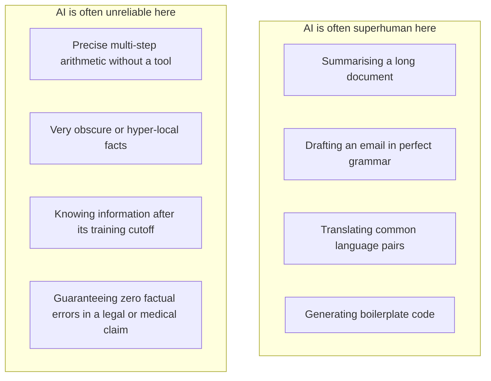
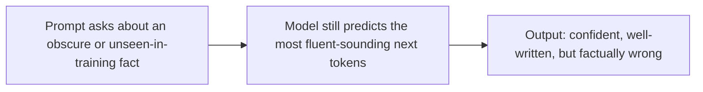

# Unit 3 — What AI Is — and Isn't
## Topic 3: AI in Context

*(Covers: AI in India today — healthcare, agriculture, vernacular translation · The jagged frontier — tasks AI is superhuman at vs tasks where it is unreliable · Hallucination — what it is and why it happens)*

---

## 1. Learning Objectives

By the end of this topic, you will be able to:

1. **Describe** real, current examples of AI being used in Indian healthcare, agriculture, and language translation.
2. **Explain** the concept of the "jagged frontier" — why AI can be superhuman at some tasks and unreliable at others that seem equally hard to a human.
3. **Identify** which category (reliable vs unreliable) a given task is likely to fall into, and justify the classification.
4. **Explain** what hallucination is and describe the mechanism that causes it.
5. **Analyze** a sample AI output to spot signs of possible hallucination.
6. **Evaluate** what oversight steps are needed before trusting AI output in a high-stakes, India-specific scenario.

---

## 2. Overview

So far you've learned what AI is, historically and mechanically. This topic grounds that knowledge in **where AI actually stands today, in 2026, especially in the Indian context** — and introduces two ideas that every AI-Native Engineer must internalise: the **jagged frontier** (AI's uneven skill profile) and **hallucination** (AI's tendency to state incorrect things confidently).

These two ideas are the practical heart of "AI implements, you specify and verify" — the professional discipline you'll formalise in Unit 2's 70/30 rule and apply throughout this program. If you assume AI is either "always right" or "always wrong," you will make poor engineering decisions. The real skill is knowing *where on the frontier* a given task sits, and knowing how to check for hallucination before trusting an output — especially in domains like healthcare or agriculture, where a wrong answer has real consequences for real people. This topic prepares you to make that judgment call, using real Indian use cases as grounding examples throughout.

---

## 3. Description

### 3.1 AI in India Today

**Definition:** This section looks at real, current applications of AI in India across three areas — healthcare, agriculture, and vernacular (regional language) translation — to ground the abstract concepts from earlier topics in tangible, local examples.

**Healthcare:** AI-based tools are being used to assist doctors in reading X-rays, CT scans, and retinal images to flag possible signs of disease (such as tuberculosis or diabetic retinopathy) faster, especially useful in areas with a shortage of specialist doctors. These systems output a **probability** (recall Unit 1) — e.g., "76% likelihood of an abnormality" — and are designed to support, not replace, a doctor's final decision.

**Agriculture:** Farmers can photograph a crop leaf using a basic smartphone, and an AI image model can identify likely pest or disease patterns and suggest next steps — something that would be impossible to encode as hand-written symbolic rules (Topic 1), since the visual variation across real crop diseases is far too large.

**Vernacular Translation:** India has 22 officially recognised languages and hundreds of dialects. LLM-based translation tools are dramatically improving access to information, government schemes, and education material in regional languages — for example, translating a government health advisory from English into Tamil, Bengali, or Marathi in a way that captures meaning and tone, not just word-for-word substitution.

> **Important Note:** In every one of these examples, the AI system is best understood as a fast, tireless *assistant that proposes*, while a qualified human remains responsible for the final decision — this is the core theme of Unit 9's Judgment Framework.

---

### 3.2 The Jagged Frontier

**Definition:** The **jagged frontier** describes the fact that AI capability is not evenly spread across all tasks of similar apparent difficulty — AI can be superhuman at some tasks (better and faster than almost any human) while being surprisingly unreliable at other tasks that seem, to a human, equally or even less difficult.

**Why this happens (in simple terms):** An LLM's skill on any given task depends heavily on how much relevant pattern it saw during training, and how well that task fits the "predict likely next token" mechanism. Tasks with huge amounts of high-quality training examples (e.g., summarising a long document, writing common code patterns, translating between major languages) tend to be handled extremely well. Tasks requiring precise, step-by-step exact calculation, very obscure or highly specialised local knowledge, or genuinely novel reasoning with no similar training pattern, tend to be far less reliable — even though a human might find these tasks comparably "easy" or "hard" to the first group.

**Rules / properties:**

1. The frontier is "jagged," not a smooth slope from easy to hard — a task's apparent human difficulty is a poor predictor of AI reliability on it.
2. The frontier also **shifts over time** as models improve — a task unreliable in one model generation can become reliable in the next. Reliability must be tested for the *specific model version* you are using, not assumed from general reputation.
3. Reliability also depends on **how the task is set up** — giving an AI system a calculator tool (Unit 4) or retrieved documents (RAG, Unit 14) can convert an "unreliable" task into a reliable one.

**Best Practices:**

- Before trusting AI output on any new task type, **test it deliberately** — don't assume reliability from a task's surface-level similarity to something AI does well.
- Pair AI with the right supporting tools (calculators, verified databases, retrieval systems) to shift unreliable tasks toward the reliable side of the frontier.

**Common Beginner Mistakes:**

- Assuming that because AI is excellent at one task (e.g., writing fluent English), it must also be excellent at a superficially similar task (e.g., stating exact, correct legal clauses from memory).
- Treating "the AI got this one right" as proof of general reliability for that task type — one correct answer is not evidence of consistent reliability; systematic evaluation (Unit 7–8) is needed.

---

### 3.3 Hallucination — What It Is and Why It Happens

**Definition:** **Hallucination** is when an AI model produces information that sounds fluent, confident, and plausible — but is factually incorrect, fabricated, or not actually supported by any real source.

**Why it happens:** Recall from Unit 1 and Topic 2 of this unit that an LLM generates text by predicting the statistically most likely next token, based on patterns learned during training — it does not have a built-in fact-checking mechanism or a live connection to "truth." If a prompt asks about something the model saw little or nothing about during training, or asks it to recall a very precise, obscure detail, the model can still confidently generate fluent, plausible-*sounding* text, because "sounding plausible" is exactly what it was trained to do well — even when the underlying facts are wrong.

**A simple analogy:** Imagine a very well-read, fluent student who is asked an exam question about a topic they never actually studied. Instead of saying "I don't know," they write a well-structured, confident-sounding answer using general patterns of what a "good answer" usually looks like — the writing sounds convincing, but the specific facts may be invented. That is very close to what hallucination looks like in an LLM.

**Rules / properties:**

1. Hallucination is not a "bug" that occasionally appears and can be permanently patched — it is a structural consequence of how LLMs generate text, and can happen with any model.
2. Hallucination risk is highest for: very specific facts, numbers/statistics, citations/references, recent events after a model's training cutoff, and highly niche or local knowledge.
3. Hallucination risk is reduced (not eliminated) by **grounding** the model in real retrieved data — this is exactly why RAG (Retrieval-Augmented Generation, Unit 4 and Unit 14) exists: it lets the model answer from actual retrieved documents instead of only from memory.

**Best Practices:**

- Always verify AI-generated facts, statistics, names, dates, and citations against a trusted source before using them in any real decision — especially in healthcare, legal, or financial contexts.
- Use RAG or tool-based verification (Unit 4, Unit 14) for any task where factual accuracy from a specific, current source matters.
- Ask the AI to cite where information came from, and treat unverifiable claims with extra caution.

**Common Beginner Mistakes:**

- Assuming a confident, well-written tone means the content is accurate — tone and accuracy are unrelated in LLM output.
- Using AI-generated statistics or citations directly in a report without independently verifying them.
- Assuming hallucination only happens with "weak" or "outdated" models — even the most advanced 2026-era models can hallucinate, especially on obscure or very recent information.

---

## 4. Real World Application

- **Healthcare (India):** An AI tool flags "82% probability of pulmonary abnormality" on a chest X-ray — reliable as a fast triage assistant, but final diagnosis must remain with a qualified radiologist, since a hallucinated or overconfident wrong call in healthcare has serious consequences.
- **Agriculture:** A crop-disease identification app is a strong (reliable-frontier) use case, but if it also tries to state exact expected yield-loss percentages for a hyper-local, rare pest, that specific number should be treated with caution and verified against agricultural extension advice.
- **Vernacular Translation / Government Services:** Translating a public health advisory is a strong use case; however, if the AI is asked to state a specific legal eligibility rule for a government scheme, this detail should be verified against the actual official document, since hallucinated eligibility criteria could mislead citizens.
- **Banking/FinTech:** An AI assistant summarising your last 10 UPI transactions in plain language is reliable; the same assistant inventing a specific RBI regulation clause from memory (rather than retrieving the real clause) is a hallucination risk.
- **Education:** An AI tutor explaining a concept in simple language is a strong use case; the same tutor citing a specific (possibly invented) textbook page number should be flagged and checked.

---

## 5. Worked Example

**Scenario:** A student is building an AI-powered assistant for a government "Kisan" (farmer) helpline app. Classify each requested feature by frontier reliability, and flag hallucination risk.

| Feature | Frontier Position | Hallucination Risk | Recommended Approach |
|---|---|---|---|
| Identify likely pest/disease from an uploaded leaf photo | Reliable (strong image pattern recognition) | Low-moderate | Use directly, but flag "AI-assisted, confirm with local expert if uncertain." |
| Explain in Hindi/Tamil what the identified pest generally does to the crop | Reliable (strong language + translation capability) | Low | Use directly. |
| State the exact current government subsidy amount (in ₹) for treating this pest this season | Unreliable if answered from memory | High — subsidy amounts change often and are highly specific | Must use RAG/retrieval from the actual current government notification, not model memory. |

**Reasoning process:** For each feature, ask *(1) is this the kind of task with huge amounts of matching training data (language, common patterns)? → likely reliable.* *(2) Does it require a precise, frequently changing, or highly specific fact? → high hallucination risk, needs grounding via retrieval or a verified database, not memory alone.*

---

## 6. Key Takeaways

- AI is already active across Indian healthcare, agriculture, and vernacular translation — usually as a fast assistant, not a final decision-maker.
- The **jagged frontier** means AI reliability does not follow human intuitions about "easy vs hard" — always test reliability for the specific task and model version.
- Task setup matters: pairing AI with tools or retrieved data can shift an unreliable task toward reliability.
- **Hallucination** is confident, fluent, but factually wrong output — a structural feature of how LLMs generate text, not an occasional bug.
- Hallucination risk is highest for precise facts, statistics, citations, recent events, and niche/local knowledge.
- **RAG** (retrieval-augmented generation) reduces hallucination by grounding answers in real retrieved documents — full detail in Unit 4 and Unit 14.
- **Interview tip:** Describing hallucination as "a natural consequence of next-token prediction without a built-in fact-checker" (rather than "a glitch") signals genuine understanding.
- Always verify AI-generated facts, numbers, and citations independently before using them in any real, especially high-stakes, decision.

---

## 7. Reference Links

- [Anthropic Documentation — Claude Overview](https://docs.claude.com/) — official documentation on model capabilities and limitations.
- [Google Machine Learning Crash Course](https://developers.google.com/machine-learning/crash-course) — background on model reliability and evaluation.
- [DeepLearning.AI — AI For Everyone](https://www.deeplearning.ai/) — accessible overview of real-world AI applications.
- [GeeksforGeeks — Hallucination in Large Language Models](https://www.geeksforgeeks.org/) — supplementary reading on hallucination mechanisms.
