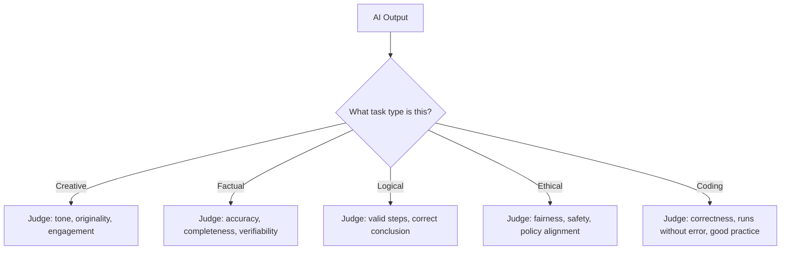

# Unit 3 — What AI Is — and Isn't
## Topic 4: Evaluating AI Output

*(Covers: How to evaluate AI output across five task types — creative, factual, logical, ethical, coding)*

---

## 1. Learning Objectives

By the end of this topic, you will be able to:

1. **Identify** which of the five task types (creative, factual, logical, ethical, coding) a given AI request falls into.
2. **Describe** the correct evaluation criteria for each of the five task types.
3. **Differentiate** between "sounds good" and "is actually correct" when judging AI output.
4. **Implement** a simple evaluation checklist for AI output appropriate to a given task type.
5. **Analyze** a sample AI response and identify specific strengths and weaknesses using the correct criteria for its task type.
6. **Evaluate** an AI-generated output and decide, with justification, whether it is acceptable to use as-is, needs editing, or must be rejected.

---

## 2. Overview

You now understand what AI is (Topic 1), how it works (Topic 2), and where its reliability is uneven (Topic 3). This topic gives you a **practical evaluation framework** — because "specify → build → verify" only works if you know *how* to verify. Different task types require completely different evaluation lenses. Judging a creative poem by "is it factually correct?" makes no sense; judging a factual answer by "is it beautifully written?" is dangerous. This topic teaches you to match the right evaluation lens to the right task type — a core, everyday skill for anyone specifying and overseeing AI-powered systems, and the direct precursor to the formal evaluation metrics (precision, recall, accuracy) you'll study mathematically in Unit 7 and Unit 8.

---

## 3. Description

### 3.1 The Five Task Types and Their Evaluation Lenses

**Definition:** AI tasks can be grouped into five broad types, each requiring a different evaluation approach:

| Task Type | What "Good" Means | Key Evaluation Questions |
|---|---|---|
| **Creative** (e.g., writing a poem, ad tagline, story) | Engaging, appropriate tone, original-feeling, fits the brief | Does it fit the requested style/tone? Is it engaging? Does it avoid clichés or plagiarism-like copying? |
| **Factual** (e.g., "what is the capital of Odisha?", summarising a document) | Accurate, verifiable, complete | Is every claim correct and checkable against a trusted source? Is anything important left out or added that wasn't in the source? |
| **Logical** (e.g., step-by-step reasoning, solving a puzzle, planning steps) | Valid reasoning, correct conclusion, no contradictions | Does each step logically follow from the last? Is the final conclusion actually correct, not just confidently stated? |
| **Ethical** (e.g., handling a sensitive customer complaint, deciding what to disclose) | Fair, safe, aligned with values/policy, avoids harm | Does it treat people fairly? Does it avoid bias, harm, or manipulation? Does it follow the relevant policy or law? |
| **Coding** (e.g., writing a function, fixing a bug) | Correct, runs without errors, follows good practice | Does it actually run and produce the expected output? Is it readable and reasonably efficient? Does it handle edge cases? |

**Why this framework exists:** A single, one-size-fits-all "is this good?" judgment fails because "good" means something fundamentally different depending on the task. A brilliantly written but factually wrong summary is a **failure** for a factual task, even though it might succeed as a creative-writing sample. This mismatch is one of the most common mistakes beginners make when evaluating AI output.

---

### 3.2 Evaluating Each Task Type — In Depth

**Creative tasks:** Because there is no single "correct" output, evaluation is about **fit to brief** rather than "right vs wrong." Ask: Does the tone match what was requested (formal/casual/festive)? Is it original, not a generic cliché? Does it stay within any given constraints (word limit, target audience, brand voice)?

**Factual tasks:** This is where **hallucination** (Topic 3) is the biggest risk. Every specific claim, number, name, or date should, in principle, be independently checkable against a trusted source. A factual answer that "sounds confident" is not evidence it is correct — confidence and correctness are unrelated in LLM output, as you learned in Topic 3.

**Logical tasks:** Evaluation here means tracing the reasoning **step by step**, not just checking the final answer. An AI can arrive at a correct final number through flawed reasoning (a "lucky guess"), or a wrong final number despite mostly sound steps. Both are red flags — you want *both* a correct conclusion *and* valid reasoning that supports it, especially since you may need to reuse or adapt that reasoning later.

**Ethical tasks:** This requires judgment about fairness, harm, and appropriateness — for example, does an AI-drafted customer response unfairly blame the customer? Does it disclose information it shouldn't? Ethical evaluation connects directly to the four pillars (fairness, transparency, accountability, harm prevention) you will study formally in Unit 5.

**Coding tasks:** "The code looks right" is not evaluation — code must actually be **run** and tested against expected inputs and outputs, including edge cases (a concept you'll practice hands-on from Unit 11 onward). Readability and good practice matter too, since code is read and maintained by humans, not just executed once.

**Best Practices:**

- Always identify the task type *before* judging output — this single habit prevents most beginner evaluation mistakes.
- For factual and coding tasks, verification against an external source or a test run is mandatory, not optional — "it sounds right" is never sufficient.
- For creative and ethical tasks, involve a human judgment call, since there is no single objectively "correct" answer to check against.

**Common Beginner Mistakes:**

- Judging a factual answer purely on how fluent and confident it sounds, rather than checking the actual facts.
- Accepting logically flawed reasoning because the final answer happened to be correct.
- Treating a "creative" brief as if it needed one single "correct" answer, and rejecting good, on-brief creative variety.
- Skipping actually running generated code, assuming it works because it reads cleanly.

---

## 4. Real World Application

- **Factual — Banking/FinTech:** An AI-generated monthly statement summary must be checked line-by-line against actual transaction records before being shown to a customer.
- **Creative — E-commerce:** AI-generated product descriptions for a Diwali sale are judged on festive tone and engagement, not on "one correct answer."
- **Logical — Railway Booking Systems:** An AI explaining why a waitlisted ticket has a given confirmation probability must show valid, traceable reasoning steps, not just state a number.
- **Ethical — Healthcare Chatbots:** An AI health assistant must be evaluated for whether it appropriately refuses to give a definitive diagnosis and instead safely refers the user to a doctor.
- **Coding — Any Software Team:** AI-generated code for a payment-processing feature must be run against test cases (including edge cases like ₹0 payment or a negative amount) before being trusted in production.

---

## 5. Worked Example

**Scenario:** An AI assistant for an Indian edtech app is asked to do four different things. Evaluate each using the correct lens.

| Request | Task Type | Evaluation Focus | Sample Verdict |
|---|---|---|---|
| "Write a motivational message for students before their board exams" | Creative | Tone, engagement, appropriateness for teenagers | Accept if tone fits; minor edits for local relevance are fine. |
| "List the number of states and union territories in India" | Factual | Accuracy — verify against an official/current source | Must be checked against the current official count before publishing; do not trust from memory alone. |
| "Explain step-by-step why a student's average will decrease if they score below their current average in the next test" | Logical | Trace each reasoning step, confirm the math itself is correct | Verify the arithmetic explicitly; check no step skips a logical justification. |
| "Write Python code to calculate a student's average from a list of marks" | Coding | Actually run the code with sample marks and check the result | Test with a sample list including edge cases like an empty list, before accepting. |

**Reasoning process:** For each request — *(1) name the task type, (2) apply only that type's evaluation lens, (3) decide accept / edit / reject with a specific reason, not a vague impression.*

---

## 6. Key Takeaways

- AI tasks fall into five broad types — **creative, factual, logical, ethical, coding** — each needing a different evaluation lens.
- Creative tasks: judge fit-to-brief, tone, and originality — there is no single "correct" answer.
- Factual tasks: verify every specific claim against a trusted source — confidence is not evidence of correctness (Topic 3, hallucination).
- Logical tasks: check the reasoning steps, not just the final answer — a correct answer can hide flawed reasoning.
- Ethical tasks: judge fairness, safety, and policy alignment — connects directly to Unit 5's four pillars.
- Coding tasks: always actually run the code against test inputs, including edge cases — never accept code purely because it "looks right."
- **Interview tip:** Naming the task type explicitly before evaluating ("this is a factual task, so I need to verify X") demonstrates structured, professional judgment.
- This five-type framework is the everyday, practical version of the formal evaluation metrics (accuracy, precision, recall, F1) you will study mathematically starting in Unit 7.

---

## 7. Reference Links

- [Anthropic Documentation — Claude Overview](https://docs.claude.com/) — official documentation on model capabilities across task types.
- [Google Machine Learning Crash Course](https://developers.google.com/machine-learning/crash-course) — background on evaluating model output.
- [DeepLearning.AI — AI For Everyone](https://www.deeplearning.ai/) — accessible framing of AI strengths and limitations by task type.
