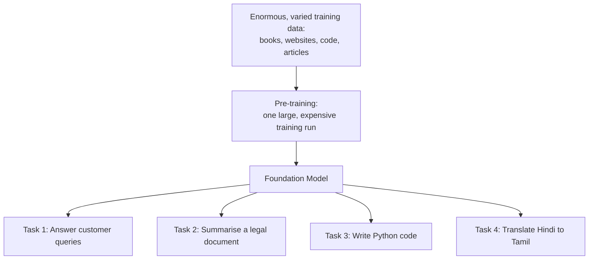

# Unit 4 — The 2026 AI Stack
## Topic 1: Foundation Models and Adaptation

*(Covers: Foundation models — trained once at scale, usable for many tasks · Fine-tuning — adapting a foundation model on domain-specific data)*

---

## 1. Learning Objectives

By the end of this topic, you will be able to:

1. **Explain** what a foundation model is and why it is called "foundation."
2. **Describe** how one foundation model can be reused across many different tasks without being rebuilt from scratch.
3. **Differentiate** between using a foundation model as-is and fine-tuning it.
4. **Identify** when a business problem calls for fine-tuning versus simply prompting a foundation model well.
5. **Evaluate** the cost and effort trade-offs between prompting, fine-tuning, and training a model from scratch.

---

## 2. Overview

Imagine if, every time a company wanted to build a new AI feature — say, a customer-support chatbot, a resume screener, and a language translator — it had to build three completely separate AI systems from zero, each needing months of data collection and training. That used to be closer to reality in the early days of AI. Today it isn't, because of **foundation models**.

A foundation model is a large AI model trained once, on a massive and varied amount of data, so that it can then be reused, with little or no extra training, for many different downstream tasks. Claude, the AI assistant used throughout this program, is a foundation model. So are the models behind tools like ChatGPT and Gemini.

This matters enormously for you as a future AI-Native Engineer, because in the real world, you will almost never train a model from scratch. Instead, your job will be to take an existing foundation model and **adapt** it to your company's specific problem — either by writing a good prompt (Week 13), by giving it relevant documents at query time through RAG (later in this topic and in Week 14), or, in some cases, by fine-tuning it on your own data. Understanding what a foundation model actually is — and the different ways to adapt one — is the entry point into the modern AI stack that this whole week is about.

---

## 3. Description

### 3.1 Foundation Models — Trained Once at Scale, Usable for Many Tasks

**Definition:** A **foundation model** is a large AI model trained on a huge, broad dataset (text, and often images, code, and more) using massive computing power, so that it develops a general understanding of language, reasoning, and the world — an understanding broad enough to be *adapted* to many different specific tasks, instead of being built for only one.

**Why this concept exists:** Before foundation models, most AI systems were **narrow** — trained for exactly one task, on exactly one type of labelled data. A spam classifier could only classify spam. A translation model could only translate. If you wanted five different AI tasks, you needed five separately trained systems, each requiring its own large labelled dataset (expensive and slow to build). Foundation models solve this by learning broad, general-purpose patterns of language and reasoning from enormous amounts of general text — and that general understanding turns out to transfer remarkably well to many specific tasks afterwards, with only light additional guidance.

**Key Terminology:**

| Term | Simple Meaning |
|---|---|
| **Foundation model** | A large, general-purpose AI model trained once on broad data, meant to be reused/adapted for many tasks. |
| **Pre-training** | The single, very expensive, large-scale training process a foundation model goes through once, before it is released. |
| **Downstream task** | Any specific job (translation, summarisation, customer support, coding help) that you point the foundation model at *after* it has already been pre-trained. |
| **General-purpose** | Capable of handling many different kinds of tasks reasonably well, rather than being built for one narrow job. |

**How it works, in plain language:** During pre-training, a foundation model is shown enormous amounts of text (and sometimes other data) and learns to predict what comes next, over and over, billions of times. This sounds like a very narrow exercise, but to get good at "predicting the next word" across every domain — legal writing, Python code, poetry, customer support chats, scientific papers — the model is forced to develop a broad internal understanding of grammar, facts, reasoning patterns, and even some world knowledge. That broad understanding is *the* foundation that gets reused afterwards.

**Important Note:** "Trained once" does not mean "trained forever unchanged." Model providers do release newer versions over time (for example, improved Claude model versions), but the key idea for this topic is: within its lifetime, *one* trained foundation model serves *many* different downstream uses, without needing a full retrain for each new use case.

---

### 3.2 Fine-Tuning — Adapting a Foundation Model on Domain-Specific Data

**Definition:** **Fine-tuning** is the process of taking an already-trained foundation model and further training it — usually briefly, on a much smaller, specific dataset — so it becomes noticeably better at one particular task or domain.

**Why this exists:** A general foundation model is good at many things reasonably well, but sometimes a business needs a model to be excellent at one very specific, narrow thing — for example, understanding a hospital's particular medical shorthand, or replying in a company's exact brand voice, or classifying support tickets into a company's own 40 specific categories. Fine-tuning lets you specialise a general foundation model toward that narrow need, without starting its training from zero.

**Everyday analogy:** Think of a foundation model like a bright engineering graduate who has a strong, broad base of knowledge — mathematics, physics, some programming, general problem-solving. That graduate is hired by a specific company (say, a railway signalling company) and given two weeks of focused, on-the-job training on that company's specific systems and processes. The graduate doesn't forget their broad education — they simply add a focused specialisation on top of it. That two-week specialisation is like fine-tuning; the engineering degree is like pre-training the foundation model.

**Comparison Table — Ways to Adapt a Foundation Model**

| Approach | What You Do | When to Use It | Effort / Cost |
|---|---|---|---|
| **Prompting only** | Write a clear, well-specified instruction/prompt (Week 2, Week 13) | Most day-to-day tasks; the model already "knows" enough | Lowest — minutes |
| **RAG (Retrieval-Augmented Generation)** | Feed the model relevant documents/data at query time (see Topic 2 below, and Week 14) | The model needs facts it wasn't trained on, or facts that change often | Low-to-medium — needs a document/knowledge setup |
| **Fine-tuning** | Retrain the model briefly on your own labelled examples | The model needs a genuinely different *style*, *format*, or *specialised skill* that prompting/RAG can't achieve well | Medium-to-high — needs quality training data and evaluation |
| **Training from scratch** | Build and pre-train an entirely new foundation model | Almost never done by individual companies — reserved for AI labs like Anthropic | Extremely high — massive data and compute |

**Best Practices:**

- Always try prompting first (it's the cheapest and fastest) — many teams fine-tune when a better-written prompt would have solved the problem.
- Use RAG when the issue is *missing or changing facts* (e.g., today's loan interest rates), not when the issue is *tone or format*.
- Reserve fine-tuning for cases with a clear, measurable gap that prompting and RAG genuinely cannot close.

**Common Mistakes:**

- Assuming fine-tuning is always "the advanced, better option" — it is often unnecessary and more expensive than simply writing a better specification/prompt.
- Fine-tuning on too little or low-quality data, which can make the model *worse*, not better.
- Forgetting that fine-tuning does not give the model new *facts* reliably — RAG is the better tool for injecting fresh, specific factual knowledge.

---

## 4. Real World Application

- **Banking/FinTech:** A bank uses the same foundation model (via prompting) to draft loan-rejection letters, summarise customer complaints, and detect suspicious transaction descriptions — three different tasks, one foundation model, no retraining needed.
- **Healthcare:** A hospital fine-tunes a foundation model on thousands of anonymised, doctor-approved discharge summaries so it learns the hospital's specific documentation style and terminology.
- **E-commerce:** An online marketplace uses RAG (not fine-tuning) to let its shopping assistant answer questions about *today's* stock and prices, which change constantly — fine-tuning would go stale within days.
- **Education:** An ed-tech platform fine-tunes a foundation model on a large set of NCERT-aligned question-answer pairs so it explains concepts using the exact vocabulary and difficulty level of the Indian school curriculum.
- **Vernacular AI:** A government helpline fine-tunes a foundation model on transcripts of past citizen queries in Tamil and Kannada, improving its accuracy on regional phrasing that the general foundation model handles only reasonably well out of the box.

---

## 5. Worked Example

**Scenario:** A food-delivery startup wants an AI feature that (a) answers "Where is my order?" and (b) writes replies in the brand's specific casual, Hinglish-friendly tone used in all their app notifications.

**Step-by-step decision walkthrough:**

1. **Where is my order?** → This needs *live, factual, changing data* (today's specific order status). **Decision: use RAG** — retrieve the live order status from the database and hand it to the model to phrase into a reply.
2. **Brand-specific casual, Hinglish tone** → This is a *consistent style requirement* across thousands of replies. First attempt: **write a strong system prompt** (Week 13) with 4–5 example replies in the desired tone (few-shot examples). If, after real testing, replies still don't consistently match the brand voice even with a well-written prompt → **consider fine-tuning** on a dataset of 500+ approved example replies in that tone.
3. **Final architecture:** One foundation model (e.g., Claude) + RAG for live order facts + a well-engineered system prompt (and, only if truly needed, a lightly fine-tuned variant for tone) = a working, adaptable AI feature — no training from scratch required.

This mirrors how real AI-native teams reason: start with prompting, add RAG for facts, and reserve fine-tuning as a last, carefully justified step.

---

## 6. Key Takeaways

- A **foundation model** is trained once, at scale, on broad data, and reused across many different downstream tasks.
- Foundation models replaced the older approach of building a separate narrow AI model for every single task.
- **Fine-tuning** further trains an existing foundation model on a smaller, specific dataset to specialise it for one domain or style.
- Adaptation options, cheapest to most expensive: **prompting → RAG → fine-tuning → training from scratch.**
- Use RAG for facts that are missing or change often; use fine-tuning for style/format/specialised skills that prompting can't fix.
- Training a foundation model from scratch is reserved almost exclusively for major AI labs — not something individual companies typically do.
- **Interview tip:** Be ready to explain *why* fine-tuning is not the default answer to "how do I make the AI better at X" — most real problems are solved by better prompting or RAG first.

---

## 7. Reference Links

- [Anthropic Documentation](https://docs.claude.com/) — official documentation on Claude, a real-world foundation model.
- [Google Machine Learning Crash Course — Foundation Models Overview](https://developers.google.com/machine-learning/crash-course) — beginner-friendly grounding in large-scale model training.
- [DeepLearning.AI — Short Courses on Fine-Tuning](https://www.deeplearning.ai/short-courses/) — practical, beginner-accessible coverage of adaptation techniques.
