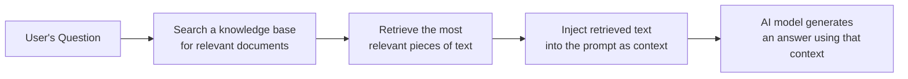
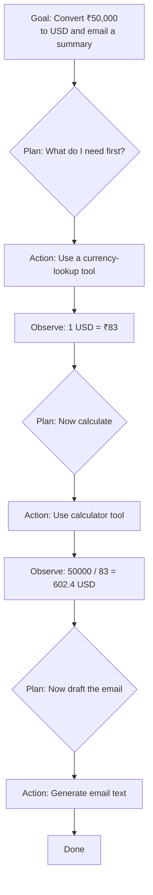

# Unit 4 — The 2026 AI Stack
## Topic 2: Retrieval, Agents and Tools

*(Covers: Retrieval-Augmented Generation (RAG) — giving AI access to external knowledge at query time · Agents — LLM plus memory, tools, and a planning loop (conceptual introduction) · Tool use — AI calling search, calculator, and code runner)*

---

## 1. Learning Objectives

By the end of this topic, you will be able to:

1. **Explain** why a foundation model, by itself, cannot know facts that happened after its training or facts specific to one company.
2. **Describe** how Retrieval-Augmented Generation (RAG) solves this by fetching relevant information at query time.
3. **Identify** the basic building blocks of an AI agent — memory, tools, and a planning loop.
4. **Differentiate** between a plain AI chat response and an AI system that uses external tools.
5. **Analyze** a simple task and decide whether it needs plain prompting, RAG, or agent-style tool use.

---

## 2. Overview

A foundation model (Topic 1) is trained once and then frozen — it does not automatically learn about events, documents, or numbers that appear *after* its training, or that are private to your company (like your organisation's HR policy or today's exact stock price). Left on its own, it can only answer from what it "remembers" from training, which can lead to outdated or invented answers.

This topic introduces two of the most important ideas in the modern AI stack that solve this limitation: **Retrieval-Augmented Generation (RAG)**, which lets an AI system look up real, current information before answering, and **agents**, AI systems that can go a step further and take actions — searching, calculating, running code — rather than only generating text. We introduce both conceptually here; you will build a real, working RAG pipeline and agent-style workflow with actual Python code later, in Week 14. For now, your job is to understand *what problem* each of these solves and *how* they fit together, because this understanding shapes every architectural decision you will make as an AI-Native Engineer — including when *not* to use them (covered further in Week 14).

---

## 3. Description

### 3.1 Retrieval-Augmented Generation (RAG)

**Definition:** **RAG** is a technique where, before the AI model generates its answer, the system first **retrieves** relevant information from an external source (documents, a database, the internet) and gives that information to the model as extra context — so the model answers based on real, current evidence instead of only its trained memory.

**Why this exists:** Imagine asking a very well-read friend, who hasn't read today's newspaper, "What's the weather like in Chennai right now?" No matter how well-read they are, they simply don't have that information — it didn't exist when they last "studied." But if you first hand them today's weather report and then ask the question, they can answer accurately. RAG does exactly this for AI: it hands the model the "today's newspaper" (the relevant document or data) right before asking the question.

**The RAG pipeline, step by step:**

**Key Terminology:**

| Term | Simple Meaning |
|---|---|
| **Retrieval** | The step of searching a knowledge base and pulling out the most relevant pieces of information for a given question. |
| **Knowledge base** | The collection of documents, FAQs, or records the system searches over (e.g., a company's policy PDFs). |
| **Context injection** | Adding the retrieved information directly into the prompt sent to the AI model. |
| **Grounding** | Making sure the AI's answer is based on ("grounded in") real retrieved evidence, rather than only its trained memory. |

**Everyday example:** A railway enquiry chatbot is asked, "Is train 12622 running on time today?" A foundation model alone cannot know this — train status changes every day. With RAG, the system first retrieves today's live train-status data, then hands that to the model, which replies accurately: "Train 12622 is running 15 minutes late today."

> **Important Note:** RAG does not change what the model "knows" permanently — it simply gives the model temporary, relevant facts for one specific answer. This is very different from fine-tuning (Topic 1), which permanently changes the model's behaviour.

---

### 3.2 Agents — LLM Plus Memory, Tools, and a Planning Loop (Conceptual Introduction)

**Definition:** An **AI agent** is an AI system built around a foundation model that can do more than just answer in text — it can **remember** context across steps, **use tools** (like a calculator, a search engine, or a code runner), and follow a **planning loop** where it decides what to do next, takes an action, observes the result, and decides again — repeating until the task is done.

**Why this exists:** A plain chatbot only produces one response and stops. But many real tasks need multiple steps: "Find out today's USD-to-INR exchange rate, then calculate how much ₹50,000 is worth in dollars, then draft an email summarising this for my manager." A single text response cannot look up a live exchange rate or reliably do multiplication — the system needs to *act* (look something up, calculate), not just *write*.

**The three building blocks of an agent:**

| Building Block | Simple Meaning |
|---|---|
| **Memory** | The agent keeps track of what has already happened in the task so far — earlier steps, results, and the overall goal. |
| **Tools** | External abilities the agent can call on, such as a web search, a calculator, a code runner, or a database lookup — instead of relying only on its own "guessed" text. |
| **Planning loop** | The repeating cycle of: decide what to do next → take that action → observe the result → decide again — until the task is complete. |

We only introduce agents conceptually here — you will build a working agent-style flow with real code, and learn the **ReAct pattern** (Reason → Act → Observe → Repeat) in full technical depth, in **Week 14**.

---

### 3.3 Tool Use — AI Calling Search, Calculator, and Code Runner

**Definition:** **Tool use** is the specific ability of an AI system to call an external program or function — such as a web search, a calculator, or a code execution environment — to get a reliable result, instead of generating that result purely from its own trained "guessing."

**Why this exists:** Recall from Unit 1 that LLMs are **probabilistic** — they predict likely text, token by token. This makes them excellent at language, but unreliable at things that need an exact, guaranteed answer, like arithmetic (`347 × 289`) or knowing today's date. Tool use fixes this specific weakness: instead of asking the probabilistic model to "guess" the multiplication result as text, the system hands the calculation to an actual, deterministic calculator tool (recall **Unit 1's deterministic vs probabilistic** distinction) and simply reports the guaranteed-correct result back.

**Common tools an AI system may call:**

- **Search tool** — looks up current information from the web or a company database (this overlaps with RAG's retrieval step).
- **Calculator tool** — performs exact arithmetic, guaranteed to be correct, unlike the model's own text-based guess.
- **Code runner** — executes a small piece of code (e.g., Python) to solve a precise, logic-heavy problem and returns the exact output.

**Comparison Table — Plain LLM Response vs Tool-Using AI System**

| Aspect | Plain LLM Text Response | AI System With Tool Use |
|---|---|---|
| Doing arithmetic | May guess, sometimes incorrectly | Delegates to a real calculator — always correct |
| Finding today's information | Cannot know it (frozen at training time) | Uses a search/retrieval tool to fetch it live |
| Running exact logic (e.g., sorting a list) | May describe it in words, imperfectly | Runs real code and returns the exact result |
| Reliability for precise tasks | Lower | Much higher — because the "hard" part is deterministic |

**Best Practices:**

- Never trust an LLM's own arithmetic for anything that matters (money, medicine dosages, engineering calculations) — always route it through a calculator/code tool.
- Use tool use specifically for tasks that have one guaranteed correct answer; keep plain generation for open-ended, creative, or conversational tasks.

**Common Mistakes:**

- Assuming "the AI can just calculate it" without realising the model is predicting text, not running real arithmetic, unless a tool is explicitly wired in.
- Confusing "tool use" with "agent" — tool use is *one ingredient* of an agent; an agent additionally needs memory and a planning loop to decide *when* and *how* to use tools across multiple steps.

---

## 4. Real World Application

- **RAG — Healthcare:** A hospital's internal assistant retrieves the latest treatment guideline PDF before answering a doctor's question, ensuring the answer reflects current protocol, not outdated training data.
- **RAG — Vernacular translation/support:** A citizen-services chatbot retrieves the exact government scheme document in the citizen's regional language before answering eligibility questions.
- **Agents — Banking:** A fraud-review agent checks a flagged transaction, looks up the customer's recent transaction history (tool use), cross-checks a risk-scoring rule (another tool), and drafts a case summary for a human analyst to approve (recall: **agents should not have the final word on high-stakes actions** — this connects to Week 9's Judgment Framework).
- **Tool use — E-commerce:** A shopping assistant uses a calculator tool to correctly compute a discount ("20% off ₹2,499") rather than risking an LLM arithmetic slip.
- **Tool use — Education:** A tutoring copilot uses a code-runner tool to actually execute a student's Python code and show the real output, rather than guessing what the code would print.

---

## 5. Worked Example

**Scenario:** Design (conceptually — no code yet) an AI system for an Indian railway enquiry app that must answer: *"Is train 12622 delayed today, and if so, by how much time will I miss my connecting train 16031, which departs at 18:40?"*

**Step-by-step reasoning:**

1. **Does this need RAG?** Yes — "Is train 12622 delayed today" needs live, current data the foundation model cannot know on its own. → Retrieve today's live status for train 12622.
2. **Does this need a tool?** Yes — calculating "how much time will I miss my connection" requires exact arithmetic (comparing today's expected arrival time to 18:40). → Use a calculator tool, not the model's own guess.
3. **Does this need agent-style planning?** Yes — this is a multi-step task: (a) retrieve delay data, (b) calculate the time difference, (c) compose a clear, human-readable answer. A single-shot plain response cannot reliably do all three steps at once.
4. **Final design:** An **agent** that uses **RAG** (to retrieve live train status) and a **calculator tool** (to compute the time gap), following a **planning loop**, before generating the final natural-language reply to the passenger.

This worked example shows how the three ideas in this topic — RAG, agents, and tool use — combine in a single realistic system, exactly the kind of architecture decision you will practise fully in Week 14.

---

## 6. Key Takeaways

- **RAG** retrieves relevant, current information at query time and hands it to the model as context — solving the "frozen knowledge" limitation of foundation models.
- RAG is **temporary grounding for one answer**, unlike fine-tuning, which permanently changes the model.
- An **agent** = an LLM + memory + tools + a planning loop that repeats: decide → act → observe → decide again.
- **Tool use** lets an AI system delegate precise, deterministic tasks (arithmetic, code execution, live lookups) to real tools instead of relying on the model's own probabilistic guessing.
- Tool use is one *ingredient* of an agent — not the same thing as a full agent.
- Never trust an LLM's raw arithmetic for anything consequential — always route exact calculations through a calculator or code tool.
- Full working RAG pipelines, the ReAct pattern, and real agent code arrive in **Week 14** — this topic gives you the conceptual foundation first.
- **Interview tip:** Be ready to explain, in one sentence each, the difference between RAG, fine-tuning, and an agent — interviewers frequently test this distinction.

---

## 7. Reference Links

- [Anthropic Documentation — Tool Use and Agents](https://docs.claude.com/) — official documentation on Claude's tool-use and agent capabilities.
- [Google Machine Learning Crash Course](https://developers.google.com/machine-learning/crash-course) — foundational grounding in retrieval-based systems.
- [DeepLearning.AI — Short Courses on RAG and AI Agents](https://www.deeplearning.ai/short-courses/) — beginner-accessible, practical coverage of these exact concepts.
