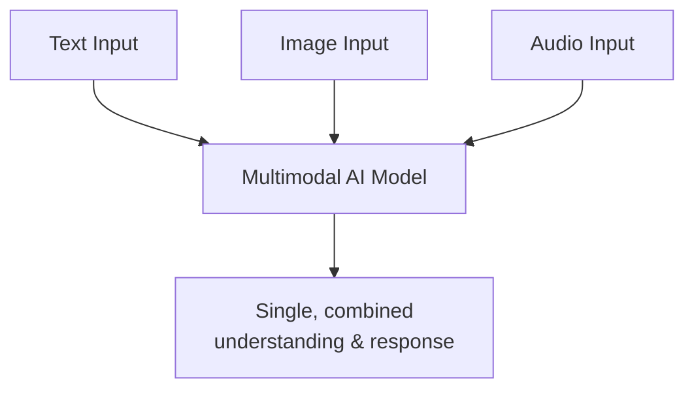

# Unit 4 — The 2026 AI Stack
## Topic 3: Multimodal AI

*(Covers: Multimodal AI — working with text, image, audio, and video in one system)*

---

## 1. Learning Objectives

By the end of this topic, you will be able to:

1. **Explain** what "multimodal" means in the context of AI systems.
2. **Describe** how a multimodal AI model processes more than one type of input (text, image, audio, video) at once.
3. **Identify** real-world tasks that genuinely require multimodal AI versus tasks that only need text.
4. **Evaluate** the benefits and current limitations of multimodal AI systems.

---

## 2. Overview

So far, this program has mostly discussed AI working with text: questions in, answers out. But a huge and growing part of the 2026 AI landscape involves AI systems that can understand and work with **multiple types of information at once** — reading a photo, listening to an audio clip, watching a short video, and reasoning about all of them together, sometimes alongside text. This capability is called **multimodal AI**.

Understanding multimodal AI matters because real-world problems rarely show up as neat, isolated text. A doctor's diagnosis depends on a scan image *and* a written report. A customer complaint might come with a photo of a damaged product *and* a text description. As an AI-Native Engineer, you need to recognise when a task genuinely needs multimodal capability (so you choose the right kind of AI model and design your system correctly) versus when plain text is enough — using a multimodal model unnecessarily adds cost and complexity without adding value.

---

## 3. Description

### 3.1 What Is Multimodal AI?

**Definition:** A **modality** is simply a *type* or *format* of information — text is one modality, an image is another, audio is another, video is another. A **multimodal AI system** is one that can accept, understand, and reason across more than one of these modalities, often at the same time, within a single request.

**Why this concept exists:** Earlier AI systems were typically **unimodal** — a model built only for text, or only for images, kept as entirely separate systems that couldn't be combined easily. But most real information in the world is naturally mixed: a WhatsApp message might include a photo *and* a caption; a lecture video has speech *and* on-screen text *and* visuals. Multimodal AI was developed so a single model could understand this combined, real-world information the way a human naturally does — by looking, listening, and reading together.

**Key Terminology:**

| Term | Simple Meaning |
|---|---|
| **Modality** | A type/format of information: text, image, audio, or video. |
| **Multimodal model** | An AI model that can process and reason across more than one modality. |
| **Unimodal model** | An AI model built to handle only one modality (e.g., text-only). |
| **Cross-modal reasoning** | Combining understanding from two or more modalities to answer a single question (e.g., "Does this photo match what the text description says?"). |

**Everyday analogy:** Think about how a human doctor examines a patient. They read the patient's written history (text), look at an X-ray (image), and listen to the patient describe their symptoms (audio/speech) — and combine all three to reach one diagnosis. A multimodal AI system aims to do something similar: combine multiple "senses" of information into one coherent understanding, rather than processing each separately and disconnectedly.

**Important Note:** Multimodal does not mean the AI has human-like senses — it means the model has been trained to convert different types of input (pixels in an image, sound waves in audio) into a shared internal representation it can reason about, alongside text, using patterns learned from large multimodal training data.

---

### 3.2 When Multimodal AI Genuinely Helps — and When It Doesn't

**Rules of thumb:**

1. If the task's core information is naturally split across more than one modality (e.g., "does this product photo match the complaint description"), multimodal AI adds real value.
2. If the task's information is fully captured in text alone (e.g., "summarise this policy document"), adding image/audio capability adds cost and complexity with no benefit.
3. Multimodal systems are generally **more expensive and slower** per request than text-only ones — so the decision should be justified by genuine task need, not novelty.

**Comparison Table — Unimodal vs Multimodal AI**

| Aspect | Unimodal (Text-Only) AI | Multimodal AI |
|---|---|---|
| Input types | Text only | Text, image, audio, video (in combination) |
| Example task | Summarise a written complaint | Check if an uploaded photo matches a written complaint |
| Cost/latency | Lower | Generally higher |
| When to choose | Task is purely language-based | Task genuinely needs more than one type of information together |

**Common Mistakes:**

- Using a multimodal model "because it sounds more advanced," when the task is actually purely textual.
- Assuming a multimodal model can perfectly interpret every image or audio clip with 100% accuracy — like all AI capabilities, this is a **jagged frontier** (a concept from Week 3): strong in some visual/audio tasks, weaker in others (e.g., reading very poor-quality handwriting, or understanding heavy background noise in audio).

---

## 4. Real World Application

- **Healthcare:** A multimodal AI system reviews a written symptom description *together with* an uploaded skin-condition photo to support (never replace — recall Week 9's Judgment Framework) a doctor's assessment.
- **E-commerce:** A returns-processing system checks a customer's uploaded photo of a damaged item *against* their written complaint, flagging mismatches for human review.
- **Education:** A multimodal tutoring app lets a student photograph a handwritten maths problem and speak their question aloud, and the AI reads the handwriting *and* listens to the spoken question together.
- **Agriculture (Indian context):** A farmer-advisory app lets farmers upload a photo of a diseased crop leaf along with a voice note describing the symptoms in their local language, and the multimodal system combines both to suggest likely causes.
- **Media/Content Moderation:** A social media platform's moderation system checks video content, its audio track, and its caption text together to detect policy violations that wouldn't be obvious from text alone.

---

## 5. Worked Example

**Scenario:** An Indian agri-tech startup wants to build a "Crop Doctor" feature. A farmer sends: (1) a photo of a wilting plant leaf, and (2) a voice note in Telugu saying "The leaves have started turning yellow since last week, and it rained heavily before that."

**Step-by-step reasoning:**

1. **Identify the modalities involved:** an image (leaf photo) and audio (voice note in Telugu) — two different modalities, both relevant to the diagnosis.
2. **Decide if multimodal AI is genuinely needed:** Yes — the yellowing pattern in the photo alone might match several possible issues (nutrient deficiency, fungal infection, overwatering); the voice note's detail about "heavy rain before yellowing" is a critical clue that narrows the diagnosis. Neither modality alone gives the full picture.
3. **System design (conceptual):** The audio is first converted to text (transcription) and translated if needed; the multimodal model reasons over the image and the transcribed text *together*, producing a combined likely-cause suggestion (e.g., "possible fungal infection due to waterlogging").
4. **Human oversight check (tying back to Week 9):** Because a wrong diagnosis could cost a farmer their harvest, the system should present this as a **suggestion for a human agricultural expert to confirm**, not a final, unquestionable answer.

---

## 6. Key Takeaways

- **Multimodal AI** understands and reasons across more than one type of input — text, image, audio, video — often combined in a single request.
- A **modality** is simply a type/format of information; **unimodal** models handle only one, **multimodal** models handle several together.
- Multimodal AI adds genuine value when the task's information is naturally split across modalities; it adds unnecessary cost when the task is purely text-based.
- Multimodal AI has a **jagged frontier** too — strong in many cases, unreliable in others (poor image quality, noisy audio) — so human oversight still matters for high-stakes decisions.
- Real Indian-context use cases include agri-diagnosis, vernacular voice+image support, and healthcare triage support.
- **Interview tip:** Be ready to justify, for a given task, *why* multimodal AI is or isn't the right architectural choice — this is a common systems-design interview question.

---

## 7. Reference Links

- [Anthropic Documentation — Vision and Multimodal Capabilities](https://docs.claude.com/) — official documentation on Claude's multimodal capabilities.
- [Google Machine Learning Crash Course](https://developers.google.com/machine-learning/crash-course) — general grounding in modern AI model capabilities.
- [DeepLearning.AI — Short Courses on Multimodal Models](https://www.deeplearning.ai/short-courses/) — accessible, beginner-friendly coverage of multimodal AI systems.
