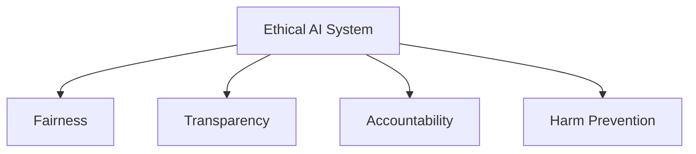

# Unit 5 — AI Ethics, Safety and Governance
## Topic 2: Ethical Principles

*(Covers: The four pillars — fairness, transparency, accountability, harm prevention)*

---

## 1. Learning Objectives

By the end of this topic, you will be able to:

1. **Explain** each of the four ethical pillars of AI: fairness, transparency, accountability, and harm prevention.
2. **Identify** which pillar is being violated in a given AI failure scenario.
3. **Describe** why all four pillars are needed together, and why any one alone is not sufficient.
4. **Apply** the four pillars as a checklist when reviewing a proposed AI system design.
5. **Evaluate** a simple system design against the four pillars and recommend improvements.

---

## 2. Overview

In Topic 1, you saw *what* goes wrong when AI systems fail. This topic gives you the **principles** that guide you toward building systems that don't fail in those ways in the first place. Just as civil engineers work from principles like "load-bearing capacity" and "material safety factor," AI-native engineers work from ethical principles that guide every specification, build, and oversight decision.

The four pillars — **fairness, transparency, accountability, and harm prevention** — are not abstract philosophy. They are practical checkpoints you will use throughout this program: when writing a specification (Unit 2), when evaluating AI output (Unit 3–4), and when designing human oversight checkpoints (Unit 9–10). Every major governance framework you'll study in Topic 4 of this unit — the EU AI Act, NIST AI RMF, India's MEITY guidelines — is built around some combination of these same four ideas. Learning them now gives you a mental model that will make every later governance topic easier to understand.

---

## 3. Description

### 3.1 The Four Pillars

**Definition:** The four pillars are the four core ethical requirements that a responsibly-built AI system should satisfy, at every stage from design to deployment.

**Pillar 1 — Fairness**

**Definition:** Fairness means the AI system treats all individuals and groups equitably, without producing systematically worse outcomes for some groups over others, for reasons unrelated to the task at hand.

*Simple analogy:* Think of a school exam. A fair exam tests everyone on the same syllabus under the same conditions. An unfair exam might ask questions that only students from wealthy schools would have been exposed to — the outcome then reflects background, not ability. AI systems can fail fairness the same way (see Topic 1's data bias discussion).

**Pillar 2 — Transparency**

**Definition:** Transparency means people affected by an AI system's decision can understand, at an appropriate level, how and why that decision was made — and know that AI was involved at all.

*Simple analogy:* If a bank rejects your loan application, transparency means you're told "your application was reviewed using an automated credit-scoring tool, and the main factors were X and Y" — not just a silent rejection with no explanation, leaving you unable to even know an algorithm was involved.

**Pillar 3 — Accountability**

**Definition:** Accountability means there is always a clearly identified human or organisation responsible for an AI system's decisions and outcomes — the AI itself is never "the one to blame."

*Simple analogy:* If a self-checkout machine in a supermarket overcharges you, you don't argue with the machine — there is a manager, a company, a policy that is accountable. The same principle must apply to AI: "the algorithm did it" is never an acceptable final answer.

**Pillar 4 — Harm Prevention**

**Definition:** Harm prevention means actively anticipating and reducing the potential for an AI system to cause physical, financial, psychological, or social harm — before deployment, not after.

*Simple analogy:* A car isn't released to the public without crash tests, seatbelts, and airbags designed in from the start — not added only after accidents happen. AI systems, especially in health, finance, and safety domains, need the same "designed-in" precaution.

**Why all four together, and not just one:**

| If you only have... | What can still go wrong |
|---|---|
| Fairness, but no transparency | The system may treat groups equally, but no one can verify or challenge a wrong decision. |
| Transparency, but no accountability | Everyone can see how a decision was made, but no one takes responsibility for fixing an unfair pattern. |
| Accountability, but no harm prevention | Someone is responsible after the fact, but the harm has already happened. |
| Harm prevention, but no fairness | The system may avoid catastrophic harm, yet still quietly disadvantage certain groups. |

**Best Practices:**

- Use the four pillars as a design review checklist *before* building — not only after something goes wrong.
- Document, in plain language, which pillar each safeguard in your system addresses.
- Revisit the four pillars whenever a system's scope or user base changes.

**Common Beginner Mistakes:**

- Treating "fairness" as the only pillar that matters, and forgetting accountability and transparency.
- Assuming a system is ethical simply because it wasn't *designed* to cause harm — harm prevention requires active testing, not good intentions alone.
- Believing ethics is "someone else's job" (like a legal team) rather than a core engineering responsibility.

---

## 4. Real World Application

- **Banking/FinTech:** A UPI fraud-detection AI must be **transparent** enough that a flagged customer can be told why their transaction was blocked, **fair** across income groups and regions, and have a clear **accountable** human escalation path, with **harm prevention** testing to avoid wrongly freezing genuine transactions.
- **Healthcare:** An AI triage tool in an Indian hospital must have a named clinical owner (accountability), be tested across patient demographics (fairness), explain its reasoning to doctors (transparency), and undergo safety testing before use (harm prevention).
- **Recruitment:** An AI résumé screener should let rejected candidates know AI was used (transparency), be audited for demographic skew (fairness), have an HR owner accountable for outcomes (accountability), and be tested to ensure it doesn't systematically block any group (harm prevention).
- **Social Media / Content Moderation:** An AI system flagging harmful content must prevent real-world harm proactively, while being fair across languages/communities (a special challenge for multilingual India) and transparent about appeal processes.

---

## 5. Worked Example

**Scenario:** You are asked to review the design of an AI-powered "priority queue" system for a hospital's outpatient department, which decides which patients get called in first based on symptom severity described in a short questionnaire.

**Four-pillar review:**

| Pillar | Question to Ask | Finding | Recommendation |
|---|---|---|---|
| Fairness | Does the system perform equally well for patients who fill the form in Hindi, Tamil, or English? | Only tested in English so far | Test and calibrate for all major languages the hospital serves before launch |
| Transparency | Do patients know an AI is ranking their queue position? | No signage or explanation currently planned | Add a simple notice explaining automated triage assistance is used, with a human nurse able to override |
| Accountability | Who is responsible if the system deprioritizes a genuinely urgent patient? | No named owner yet | Assign a clinical lead accountable for the tool's outcomes and periodic review |
| Harm Prevention | What happens if the system fails or is uncertain? | Currently: system decides silently | Require the system to escalate uncertain or borderline cases directly to a human nurse, never silently deprioritize |

**Conclusion:** The system cannot ethically launch until all four gaps are addressed — this is exactly the kind of structured review you'll practice again in Unit 9 (Judgment Framework) and Unit 15 (Capstone).

---

## 6. Key Takeaways

- The four pillars of AI ethics are: **Fairness, Transparency, Accountability, Harm Prevention.**
- **Fairness** = equitable treatment across groups. **Transparency** = people can understand and know about AI's role. **Accountability** = a human/organisation is always responsible. **Harm Prevention** = anticipating and reducing harm before deployment.
- No single pillar is sufficient alone — weaknesses in one pillar let harm slip through even if the others are strong.
- Use the four pillars as a practical design-review checklist, not just theory.
- These four pillars underpin every major governance framework you'll study next (EU AI Act, NIST AI RMF, MEITY guidelines).
- **Interview tip:** When asked "what makes AI ethical," structure your answer around these four named pillars — it signals structured thinking, not vague opinion.
- Harm prevention must be designed in from the start — it cannot be "patched in" after an incident.

---

## 7. Reference Links

- [NIST AI Risk Management Framework](https://www.nist.gov/itl/ai-risk-management-framework) — organizes trustworthy AI around fairness, transparency, accountability, and safety.
- [EU AI Act (official text)](https://eur-lex.europa.eu/legal-content/EN/TXT/?uri=CELEX%3A32024R1689) — legally codifies many of these same principles for high-risk AI systems.
- [MEITY — Advisories on Responsible AI](https://www.meity.gov.in/) — Indian government guidance touching on these same ethical principles.
