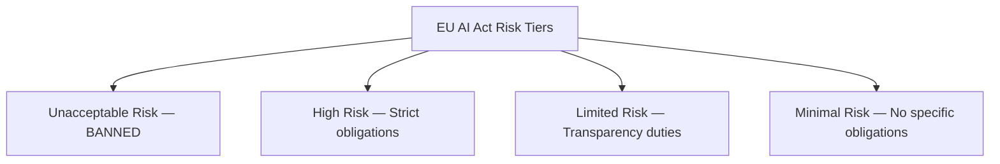

# Unit 5 — AI Ethics, Safety and Governance
## Topic 4: Governance Frameworks

*(Covers: EU AI Act — risk tiers · EU AI Act — obligations for high-risk systems · EU AI Act — prohibited uses · NIST AI Risk Management Framework · White House Executive Order on AI (2023) · India AI governance — MEITY advisory guidelines · Knowing which governance framework applies to your system)*

---

## 1. Learning Objectives

By the end of this topic, you will be able to:

1. **Describe** the EU AI Act's four risk tiers and give an example system for each.
2. **Explain** the obligations placed on "high-risk" AI systems under the EU AI Act.
3. **Identify** the categories of AI use explicitly prohibited under the EU AI Act.
4. **Describe** the four functions of the NIST AI Risk Management Framework: Govern, Map, Measure, Manage.
5. **Summarize** the key provisions of the 2023 White House Executive Order on AI.
6. **Explain** the current direction of India's AI governance approach via MEITY advisories.
7. **Evaluate** which governance framework(s) apply to a given AI system, based on its users, location, and risk level.

---

## 2. Overview

This is a **survey topic** — it covers more ground than most others in this unit, because governance is genuinely a fast-evolving, multi-jurisdictional landscape in 2026, and an AI-native engineer must at least know *which map to reach for* even before memorising every detail. You already have the conceptual foundation you need: the four ethical pillars (Topic 2) — fairness, transparency, accountability, harm prevention — are the DNA of every framework in this topic. What differs between them is **how formally, and how strictly, each principle is enforced.**

You will study four major frameworks: the **EU AI Act** (the world's first comprehensive, legally binding AI law, using a risk-tiered approach), the **NIST AI Risk Management Framework** (a US-origin, voluntary framework widely used as an industry best-practice reference), the **White House Executive Order on AI (2023)** (US federal policy direction), and **India's MEITY advisories** (India's current, evolving approach to AI governance). Finally, you'll learn a practical skill: given a real system, how do you figure out *which* of these frameworks actually applies to you? This skill matters directly for your Unit 15 Capstone, where you must document the human-oversight point for each component of your project — grounded in real governance thinking, not guesswork.

---

## 3. Description

### 3.1 The EU AI Act — Risk Tiers

**Definition:** The EU AI Act is a binding law of the European Union (fully entered into force, with obligations phasing in through 2026–2027) that regulates AI systems based on the **level of risk** they pose to health, safety, and fundamental rights.

It sorts every AI system into one of **four risk tiers**:

| Tier | Meaning | Example |
|---|---|---|
| **Unacceptable Risk** | Banned outright — the harm is considered too severe to permit under any safeguard | Real-time public biometric surveillance for mass monitoring, social scoring by governments |
| **High Risk** | Legal, but subject to strict obligations before and during use | AI used in hiring, credit scoring, medical devices, critical infrastructure |
| **Limited Risk** | Legal, with specific transparency duties | Chatbots (must disclose that a user is talking to an AI), deepfake generators (must label content as AI-generated) |
| **Minimal Risk** | Legal, no specific obligations under the Act | AI-powered spam filters, video game AI opponents |

**Why this exists:** Instead of regulating "AI" as one single thing, the EU AI Act recognises that a spam filter and a medical-diagnosis AI carry wildly different real-world stakes — so it scales the legal requirements to match the actual risk, rather than applying a single blanket rule to everything.

---

### 3.2 The EU AI Act — Obligations for High-Risk Systems

**Definition:** "High-risk" AI systems under the EU AI Act must satisfy a defined set of obligations *before* they can be placed on the market and *throughout* their use.

**Key obligations include:**

1. **Documentation** — maintaining detailed technical documentation describing how the system works, what data trained it, and its known limitations.
2. **Testing and risk management** — a continuous process of testing for accuracy, robustness, and safety, not a one-time check.
3. **Human oversight** — the system must be designed so a human can understand its output, intervene, and override or halt it when necessary (directly echoing the **Judgment Framework** you'll study in Unit 9).
4. **Data governance** — training data must be checked for quality and, where feasible, for bias.
5. **Transparency to users** — providing clear instructions on the system's capabilities and limitations to whoever deploys or is affected by it.
6. **Record-keeping (logging)** — maintaining logs of the system's operation for traceability, in case of investigation after an incident.

**Simple analogy:** Think of this like the requirements for a new medicine before it can be sold — clinical trial documentation, quality checks on raw materials, clear usage instructions on the packaging, and a way for doctors to report side effects. High-risk AI is regulated with a similarly rigorous mindset.

---

### 3.3 The EU AI Act — Prohibited Uses

**Definition:** The "unacceptable risk" tier from 3.1 lists specific AI uses that are **banned outright** within the EU's jurisdiction, regardless of any safeguard applied.

**Key prohibited categories include:**

- **Social scoring** by public authorities — ranking or judging people based on behaviour or characteristics in a way that leads to unjustified or disproportionate treatment.
- **Real-time remote biometric identification** in publicly accessible spaces for law enforcement purposes (with narrow, tightly defined exceptions).
- **Manipulative AI** that materially distorts a person's behaviour in a way that causes them significant harm, by exploiting vulnerabilities such as age or disability.
- **Untargeted scraping** of facial images from the internet or CCTV footage to build facial recognition databases.

**Why this matters:** These prohibitions tell you where the "hard boundary" is — no amount of good documentation or human oversight makes these use cases legal in the EU. This is a useful mental model even outside the EU: **some AI applications should not exist at all**, not just be "used carefully."

---

### 3.4 NIST AI Risk Management Framework (AI RMF)

**Definition:** The NIST AI Risk Management Framework is a **voluntary**, US-origin framework (published by the National Institute of Standards and Technology) that provides a structured process for managing risks throughout an AI system's lifecycle.

It organises AI risk management into **four core functions**:

| Function | What It Means |
|---|---|
| **Govern** | Establish the organisational culture, policies, and accountability structures for responsible AI use — this is the foundation the other three functions sit on. |
| **Map** | Understand the context: what is this system for, who does it affect, and what could go wrong? |
| **Measure** | Use quantitative and qualitative tools to assess the system's risks, performance, and trustworthiness (this connects directly to the metrics you'll study in Units 7–8: accuracy, precision, recall). |
| **Manage** | Prioritize and act on the risks identified — allocate resources to the highest-risk issues, and monitor continuously. |

**Why this matters:** Unlike the EU AI Act, NIST's framework is not a law — you cannot be fined for ignoring it. But it is widely adopted **as a best-practice reference** by companies worldwide (including in India) precisely because it gives a practical, repeatable process rather than a legal checklist.

---

### 3.5 White House Executive Order on AI (2023) — Key Provisions

**Definition:** In October 2023, the White House issued an Executive Order on the "Safe, Secure, and Trustworthy Development and Use of Artificial Intelligence" — a US federal policy directive shaping how US government agencies approach AI oversight (note: executive orders can be modified or superseded by later administrations, so always check the current status when this matters professionally).

**Key provisions included:**

- Requiring developers of the most powerful "frontier" AI models to share safety test results with the government before public release.
- Directing the development of standards for AI safety and security testing (building on frameworks like the NIST AI RMF).
- Addressing AI-related risks in critical areas: biosecurity, cybersecurity, and critical infrastructure.
- Promoting AI innovation and competition, while directing agencies to guard against AI-enabled fraud and discrimination in areas like housing, healthcare, and hiring.
- Directing federal agencies to develop guidance for their own responsible use of AI in government services.

**Important Note:** US AI policy, unlike the EU AI Act, has moved through executive orders and agency guidance rather than one single comprehensive law — meaning it can shift with each administration. As an AI-native engineer working with US-facing products, always verify the *current* federal guidance rather than relying on a fixed rule.

---

### 3.6 India AI Governance — MEITY Advisory Guidelines

**Definition:** In India, AI governance is currently guided primarily through **advisories issued by the Ministry of Electronics and Information Technology (MEITY)**, rather than a single comprehensive AI law (as of the time of this program) — an evolving, principles-based approach rather than a fixed rulebook like the EU AI Act.

**Key themes in India's approach so far:**

- Encouraging **responsible AI development** — flagging concerns like deepfakes, misinformation, and bias to platforms and developers.
- Emphasis on **user disclosure** for AI-generated content (e.g., labelling synthetic/deepfake media), echoing the EU's "limited risk" transparency duties.
- A stated intent to **balance innovation with safety** — India's IT sector and startup ecosystem is a major economic priority, so guidance has generally aimed to avoid over-restrictive blanket rules while still addressing clear harms (deepfakes, misinformation, safety of users).
- Sector-specific rules (e.g., in finance, health data) continuing to apply *alongside* general AI advisories — AI does not exempt you from existing sectoral regulation (like RBI rules for FinTech, or health data protection rules).

**Important Note:** India's AI governance approach is actively evolving. As a professional, you should treat this section as a snapshot of the *approach and direction*, not a final fixed rulebook — always check the latest MEITY guidance before making compliance decisions in a real project.

---

### 3.7 Knowing Which Governance Framework Applies to Your System

**Definition:** This is the practical skill of determining which governance framework(s) — legal or voluntary — apply to a specific AI system you are building or overseeing.

**A simple decision checklist:**

1. **Where are your users located?** If any users are in the EU, the EU AI Act may apply to you regardless of where your company is based (it has extraterritorial reach for high-risk systems affecting EU residents).
2. **Where is your company/team based, and who are you serving?** US-based deployments may fall under federal guidance stemming from the Executive Order and sector regulators; India-based deployments should follow current MEITY advisories plus sector rules (RBI, health data rules, etc.).
3. **What risk tier would your system fall into under the EU framework, even if you're not in the EU?** This is a useful thought exercise everywhere — hiring, credit, and healthcare AI are "high-risk" categories under most frameworks' spirit, even where no single binding law says so yet.
4. **Is there a voluntary best-practice framework (like NIST AI RMF) you should adopt anyway?** Even without a legal requirement, adopting NIST's Govern–Map–Measure–Manage cycle is good practice and increasingly expected by enterprise clients and investors.

**Comparison Table — Governance Frameworks at a Glance**

| Framework | Jurisdiction | Binding? | Core Approach |
|---|---|---|---|
| **EU AI Act** | European Union (extraterritorial for high-risk use affecting EU residents) | Yes — legally binding law | Risk-tiered (unacceptable / high / limited / minimal) with specific obligations per tier |
| **NIST AI RMF** | United States (widely adopted globally) | No — voluntary | Process-based: Govern, Map, Measure, Manage |
| **White House Executive Order (2023)** | United States (federal government and its agencies/contractors) | Directive for federal agencies; influences industry norms | Safety testing requirements, agency guidance, critical-risk focus |
| **India — MEITY Advisories** | India | Advisory guidance (evolving); sector laws remain binding | Principles-based, balancing innovation with safety, with a focus on disclosure and misuse (deepfakes, misinformation) |

**Best Practices:**

- Never assume "no specific AI law in my country" means "no obligations at all" — sector regulation (banking, health, data protection) usually still applies.
- When building for a global audience, design to the *strictest* applicable framework (usually the EU AI Act) as a safe default.
- Keep a short "governance note" in your project documentation stating which framework(s) you considered — this is exactly what you'll be asked to produce in the Unit 15 Capstone.

---

## 4. Real World Application

- **Indian FinTech startup with EU customers:** Must consider the EU AI Act's "high-risk" obligations for its credit-scoring AI, even though the company is based in India.
- **Indian healthcare AI for domestic hospitals:** Primarily guided by MEITY advisories and India's health-data regulations, but adopting the NIST AI RMF voluntarily as an international best-practice signal to investors and partners.
- **US Government contractor building an AI tool:** Must follow guidance stemming from the White House Executive Order and relevant federal agency AI policies.
- **Global AI chatbot product:** Must implement EU-style "AI disclosure" transparency (telling users they're talking to an AI) as a baseline, since it's both an EU legal requirement and increasingly a global user-trust expectation.

---

## 5. Worked Example

**Scenario:** An Indian startup builds an AI-powered resume-screening tool. It plans to sell the product to companies in India, the US, and Germany.

**Step-by-step framework mapping:**

1. **Germany-based customers (EU):** Hiring AI is explicitly listed as a **high-risk** category under the EU AI Act → the startup must provide documentation, human oversight design, bias testing, and transparency to candidates for any EU deployment.
2. **US-based customers:** No single comprehensive federal AI law yet, but the company should align with the NIST AI RMF (Govern–Map–Measure–Manage) as an industry-standard risk process, and stay aware of sector-specific US anti-discrimination employment law, which applies regardless of AI involvement.
3. **India-based customers:** Follow current MEITY advisories (transparency, responsible AI), and continue complying with India's existing labour and anti-discrimination laws — AI doesn't create an exemption from them.
4. **Overall engineering decision:** Since the EU AI Act's high-risk obligations are the strictest of the three, the startup decides to build **one single compliant version** of the product (with full documentation, bias testing, and human-oversight controls) and deploy it everywhere — simpler to maintain, and safest by default.

---

## 6. Key Takeaways

- The **EU AI Act** is the world's first comprehensive binding AI law, using four risk tiers: unacceptable (banned), high (strict obligations), limited (transparency duties), minimal (no specific rules).
- High-risk EU AI Act obligations include documentation, testing, human oversight, data governance, transparency, and logging.
- Prohibited EU AI Act uses include social scoring and real-time public biometric surveillance for mass monitoring.
- The **NIST AI RMF** is voluntary but widely used, organised around **Govern, Map, Measure, Manage**.
- The **2023 White House Executive Order** directs US federal AI safety testing requirements and agency guidance — it can shift with new administrations.
- **India's MEITY advisories** currently take a principles-based, evolving approach, emphasizing disclosure and responsible AI while relying on existing sector laws for enforcement.
- To find which framework applies to you: check your users' location, your own jurisdiction, your system's risk level, and whether adopting a voluntary framework (like NIST) is good practice anyway.
- **Interview tip:** If asked to compare governance frameworks, lead with "binding vs voluntary" and "risk-tiered vs process-based" — these two axes explain most of the differences cleanly.
- When in doubt, design to the strictest applicable framework as your default — it's simpler to maintain one high-quality standard than many partial ones.

---

## 7. Reference Links

- [EU AI Act — Official Text (EUR-Lex)](https://eur-lex.europa.eu/legal-content/EN/TXT/?uri=CELEX%3A32024R1689) — the authoritative legal text of the Regulation.
- [NIST AI Risk Management Framework](https://www.nist.gov/itl/ai-risk-management-framework) — official framework documentation and resources.
- [White House — Executive Order on Safe, Secure, and Trustworthy AI (2023)](https://www.whitehouse.gov/briefing-room/presidential-actions/2023/10/30/executive-order-on-the-safe-secure-and-trustworthy-development-and-use-of-artificial-intelligence/) — official archived text of the order.
- [MEITY — Ministry of Electronics and Information Technology, Government of India](https://www.meity.gov.in/) — official source for current Indian AI advisories and policy.
