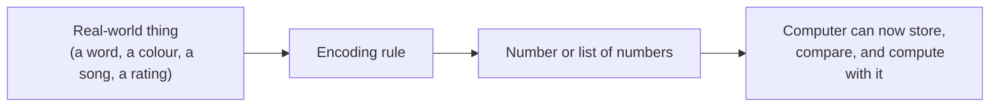

# Unit 6 — Numbers, Vectors and Meaning
## Topic 1: Why Numbers Matter in AI

*(Covers: Why every AI system is built on numbers)*

---

## 1. Learning Objectives

By the end of this topic, you will be able to:

1. **Explain** why every AI system, no matter how "intelligent" it looks, is ultimately doing arithmetic on numbers.
2. **Describe** how non-numeric things — words, images, sounds, preferences — are converted into numbers before an AI system can process them.
3. **Identify** the numeric representation hiding behind a everyday AI feature (a recommendation, a translation, a search result).
4. **Differentiate** between the human way of understanding meaning and the machine's way of representing meaning as numbers.
5. **Evaluate** why understanding "it's all numbers underneath" matters when you are the person specifying or verifying an AI system's behaviour.

---

## 2. Overview

In Unit 1, you learned that computation is simply *input → steps → output*. Now we go one level deeper and ask: **what form does that input actually take inside the machine?** The answer, for every computer system ever built — including the most advanced AI models of 2026 — is: **numbers**. Nothing else. A computer chip does not understand the word "mango," the sound of a violin, or the feeling of happiness. It only ever understands numbers, arranged and combined according to rules.

This might sound like a strange or even disappointing fact — how can something as rich as human language or a photograph be "just numbers"? But this is precisely the foundational idea that makes modern AI possible. Once you convert an idea into numbers, you can compare it, measure it, and compute with it, using the same mathematical tools you'll use throughout this program — especially in Weeks 6 to 8 (Applied Maths for AI).

As an AI-Native Engineer, you will rarely write the mathematics yourself (libraries and pretrained models do that heavy lifting). But you absolutely must understand *that* everything — a customer review, a product photo, a spoken sentence, a resume — gets turned into numbers before an AI model can work with it. This understanding is what lets you reason clearly about why an AI system behaves the way it does, why it sometimes makes strange mistakes, and how to specify and verify its behaviour with confidence. This topic is the bridge between "How Machines Think" (Units 1–5) and the applied mathematics you're about to learn.

---

## 3. Description

### Definition

**Numeric representation** is the process of converting any piece of real-world information — a word, an image, a sound, a preference — into a number or a set of numbers, so that a computer can store, compare, and compute with it.

### Why This Concept Exists

Computers are built from electronic circuits that can only reliably do one thing at the lowest level: represent whether a tiny switch is "on" or "off" (which we write as 1 or 0). Every single thing a computer ever does — showing you a picture, playing a song, running a UPI transaction, or generating a chatbot's reply — is built up from combinations of these 1s and 0s, arranged into numbers, and then numbers arranged into more complex structures. There was never an alternative: if you want a machine to do anything at all, you must first find a way to express that "thing" using numbers.

### Key Terminology

| Term | Simple Meaning |
|---|---|
| **Numeric representation** | Turning any real-world thing (a word, a picture, a rating) into a number or list of numbers. |
| **Encoding** | The specific method/rule used to turn something into numbers (e.g., turning a letter into a number using a standard code). |
| **Feature** | One measurable property of something, expressed as a number (e.g., "spiciness level" of a dish, rated 1 to 5). |
| **Data point** | One complete numeric description of a single real-world thing (e.g., all the features describing one customer). |

### How Everyday Things Become Numbers

Let's ground this with simple, real examples before we touch AI at all:

- **Text → numbers:** Every character you type is already stored as a number inside your computer. The letter "A", for instance, is stored using a standard code (ASCII) as the number 65. Your phone doesn't "see" letters — it sees a sequence of numbers, and only *displays* them to you as letters on the screen.
- **Colour → numbers:** Every colour you see on a screen is represented as three numbers — how much Red, how much Green, how much Blue (each from 0 to 255). Pure white is `(255, 255, 255)`; pure black is `(0, 0, 0)`; a mid-range orange might be `(255, 140, 0)`.
- **Sound → numbers:** A song is stored as thousands of numbers per second, each representing the loudness of the sound wave at that exact instant.
- **Rating/preference → numbers:** When you rate a food-delivery order 4 out of 5 stars, that "4" is already a number — no conversion needed.

### Why This Matters Specifically for AI

Modern AI systems, particularly Large Language Models (LLMs) like Claude, take this idea to an extraordinary scale. A single word like "mango" isn't represented by just one number — it's represented by a long list of numbers (often hundreds of them), where each number captures a tiny fragment of the *meaning* of the word — is it a fruit? Is it sweet? Is it commonly used in Indian cooking? Is it associated with summer? This special kind of numeric representation for meaning is called an **embedding**, and you will study it in full depth in Topic 3 of this unit ("Similarity and Meaning"). For now, the key idea to lock in is simpler: **before an AI model can "understand" or generate anything, that thing must first exist as numbers.**

### Best Practices

- When specifying an AI system, always ask: *"What real-world information does this system need to convert into numbers, and could anything important get lost in that conversion?"* (e.g., converting a customer complaint into a simple 1–5 "sentiment score" may lose important nuance).
- Remember that the *quality* of an AI system's output directly depends on the *quality* of its numeric representation of the input — poor or biased encoding leads to poor or biased output (a theme you'll revisit under AI Ethics in Unit 5 — the memory of that unit is closely tied to this one).

### Common Beginner Mistakes

- Assuming AI models "read" and "understand" text the same way a human does — they don't; they process numeric representations of text.
- Believing that because AI works with "just numbers," it cannot capture something as rich as meaning or emotion — modern numeric representations (embeddings) are sophisticated enough to capture surprisingly subtle meaning, as you'll see in Topic 3.
- Confusing "encoding" (turning something into numbers) with "understanding" (a human-like grasp of meaning) — a computer only ever does the former.

> **Important Note:** "It's all numbers underneath" is not a limitation to apologize for — it is the very reason computation is possible at all. Your job as an AI-Native Engineer is not to avoid this fact but to understand it well enough to specify, build, and verify systems that use it responsibly.

---

## 4. Real World Application

- **Banking/FinTech:** A UPI fraud-detection system converts a transaction into numbers — amount, time of day, distance from your usual location, frequency of transactions in the last hour — before deciding whether to flag it as suspicious.
- **Healthcare:** A patient's symptoms, vital signs, and scan results are all converted into numeric features before an AI triage tool can estimate risk.
- **E-commerce:** Every product you browse is converted into numbers (price, category, past purchase count, rating) so a recommendation engine can compare it to your preferences.
- **Vernacular AI Translation:** Before Claude or any translation model can translate a Hindi sentence into Tamil, both sentences must first be converted into numeric representations (embeddings) that capture meaning independent of the specific language.
- **Education:** An AI tutoring app converts a student's quiz answers into numbers (score per topic) to numerically identify which topics need more practice.

---

## 5. Worked Example

**Scenario:** A food-delivery app wants to numerically represent a "customer profile" so an AI system can recommend restaurants.

Suppose we describe a customer using three simple numeric features:

| Feature | Meaning | Example Value |
|---|---|---|
| Average order value (₹) | How much the customer typically spends | 350 |
| Orders per month | How often the customer orders | 12 |
| Spice preference (1–5) | How spicy the customer likes their food | 4 |

This customer can now be represented as a single row of numbers: **(350, 12, 4)**.

Notice what just happened: a real human being, with complex tastes and habits, has been reduced to **three numbers**. This is a simplification (we've deliberately left out many things — cuisine preference, delivery time preference, etc.) — but it's a *useful* simplification, because now the recommendation engine can mathematically compare this customer's numbers to thousands of other customers' numbers and find people with a similar profile, to suggest restaurants they enjoyed. This comparison-of-numbers idea is exactly what you'll formalize using vectors and similarity scoring later in this unit.

**Reasoning checklist for any AI system you'll specify in future:**
1. What real-world information does the system need? 
2. What numeric feature(s) capture that information?
3. What might be lost in that simplification, and does it matter for this use case?

---

## 6. Key Takeaways

- Every AI system — no matter how advanced — ultimately operates on numbers, because that is the only thing a computer's electronic circuits can represent.
- Text, images, sound, and preferences are all converted into numbers through a process called encoding, before any computation (including AI) can happen.
- A **feature** is one measurable numeric property of something; a **data point** is the complete numeric description of one real-world thing.
- LLMs represent the *meaning* of words using a rich numeric representation called an **embedding** — covered fully in Topic 3.
- "It's all numbers" is not a weakness of AI — it's the foundation that makes computation possible at all.
- Always ask what might be lost when real-world information gets simplified into numbers — this is a core AI-oversight skill.
- **Interview tip:** If asked "how does an AI model process text/images?", the strongest answer starts with "everything is first converted into a numeric representation" before mentioning embeddings or neural networks.

---

## 7. Reference Links

- [Google Machine Learning Crash Course — Introduction to ML](https://developers.google.com/machine-learning/crash-course) — beginner-friendly grounding in numeric feature representation.
- [GeeksforGeeks — Data Representation in Computers](https://www.geeksforgeeks.org/) — supplementary reading on how computers store information as numbers.
- [Anthropic Documentation](https://docs.claude.com/) — for later reference on how Claude processes text input.
