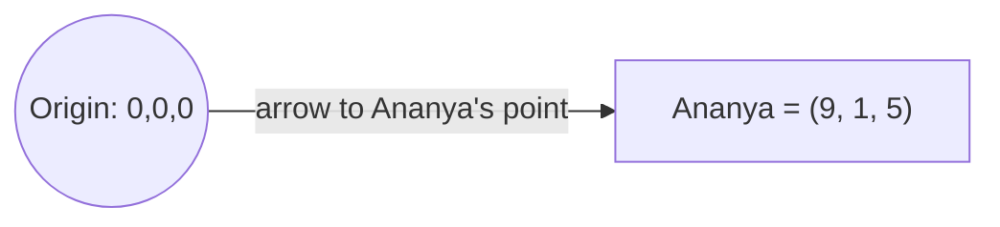

# Unit 6 — Numbers, Vectors and Meaning
## Topic 2: Scalars, Vectors and Matrices

*(Covers: Scalars · Vectors · Matrices · A vector as a point in space — music taste described as three numbers)*

---

## 1. Learning Objectives

By the end of this topic, you will be able to:

1. **Explain** the difference between a scalar, a vector, and a matrix using simple, everyday examples.
2. **Describe** how a vector can represent multiple properties of one thing at the same time.
3. **Identify** whether a piece of data (a temperature, a customer profile, a spreadsheet of students) is best represented as a scalar, a vector, or a matrix.
4. **Construct** a simple 2D or 3D vector by hand for a real-world scenario (e.g., music taste).
5. **Analyze** how a vector can be visualized as a point (or arrow) in space.

---

## 2. Overview

In the previous topic, you learned that AI systems represent everything as numbers. Now we need precise vocabulary for *how many* numbers, and *how they're organized*, because this organization is the backbone of almost all AI mathematics you'll encounter in this program (embeddings, similarity scoring, evaluation metrics, and more).

There are three building blocks you must know cold: the **scalar** (a single number), the **vector** (a list of numbers describing multiple properties of one thing), and the **matrix** (a grid of numbers, essentially many vectors stacked together). These aren't just abstract maths terms — they are the actual data structures that sit underneath every AI feature you will build or oversee, from a simple recommendation system to a full LLM.

This topic builds your mental model with everyday, non-technical examples (marks, temperatures, music taste) before Topic 3 shows you what happens when we use vectors to represent *meaning* itself. By the end, you should be comfortable enough with vectors to picture one as a literal point plotted in space — a skill you will use again and again in Weeks 6–8.

---

## 3. Description

### 3.1 Scalars — A Single Number Representing One Property

**Definition:** A **scalar** is just a single number that represents one property of something, with no other numbers attached to it.

**Everyday examples:**
- Today's temperature: `32°C`
- Your exam score: `78 marks`
- The price of one samosa: `₹15`

A scalar answers exactly one question: "how much/how many of this one thing?" Nothing more.

---

### 3.2 Vectors — A List of Numbers Representing Multiple Properties at Once

**Definition:** A **vector** is an ordered list of numbers that together describe multiple properties of the *same* thing, at the *same* time.

**Why this exists:** Real-world things are rarely described by just one number. A student isn't just "one mark" — they have marks in Maths, Science, and English. A vector lets us bundle all of these related numbers into a single, organized unit, so we can treat "this student's performance" as *one* mathematical object instead of three separate, disconnected numbers.

**Notation explained:** A vector is usually written inside square brackets, with numbers separated by commas, like this:

```
v = [78, 85, 92]
```

- `v` is just the *name* we give to this vector (like naming a variable) — it could be called anything, `v` is just a common short label for "vector."
- The **square brackets `[ ]`** signal "this is a single vector, a bundled group of numbers, not three separate scalars."
- Each number inside is called a **component** or **dimension** of the vector. `78` is the 1st component, `85` is the 2nd, `92` is the 3rd.
- The **order matters** — `[78, 85, 92]` (Maths, Science, English) is a completely different vector from `[92, 85, 78]` (English, Science, Maths) even though it contains the same three numbers, because each *position* has an agreed meaning.
- The **number of components** is called the vector's **dimensionality**. `v = [78, 85, 92]` is a **3-dimensional vector** (often written 3D) because it has 3 components.

**A simple worked example — Student Marks Vector:**

Ravi scored 78 in Maths, 85 in Science, and 92 in English.

```
Ravi = [78, 85, 92]     (a 3-dimensional vector)
```

Priya scored 90 in Maths, 60 in Science, and 70 in English.

```
Priya = [90, 60, 70]    (also a 3-dimensional vector)
```

Both Ravi and Priya are now represented as 3D vectors, using the *same* three positions (Maths, Science, English) — which means we can now meaningfully compare them mathematically (you'll learn exactly how, using the dot product and cosine similarity, in Topic 3).

---

### 3.3 Matrices — Grids of Numbers and How AI Uses Them

**Definition:** A **matrix** (plural: matrices) is a rectangular grid of numbers, arranged in rows and columns. You can think of a matrix as **many vectors stacked on top of each other**.

**Notation explained:**

```
        Maths  Science  English
Ravi  [  78,     85,      92   ]
Priya [  90,     60,      70   ]
Aisha [  55,     95,      80   ]
```

- Each **row** is one student's full vector of marks (exactly like the vectors above).
- Each **column** represents one subject, across all students.
- We describe the *size* of a matrix as **rows × columns**. The example above is a **3 × 3 matrix** (3 students, 3 subjects).

**Why AI uses matrices:** AI models need to process not just one data point at a time, but thousands or millions at once (thousands of student records, thousands of product listings, thousands of words). Instead of handling each vector one by one, matrices let a computer store and process *all of them together*, using extremely fast, well-optimized matrix mathematics. This is one of the biggest reasons modern AI (especially deep learning) became practical — specialized computer chips (GPUs) are exceptionally good at doing matrix calculations at enormous speed.

> **Important Note:** You do not need to perform matrix multiplication by hand to work as an AI-Native Engineer — libraries handle that. But you must recognize a matrix when you see one (e.g., a spreadsheet of customer data, a table of product features) and understand that it is simply "many vectors, stacked."

---

### 3.4 A Vector as a Point in Space — Music Taste Described as Three Numbers

Here is one of the most powerful ideas in this entire unit: **a vector is not just a list of numbers — it can be visualized as a single point (or an arrow from the origin to that point) in space.**

**Worked Example — Music Taste Vector:**

Suppose we rate someone's music taste on three scales, each from 0 (dislike) to 10 (love):

```
taste = [pop_score, classical_score, rock_score]
```

Meet Ananya: she loves pop, dislikes classical, and somewhat likes rock:

```
Ananya = [9, 1, 5]
```

We can now plot Ananya as a single **point in 3-dimensional space**, where:
- the X-axis measures her "pop" score,
- the Y-axis measures her "classical" score,
- the Z-axis measures her "rock" score.



Now meet Kabir: he also loves pop, dislikes classical, and likes rock a little more than Ananya:

```
Kabir = [8, 2, 6]
```

Because Ananya's point and Kabir's point are *close together* in this 3D music-taste space, we can say their taste in music is *similar* — and a music-streaming app's recommendation engine could suggest Kabir's favourite playlists to Ananya, and vice versa. This exact idea — "vectors that are close together in space represent similar things" — is the single most important concept underlying embeddings, search, and recommendation systems, and you will formalize the maths behind "closeness" (using the dot product and cosine similarity) in the very next topic.

**Comparison Table — Scalar vs Vector vs Matrix**

| Aspect | Scalar | Vector | Matrix |
|---|---|---|---|
| What it is | A single number | An ordered list of numbers | A grid (rows × columns) of numbers |
| Describes | One property of one thing | Multiple properties of one thing | Multiple properties of many things |
| Everyday example | Today's temperature (32°C) | A student's 3 subject marks | A whole class's marks in 3 subjects |
| Can be visualized as | A point on a number line | A point (or arrow) in space | A table / stacked set of vectors |
| Typical AI use | A single setting (e.g., temperature=0.7) | One embedding, one data point | A dataset, a batch of embeddings |

### Best Practices

- Before you build or specify any AI feature, ask: "is this piece of data one number (scalar), multiple properties of one thing (vector), or multiple things at once (matrix)?" — getting this right shapes how you describe requirements to a developer or an AI coding assistant.
- Keep the *order/position* of a vector's components consistent across all your data points — comparing `[Maths, Science, English]` to `[English, Science, Maths]` would silently produce nonsense results.

### Common Beginner Mistakes

- Confusing a vector's *dimensionality* (number of components) with physical, visual 3D space — vectors can have hundreds or thousands of dimensions (as real AI embeddings do), even though we can only comfortably *draw* up to 3 dimensions.
- Thinking a matrix is a completely different concept from a vector — remember, a matrix is just several vectors stacked together.
- Forgetting that the order of components in a vector must mean the same thing across every data point being compared.

---

## 4. Real World Application

- **Education:** A school's entire gradebook is a matrix — rows are students (each a vector of marks), columns are subjects.
- **Banking:** A bank represents each customer as a vector (income, monthly spend, credit score, account age); the entire customer base is a matrix used for credit-risk models.
- **E-commerce:** Every product is a vector (price, rating, category-code, stock count); the full product catalogue is a matrix.
- **Music/Video streaming (Spotify-, YouTube-style recommendation):** Every user's taste and every song/video is represented as a vector — matching engines find "nearby" vectors to generate "Recommended for you."
- **Healthcare:** A patient's vital signs (heart rate, blood pressure, oxygen level) form a vector used by triage-support AI tools.

---

## 5. Worked Example

**Scenario:** Represent three e-commerce customers as vectors of two features — (average order value in ₹, number of orders this year) — and organize them into a matrix.

| Customer | Avg. Order Value (₹) | Orders This Year |
|---|---|---|
| Rahul | 1200 | 8 |
| Sneha | 300 | 45 |
| Vikram | 2500 | 3 |

Individual vectors:
```
Rahul  = [1200, 8]
Sneha  = [300, 45]
Vikram = [2500, 3]
```

Combined as a matrix (3 customers × 2 features = a 3×2 matrix):
```
        AvgOrderValue  OrdersThisYear
Rahul [    1200,            8      ]
Sneha [     300,           45      ]
Vikram[    2500,            3      ]
```

**Interpretation:** Rahul and Vikram both spend a lot per order but order rarely (occasional big spenders); Sneha orders frequently but spends less each time (frequent small spender). Plotting these as points on a 2D graph (X = avg order value, Y = orders this year), Rahul and Vikram would appear close together in space, while Sneha would sit far apart — visually confirming what the numbers already told us.

---

## 6. Key Takeaways

- A **scalar** is a single number describing one property (e.g., today's temperature).
- A **vector** is an ordered list of numbers describing multiple properties of the *same* thing at once (e.g., a student's marks in 3 subjects).
- The **dimensionality** of a vector is simply how many numbers (components) it contains.
- The **order/position** of components in a vector must be consistent across every data point you compare.
- A **matrix** is a grid of numbers — essentially many vectors stacked into rows and columns — used to represent many things at once.
- A vector can be visualized as a **point (or arrow) in space**; vectors that are *close together* in that space represent things that are *similar* to each other.
- This "closeness = similarity" idea is the foundation for embeddings, recommendation systems, and search — covered next in Topic 3.
- **Interview tip:** Be ready to explain, in one sentence each, the difference between a scalar, a vector, and a matrix, with a real-world example for each.

---

## 7. Reference Links

- [Google Machine Learning Crash Course — Embeddings](https://developers.google.com/machine-learning/crash-course) — foundational reading on vectors in ML.
- [GeeksforGeeks — Vectors and Matrices](https://www.geeksforgeeks.org/) — supplementary reading with worked examples.
- [TensorFlow Embedding Projector](https://projector.tensorflow.org/) — a visual tool for exploring high-dimensional vectors (used hands-on in Topic 4 of this unit).
