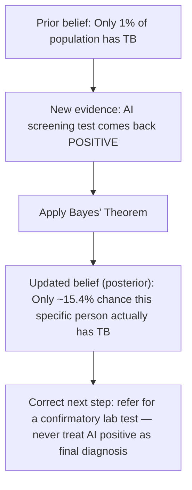

# Unit 7 — Probability, Statistics and AI Confidence
## Topic 1: Probability Foundations

*(Covers: Probability basics — likelihood, events, outcomes · Conditional probability — P(A given B) · Bayes' theorem intuition — updating belief with new evidence)*

---

## 1. Learning Objectives

By the end of this topic, you will be able to:

1. **Explain** what probability means and how it measures the likelihood of an event.
2. **Identify** the outcomes and sample space of a simple everyday event.
3. **Calculate** a conditional probability, P(A given B), from a table of counts.
4. **Describe** the intuition behind Bayes' theorem — how new evidence updates a prior belief.
5. **Apply** Bayes' theorem to a worked, real-world AI screening example, by hand.
6. **Evaluate** why a "positive" AI prediction is not automatically proof that the predicted event is true.

---

## 2. Overview

In **Unit 1** you learned that AI systems are **probabilistic** — they work with likelihoods rather than fixed, guaranteed answers (recall the "capital of India" example, where the model was 91% confident in "New Delhi"). But where do these percentages actually come from, and how should you, as the person specifying and overseeing an AI system, interpret them correctly?

That is exactly what **probability** gives us: a precise mathematical language for talking about uncertainty. Every time an AI model says "I am 85% confident," or a fraud-detection system flags a transaction as "likely fraudulent," or a medical-screening AI reports "probable anomaly detected" — probability is the machinery running underneath.

This topic builds the mathematical foundation for everything that follows in this Applied Maths module: how LLMs pick their next word (Topic 2), and how we measure whether an AI system is actually reliable (Topic 3, Unit 8). Skipping this foundation is one of the most common reasons beginner AI-native engineers misread AI output confidently but incorrectly — for example, believing a "95% accurate" fraud detector never causes trouble for a genuine customer. By the end of this topic, you will be equipped to reason about AI confidence numbers the way an experienced engineer does — with healthy scepticism, backed by maths.

---

## 3. Description

### 3.1 Probability Basics — Likelihood, Events, Outcomes

**Definition:** **Probability** is a number between 0 and 1 (or, written as a percentage, between 0% and 100%) that measures **how likely** something is to happen.

- A probability of **0** means the event will *never* happen.
- A probability of **1 (100%)** means the event will *definitely* happen.
- Anything in between represents partial likelihood.

**Key Terminology:**

| Term | Simple Meaning | Example |
|---|---|---|
| **Experiment / Trial** | An action whose result is uncertain until it happens. | Tossing a coin, rolling a dice, running an AI model on an input. |
| **Outcome** | One possible result of an experiment. | "Heads" is one outcome of a coin toss. |
| **Sample Space** | The full list of *all* possible outcomes. | For a dice roll: {1, 2, 3, 4, 5, 6}. |
| **Event** | One or more outcomes we are interested in. | "Rolling an even number" is the event {2, 4, 6}. |
| **Likelihood** | An informal word for "probability" — how believable/expected an event is. | "It is highly likely to rain today." |

**The basic formula**, when all outcomes are equally likely:

```
P(Event) = (Number of outcomes that satisfy the event) / (Total number of possible outcomes)
```

Here, **P(Event)** is read as "the probability of the event." The letter **P** simply stands for "probability of," and whatever is inside the brackets is the event we are measuring.

**Worked calculation — rolling a fair six-sided dice:**

Sample space = {1, 2, 3, 4, 5, 6} → 6 total outcomes, each equally likely.

- P(rolling a 4) = 1 ÷ 6 = **0.1667 (≈ 16.7%)** — only one outcome (the number 4) satisfies this event.
- P(rolling an even number) = 3 ÷ 6 = **0.5 (50%)** — three outcomes {2, 4, 6} satisfy this event.

> **Important Note:** Probabilities of *all* possible outcomes in a sample space must always add up to exactly 1 (100%). For a dice: P(1)+P(2)+P(3)+P(4)+P(5)+P(6) = 1/6 × 6 = 1 (100%). This is a useful way to sanity-check your own calculations.

---

### 3.2 Conditional Probability — P(A given B)

**Definition:** **Conditional probability** is the probability of an event **A** happening, **given that** we already know event **B** has happened. It is written as:

```
P(A | B)
```

Here, the vertical bar `|` is read as **"given."** So `P(A | B)` reads as **"the probability of A, given B."** This is different from the plain probability P(A), because knowing that B happened can change how likely A is.

**Why this concept exists:** In real life — and in AI systems — we almost never reason from zero information. An AI spam filter doesn't ask "what's the probability any email is spam?" in isolation; it asks "what's the probability this email is spam, **given that** it contains the word 'free', was sent at 3 a.m., and has 5 attachments?" Conditional probability is how we formally update our estimate using evidence we already have.

**Worked calculation — email spam filter (1,000 emails analysed):**

| | Contains word "free" | Does NOT contain "free" | Row Total |
|---|---|---|---|
| **Spam** | 240 | 60 | 300 |
| **Not Spam** | 50 | 650 | 700 |
| **Column Total** | 290 | 710 | 1000 |

To find **P(Spam given "free")** — i.e., "given that an email contains the word 'free', what is the probability it is spam?":

```
P(Spam | "free") = (Emails that are Spam AND contain "free") / (Total emails that contain "free")
                 = 240 / 290
                 = 0.8276 (≈ 82.8%)
```

Compare this to the plain, unconditional probability of spam: P(Spam) = 300/1000 = 30%. Notice how dramatically the extra evidence ("contains the word 'free'") raised our estimate — from 30% up to 82.8%. This is the entire point of conditional probability: **new evidence changes the probability.**

---

### 3.3 Bayes' Theorem Intuition — Updating Belief With New Evidence

**Definition:** **Bayes' theorem** is a formula that tells you exactly *how much* to update your belief in an event, once you observe new evidence — combining what you *already believed* (called the **prior**) with how *strong the new evidence* is, to produce an updated belief (called the **posterior**).

**Key Terminology (explaining every symbol before we use them):**

| Symbol | Name | Meaning |
|---|---|---|
| `P(D)` | **Prior probability** | How likely event D was *before* seeing any new evidence. |
| `P(E \| D)` | **Likelihood** | How probable the evidence E is, *if* D is actually true. |
| `P(E)` | **Total probability of the evidence** | How probable the evidence E is overall, across all cases (D true or false). |
| `P(D \| E)` | **Posterior probability** | Our *updated* belief in D, now that we have seen evidence E. This is what we want to calculate. |

**The formula:**

```
P(D | E) = [ P(E | D) × P(D) ] / P(E)
```

In plain words: *your updated belief = (how well the evidence fits your theory) × (how likely your theory was to begin with), scaled down by how common that evidence is overall.*

**Worked Example — an AI-based Tuberculosis (TB) screening tool used at a rural health camp in India:**

Suppose in the population being screened:
- **Prior:** Only **1% of people** actually have TB → P(TB) = 0.01, so P(No TB) = 0.99.
- **Likelihood (sensitivity):** If a person truly has TB, the AI screening tool correctly flags it **90% of the time** → P(Positive | TB) = 0.90.
- **False alarm rate:** If a person does *not* have TB, the tool still incorrectly flags them as positive **5% of the time** → P(Positive | No TB) = 0.05.

**Step 1 — Calculate P(Positive)**, the overall probability that *any* random person tests positive, whether or not they actually have TB:

```
P(Positive) = P(Positive|TB) × P(TB)  +  P(Positive|No TB) × P(No TB)
            = (0.90 × 0.01) + (0.05 × 0.99)
            = 0.009 + 0.0495
            = 0.0585  (5.85%)
```

**Step 2 — Apply Bayes' theorem** to find P(TB | Positive) — given that a person tested positive, what is the actual probability they have TB?

```
P(TB | Positive) = [ P(Positive|TB) × P(TB) ] / P(Positive)
                 = (0.90 × 0.01) / 0.0585
                 = 0.009 / 0.0585
                 = 0.1538  (≈ 15.4%)
```

**This result surprises almost every beginner:** even though the AI screening tool is 90% accurate at catching real TB cases, a person who tests *positive* only has a **15.4% actual chance** of having TB! This happens because TB is rare in this population (only 1%), so the tool's false positives (from the large healthy majority) heavily outnumber its true positives (from the small diseased minority).



> **Important Note:** This is precisely *why* the **Judgment Framework** (Unit 9) insists that AI screening results in healthcare must always be confirmed by a human expert and a proper diagnostic test — a "positive" AI result is evidence, not proof.

**Best Practices:**

- Always ask: "What is the *base rate* (prior probability) of this event in the real population?" before trusting a single AI prediction.
- When a predicted event is rare, expect a meaningful number of false positives even from a "highly accurate" model — this is a mathematical certainty, not a flaw in that specific model.
- Use Bayes' theorem thinking whenever you must combine an AI model's confidence score with real-world background knowledge.

**Common Beginner Mistakes:**

- Confusing P(Positive | TB) [test catches real disease] with P(TB | Positive) [disease is real, given a positive test] — these are **not** the same number, and mixing them up is called the "prosecutor's fallacy."
- Assuming "the model said 90% accurate" automatically means "90% of positive results are correct" — as shown above, this is false when the event being detected is rare.

---

## 4. Real World Application

- **Healthcare AI (India):** TB, diabetic retinopathy, and cancer screening AI tools (as used in several ICMR and state health-department pilot programs) must report results with Bayesian caution — a positive AI flag triggers a confirmatory lab test, never an immediate diagnosis.
- **Banking / UPI Fraud Detection:** A bank's AI fraud model calculates P(Fraud | this transaction's pattern) using conditional probability — combining prior fraud rates with evidence like unusual location, amount, or time of transaction.
- **Spam Filters (Email/SMS):** Exactly the worked example above — conditional probability based on the presence of suspicious words, links, or sender patterns.
- **Recommendation Systems (E-commerce/OTT):** P(You will like this product | your past 10 purchases) — conditional probability drives "recommended for you" sections.
- **Cricket Match Prediction Apps:** Continuously update P(Team A wins | current score, wickets, overs remaining) — a live, real-time application of Bayesian updating as new evidence (each ball bowled) arrives.

---

## 5. Worked Example

**Scenario:** A college's AI-based plagiarism detector flags submitted assignments. Historically, only **8% of submitted assignments** are actually plagiarised (the prior). The detector correctly flags **95%** of truly plagiarised assignments (P(Flag | Plagiarised) = 0.95), but also incorrectly flags **10%** of original, non-plagiarised assignments (P(Flag | Original) = 0.10).

**Question:** If an assignment gets flagged, what is the actual probability it is truly plagiarised?

**Step 1 — Calculate P(Flag)** (probability any random assignment gets flagged):

```
P(Flag) = P(Flag|Plagiarised) × P(Plagiarised) + P(Flag|Original) × P(Original)
        = (0.95 × 0.08) + (0.10 × 0.92)
        = 0.076 + 0.092
        = 0.168  (16.8%)
```

**Step 2 — Apply Bayes' theorem:**

```
P(Plagiarised | Flag) = (0.95 × 0.08) / 0.168
                       = 0.076 / 0.168
                       = 0.4524  (≈ 45.2%)
```

**Conclusion:** Even though the detector "catches" 95% of real plagiarism cases, a flagged assignment is only **45.2% likely** to actually be plagiarised — slightly less likely than a coin flip! This is exactly why a responsible AI-native engineer would insist that a human reviewer (a professor) always makes the final call, never the AI alone — the flag is a prompt for human review, not a verdict.

---

## 6. Key Takeaways

- **Probability** measures likelihood on a scale from 0 (impossible) to 1 or 100% (certain).
- **Sample space** = all possible outcomes; **event** = the specific outcome(s) you care about.
- **Conditional probability P(A | B)** = probability of A, *given that* B is already known to be true — read the `|` symbol as "given."
- **Bayes' theorem** formally combines a **prior** belief with new **evidence (likelihood)** to produce an updated **posterior** belief: `P(D|E) = [P(E|D) × P(D)] / P(E)`.
- When the event you're detecting is **rare** (a low prior/base rate), even a "highly accurate" AI model will produce a surprising number of false positives — always check the base rate before trusting a single flagged result.
- P(A | B) is **not** the same as P(B | A) — confusing the two is one of the most common statistical reasoning errors (and a classic AI-oversight interview question).
- This maths directly justifies the **human-in-the-loop** principle from Unit 9: AI "positive" flags in high-stakes domains (health, fraud, plagiarism, legal) must be treated as evidence to investigate, not as a final decision.
- **Interview tip:** Be ready to explain, with a worked number, why a 90%-accurate AI test can still be wrong most of the time for rare events — this tests real understanding of Bayes' theorem, not memorisation.

---

## 7. Reference Links

- [Khan Academy — Conditional Probability and Bayes' Theorem](https://www.khanacademy.org/math/statistics-probability) — free, beginner-friendly walkthroughs with practice problems.
- [Google Machine Learning Crash Course — Framing](https://developers.google.com/machine-learning/crash-course) — for how probability underlies ML predictions.
- [GeeksforGeeks — Bayes' Theorem](https://www.geeksforgeeks.org/) — supplementary worked examples for practice.
