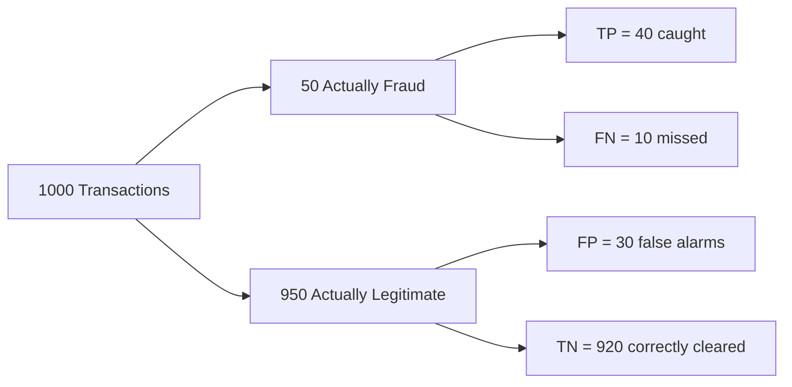

# Unit 7 — Probability, Statistics and AI Confidence
## Topic 3: Measuring AI Performance

*(Covers: Mean, median, mode — measuring consistency across AI runs · Accuracy · Precision · Recall · Confusion matrix · Interpreting AI output variation)*

---

## 1. Learning Objectives

By the end of this topic, you will be able to:

1. **Calculate** the mean, median, and mode of a set of repeated AI evaluation results.
2. **Explain** what accuracy measures and identify its limitations.
3. **Differentiate** between precision and recall using a worked example.
4. **Construct** and interpret a confusion matrix from raw prediction counts.
5. **Analyze** why a high accuracy score can still hide a seriously unreliable AI system.
6. **Evaluate** AI output variation across repeated runs to judge real-world reliability.

---

## 2. Overview

You now know that AI systems are probabilistic (Unit 1), that probability itself follows precise rules (Topic 1), and that an LLM's very act of choosing words is a probability calculation controlled by temperature (Topic 2). The natural next question, and the single most important skill for anyone who will **oversee** an AI system rather than just build one, is: **how do we actually measure whether an AI system is good?**

This is where **evaluation metrics** come in — mean, median, mode, accuracy, precision, recall, and the confusion matrix. These are not abstract statistics-class topics; they are the everyday vocabulary of AI-native engineering teams. When your manager asks, "How good is our fraud-detection model?", answering "96% accurate" is often **dangerously incomplete** — as you will see in this topic's worked example. Mastering these metrics is directly required for your Capstone project in Unit 15, where you must build a 5-case evaluation harness for your own AI system.

---

## 3. Description

### 3.1 Mean, Median, Mode — Measuring Consistency Across AI Runs

Because AI output is probabilistic (Unit 1), a responsible engineer never judges an AI system from a single run — you test it multiple times and look at the *spread* of results.

**Key Terminology:**

| Term | Simple Meaning | Formula |
|---|---|---|
| **Mean** | The "average" — add up all values, divide by how many there are. | Mean = (sum of all values) ÷ (count of values) |
| **Median** | The middle value when all values are sorted in order. | Sort the list; pick the middle number (or average the two middle numbers if the count is even). |
| **Mode** | The value that appears most frequently. | Count repeats; the most repeated value is the mode. |

**Worked Calculation:** You run the same AI-generated report through your system 5 times and measure response time (in seconds): **2, 3, 3, 4, 20** (the 20-second run was a rare, unusually slow response).

```
Mean   = (2 + 3 + 3 + 4 + 20) ÷ 5 = 32 ÷ 5 = 6.4 seconds
Median = sort → [2, 3, 3, 4, 20] → middle value (3rd of 5) = 3 seconds
Mode   = value that repeats most often = 3 seconds (appears twice)
```

**Why this matters:** The mean (6.4 seconds) looks alarming and doesn't represent a "typical" run at all — it was dragged upward by one unusual 20-second outlier. The median and mode (both 3 seconds) far better represent what a *typical* user actually experiences. **Lesson:** when reporting AI performance, especially latency or output-quality scores, always check whether an outlier is distorting your mean before presenting it as "the" number.

---

### 3.2 Accuracy — What Proportion of Outputs Were Correct

**Definition:** **Accuracy** is the proportion (or percentage) of all predictions that the AI system got correct.

```
Accuracy = (Number of correct predictions) / (Total number of predictions)
```

**Worked Calculation:** An AI model classifies 1,000 UPI transactions as "fraud" or "legitimate." It gets 960 of these 1,000 classifications right.

```
Accuracy = 960 / 1000 = 0.96 → 96%
```

96% sounds excellent — but as you'll see in section 3.4, this single number can dangerously hide a serious problem.

---

### 3.3 Precision — Of the Things the Model Flagged, How Many Were Actually Correct

**Definition:** **Precision** answers the question: *"Of everything the model predicted as 'positive' (e.g., flagged as fraud), how many were actually correct?"*

```
Precision = TP / (TP + FP)
```

Where (introducing terms used throughout this section):
- **TP (True Positive):** The model said "positive," and it really was positive.
- **FP (False Positive):** The model said "positive," but it was actually negative (a false alarm).

---

### 3.4 Recall — Of All the Things That Were Correct, How Many Did the Model Find

**Definition:** **Recall** answers a different question: *"Of everything that was actually 'positive' (e.g., truly fraud) in reality, how many did the model successfully catch?"*

```
Recall = TP / (TP + FN)
```

Where:
- **FN (False Negative):** The model said "negative," but it was actually positive (a missed case).

---

### 3.5 Confusion Matrix — Why 95% Accuracy Can Still Mean Frequent Failure

**Definition:** A **confusion matrix** is a simple table that lays out all four possible outcomes of a prediction — True Positive, False Positive, True Negative, and False Negative — so you can compute accuracy, precision, and recall all from one place.

**Worked Example — the same UPI fraud-detection model (1,000 transactions, 96% accuracy from section 3.2):**

We now reveal what those 1,000 predictions actually looked like. Suppose 50 of the 1,000 transactions were genuinely fraudulent, and 950 were genuinely legitimate.

| | **Predicted: Fraud** | **Predicted: Legitimate** | **Row Total** |
|---|---|---|---|
| **Actually Fraud** | TP = 40 | FN = 10 | 50 |
| **Actually Legitimate** | FP = 30 | TN = 920 | 950 |
| **Column Total** | 70 | 930 | 1000 |

**Step-by-step calculations:**

```
Accuracy  = (TP + TN) / Total = (40 + 920) / 1000 = 960 / 1000 = 96.0%
Precision = TP / (TP + FP)    = 40 / (40 + 30)     = 40 / 70    = 57.1%
Recall    = TP / (TP + FN)    = 40 / (40 + 10)     = 40 / 50    = 80.0%
```

**Why this matters — the whole point of this topic:** The headline number, **96% accuracy, sounds impressive**. But look closer:

- **Precision is only 57.1%** — meaning that when this model flags a transaction as fraud, it is *wrong more than 4 times out of 10*. Nearly half of all "fraud alerts" are actually innocent customers being wrongly blocked or investigated — a real business and customer-trust cost.
- **Recall is 80%** — meaning the model still misses 1 in every 5 real fraud cases (10 out of 50 actual frauds went undetected as FN).

**The reason accuracy hides this:** legitimate transactions vastly outnumber fraud (950 vs. 50) in this dataset. A lazy model could predict "legitimate" for *everything* and still score `950/1000 = 95%` accuracy — while catching **zero** actual fraud! This is called the **class imbalance problem**, and it is one of the most important things to check before trusting any single accuracy number.



**Comparison Table — When to Prioritise Which Metric**

| Metric | Answers | Prioritise when... |
|---|---|---|
| Accuracy | "How often is the model right overall?" | Classes are balanced (roughly equal positive/negative cases). |
| Precision | "When it says yes, can I trust it?" | False alarms are costly (e.g., blocking a genuine customer's payment). |
| Recall | "Does it catch all the real cases?" | Missing a real case is costly (e.g., missing a genuine fraud, missing a disease). |

---

### 3.6 Interpreting AI Output Variation — What It Tells You About Reliability

Because AI is probabilistic, running the **same evaluation multiple times** and looking at how much the results vary (not just a single accuracy/precision/recall number) tells you how *reliable* the system truly is.

**Best Practices:**

- Always run your evaluation set multiple times (not just once) and report the **mean and spread** (how far results vary), not a single lucky run.
- If precision/recall numbers swing wildly between runs, this signals the AI system is unstable and needs further tuning, more data, or a lower/adjusted temperature (Topic 2) before deployment.
- Always check the confusion matrix (not just accuracy) whenever the "positive" class (fraud, disease, plagiarism) is rare compared to the "negative" class.

**Common Beginner Mistakes:**

- Reporting only accuracy and ignoring precision/recall, especially for imbalanced real-world problems (fraud, disease, rare defects).
- Evaluating an AI system only once, ignoring the fact that probabilistic systems can behave differently across runs.
- Confusing precision and recall — remember: **Precision** cares about the quality of what was *flagged*; **Recall** cares about *not missing* real cases.

---

## 4. Real World Application

- **Banking/UPI Fraud Detection:** Exactly the worked example above — banks must balance precision (don't annoy genuine customers) against recall (don't miss real fraud).
- **Healthcare AI Screening:** Recall is usually prioritised over precision — missing a genuine disease case (false negative) is far more dangerous than a false alarm that triggers a confirmatory test.
- **Railway/E-commerce Fraud and Bot Detection:** Confusion matrices are used to tune ticket-booking bot detectors, balancing genuine customer convenience against blocking bots.
- **Spam Filtering:** Precision matters greatly — users are annoyed if genuine emails are marked spam (false positives), even if some spam slips through.
- **Capstone Evaluation Harness (Unit 15):** You will be required to compute these exact metrics for your own AI-native system before presenting it.

---

## 5. Worked Example

**Scenario:** An EdTech startup builds an AI system to auto-detect plagiarised college assignments. They test it on 200 assignments: 20 are genuinely plagiarised, 180 are original. The results: TP = 16, FN = 4, FP = 36, TN = 144.

**Step 1 — Verify the counts add up:**
```
Actually plagiarised: TP + FN = 16 + 4 = 20 ✓
Actually original:    FP + TN = 36 + 144 = 180 ✓
Total: 20 + 180 = 200 ✓
```

**Step 2 — Calculate all three metrics:**
```
Accuracy  = (TP+TN)/Total = (16+144)/200 = 160/200 = 80.0%
Precision = TP/(TP+FP)    = 16/(16+36)   = 16/52   = 30.8%
Recall    = TP/(TP+FN)    = 16/(16+4)    = 16/20   = 80.0%
```

**Interpretation:** The model catches 80% of real plagiarism cases (good recall), but its precision is very poor (30.8%) — meaning **more than two-thirds of all flagged assignments are actually original work**, wrongly accused. For a real deployment, this system would need significant improvement before professors could trust its flags, or it would need to be positioned only as a "first-pass filter for human review," never an automatic penalty trigger — directly connecting back to the Judgment Framework (Unit 9).

---

## 6. Key Takeaways

- **Mean, median, mode** describe the "centre" of repeated AI results — always check if an outlier is distorting your mean.
- **Accuracy** = (correct predictions) / (total predictions) — simple, but misleading when classes are imbalanced.
- **Precision** = TP/(TP+FP) — "when it says yes, how often is it right?"
- **Recall** = TP/(TP+FN) — "of all the real cases, how many did it catch?"
- A **confusion matrix** (TP, FP, TN, FN) is the single most useful tool for honestly evaluating an AI system — always build one before trusting a headline accuracy number.
- **Class imbalance** (rare positive events) is exactly why "96% accurate" fraud/disease/plagiarism detectors can still fail most of the people they flag.
- Always evaluate AI systems across **multiple runs**, not once, because AI output is probabilistic (Unit 1) — check for consistency, not just a single good result.
- **Interview tip:** Be ready to compute precision, recall, and accuracy from a raw confusion matrix by hand, and to explain in one sentence *why* accuracy alone can be misleading — this is one of the most frequently asked entry-level AI/ML interview questions.

---

## 7. Reference Links

- [Google Machine Learning Crash Course — Classification: Precision and Recall](https://developers.google.com/machine-learning/crash-course/classification/precision-and-recall) — official, beginner-friendly explanation with interactive examples.
- [GeeksforGeeks — Confusion Matrix in Machine Learning](https://www.geeksforgeeks.org/) — supplementary worked examples.
- [NIST AI Risk Management Framework](https://www.nist.gov/itl/ai-risk-management-framework) — for how evaluation metrics connect to responsible AI risk measurement (Measure function).
