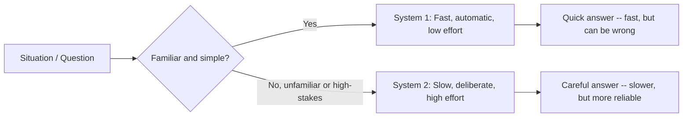

# Unit 9 — Human Judgment and AI Oversight
## Topic 1: How Humans Think

*(Covers: System 1 thinking — fast, instinctive, automatic · System 2 thinking — slow, deliberate, effortful)*

---

## 1. Learning Objectives

By the end of this topic, you will be able to:

1. **Explain** the difference between System 1 and System 2 thinking in the human brain.
2. **Identify** everyday situations where you are using System 1 versus System 2 thinking.
3. **Describe** why System 1 thinking makes humans fast but occasionally error-prone.
4. **Differentiate** between tasks that are safe to leave to instinct and tasks that demand deliberate, slow thinking.
5. **Analyze** why understanding your own thinking process is the first step before you can responsibly oversee an AI system's output.

---

## 2. Overview

Before we can talk about how humans should *oversee* AI systems, we need to understand how the human brain itself makes decisions. This might feel like a strange place to start in a program about AI — but it is deliberate. The single biggest risk in AI-native software is not the AI being wrong. It is a **human reviewer approving a wrong AI answer without noticing**, because their own brain took a shortcut.

Psychologist and Nobel Prize winner Daniel Kahneman popularised a simple but powerful idea: our brain runs on **two different thinking systems** — one fast and automatic (System 1), and one slow and effortful (System 2). Both are useful. Both are also, in different ways, unreliable if used in the wrong situation.

As a future AI-Native Engineer, you will constantly be asked to review AI-generated code, AI-generated reports, or AI-generated decisions and say "yes, this is correct" or "no, this needs fixing." That review is a human thinking process — and if you review AI output using System 1 (fast, instinctive skimming), you will miss things a careless AI got wrong. This topic gives you the vocabulary and self-awareness to recognise which kind of thinking a situation demands, which directly prepares you for the **Judgment Framework** (Topic 3 of this unit) and the human-oversight design work you'll do in Week 10.

---

## 3. Description

### 3.1 System 1 Thinking — Fast, Instinctive, Automatic

**Definition:** System 1 is the part of your thinking that works **automatically, quickly, and with very little effort**. It runs constantly in the background, without you consciously choosing to "turn it on."

**Why it exists:** Evolution favoured fast thinking because, for most of human history, slow thinking could get you killed. If you saw a shadow that looked like a snake, you jumped back *immediately* — you did not sit down and calculate the probability that it was actually a snake. System 1 is your brain's shortcut system, built for speed and survival, not for perfect accuracy.

**Everyday examples of System 1 thinking:**

- Recognising a friend's face in a crowd.
- Reacting to a car honking behind you while crossing the road.
- Reading the word "STOP" on a signboard without sounding out each letter.
- Feeling that a WhatsApp forward message "seems fishy" before you've even fact-checked it.
- Answering "2 + 2 = ?" — you don't calculate this; you just *know* it instantly.

**Key properties of System 1:**

| Property | Description |
|---|---|
| Speed | Near-instant |
| Effort | Very low — feels automatic |
| Awareness | You are often not aware it is even "thinking" |
| Reliability | Good for familiar, repeated patterns; unreliable for new or complex situations |
| Error-proneness | High — it takes shortcuts (called *heuristics*) that can lead to *biases* (covered in Topic 2) |

---

### 3.2 System 2 Thinking — Slow, Deliberate, Effortful

**Definition:** System 2 is the part of your thinking that engages **deliberately, slowly, and with conscious effort**. You "switch it on" when a situation demands careful reasoning.

**Why it exists:** Some problems cannot be solved by instinct — they require holding multiple pieces of information in your mind at once, comparing options, and reasoning step by step. System 2 is slower and more tiring, but it is far more accurate for unfamiliar or high-stakes problems.

**Everyday examples of System 2 thinking:**

- Solving `47 × 36` in your head without a calculator.
- Carefully reading through a rental agreement before signing it.
- Deciding which college course to choose based on comparing fees, placement records, and location.
- Debugging a piece of code line by line to find why it's producing the wrong output.
- Double-checking an AI-generated summary of a legal document against the original text.

**A Simple Diagram — Two Systems, One Brain:**

**Comparison Table — System 1 vs System 2**

| Aspect | System 1 | System 2 |
|---|---|---|
| Speed | Instant | Slow |
| Mental effort | Very low | High |
| Awareness of the process | Usually unconscious | Conscious, deliberate |
| Best suited for | Familiar, repeated, low-stakes decisions | Unfamiliar, complex, high-stakes decisions |
| Risk | Prone to shortcuts and biases | Tiring — humans avoid it unless forced to engage |
| Example | Recognising a familiar app icon | Reviewing an AI-written contract clause by clause |

> **Important Note:** You cannot run on System 2 all day — it is mentally exhausting, so your brain naturally tries to solve as many things as possible using System 1, even when it shouldn't. This tendency to "default to System 1" is exactly what causes **automation bias** — trusting an AI's answer without questioning it — which you'll study in the next topic.

**Best Practices:**

- Before accepting any AI-generated output as final, consciously ask yourself: *"Am I reviewing this with System 1 (skimming) or System 2 (actually verifying)?"*
- Reserve System 2 review for high-stakes AI outputs — medical, financial, legal, safety-related — even if it feels slower and more tiring.
- Build habits (like re-reading, checklists, or a second pair of eyes) that force System 2 engagement for important decisions, since your brain will not do it automatically.

**Common Beginner Mistakes:**

- Assuming "I read the AI's answer, so I checked it" — reading is often System 1; *checking* requires System 2 verification against a source of truth.
- Believing System 1 is "bad" and System 2 is "good" — both are necessary; the skill is knowing *when* to use which.
- Underestimating how tempting it is to trust a confident-sounding AI answer without verification — confidence in tone has nothing to do with correctness (you'll see this connect directly to hallucination in Unit 5).

---

## 4. Real World Application

- **Software QA / Code Review:** A senior developer reviewing a junior's (or an AI's) code uses System 2 — reading line by line, tracing logic, checking edge cases — rather than System 1 skimming.
- **Banking:** A bank employee approving a large loan is expected to use System 2 — verifying documents carefully — rather than instinctively trusting a customer's claim (System 1).
- **Healthcare:** A doctor reviewing an AI-suggested diagnosis engages System 2 by cross-checking against the patient's full history, rather than accepting the AI's suggestion at a glance.
- **Everyday UPI Use:** Approving a UPI payment request quickly (System 1) is how many users fall for fraud — scammers rely on you *not* switching to System 2 to verify the payee's name carefully.
- **AI Chatbot Oversight:** A customer support agent reviewing chatbot-drafted replies before sending them to customers must consciously use System 2, especially for sensitive complaints or refund decisions.

---

## 5. Worked Example

**Scenario:** You are reviewing an AI assistant's draft reply to a customer complaint on an e-commerce app before it gets sent.

The AI drafted: *"We're sorry, your refund of ₹1,499 has been processed and will reflect in 3–5 business days."*

**System 1 review (fast, instinctive):** "Sounds polite and complete. Looks fine. Send it." *(Takes 3 seconds, no verification.)*

**System 2 review (slow, deliberate):**
1. Check the actual order record: was a refund of ₹1,499 *actually* approved, or did the AI assume this from the customer's message?
2. Check the refund amount against the order total — is ₹1,499 correct, or should it be a partial refund?
3. Check whether "3–5 business days" matches this company's actual refund policy, or whether the AI generated a generic-sounding number.

**Outcome:** On checking, you discover the actual approved refund was ₹1,299 (a partial refund due to a returned accessory), not ₹1,499. If you had relied on System 1, you would have sent a factually wrong message to the customer — creating a real financial and trust problem. This is exactly why AI-generated output that touches money, health, or legal facts must be reviewed with System 2, never System 1.

---

## 6. Key Takeaways

- **System 1** = fast, automatic, low-effort thinking. Great for familiar, low-stakes situations; prone to shortcuts and mistakes in new or complex ones.
- **System 2** = slow, deliberate, effortful thinking. Needed for unfamiliar, complex, or high-stakes decisions.
- Your brain defaults to System 1 whenever possible, because System 2 is mentally tiring — this default is a major hidden risk when reviewing AI output.
- A confident, well-written AI answer *feels* trustworthy to System 1 — but tone has no relationship to factual correctness.
- Reviewing AI output responsibly means consciously choosing to engage System 2, especially for high-stakes decisions (money, health, legal, safety).
- **Interview tip:** If asked "how do you ensure quality when reviewing AI-generated output?", referencing System 1 vs System 2 (Kahneman's dual-process theory) shows you understand the *human* side of AI oversight, not just the technical side.
- This topic is the psychological foundation for **Topic 2 (Cognitive Biases and AI)** and the **Judgment Framework (Topic 3)** later in this unit.

---

## 7. Reference Links

- Daniel Kahneman, *Thinking, Fast and Slow* — the original, authoritative source for System 1 / System 2 theory (summarised in most reputable psychology courses).
- [Google Machine Learning Crash Course — Fairness and Human Oversight](https://developers.google.com/machine-learning/crash-course) — for how human review connects to responsible AI use.
- [NIST AI Risk Management Framework](https://www.nist.gov/itl/ai-risk-management-framework) — "Govern" and "Manage" functions discuss the role of human oversight in AI systems.
