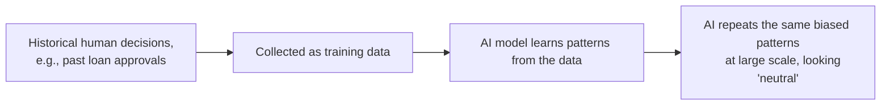

# Unit 9 — Human Judgment and AI Oversight
## Topic 2: Cognitive Biases and AI

*(Covers: Confirmation bias · Anchoring bias · Automation bias · How human biases get encoded into AI training data)*

---

## 1. Learning Objectives

By the end of this topic, you will be able to:

1. **Explain** what a cognitive bias is and why the human brain produces them.
2. **Identify** confirmation bias, anchoring bias, and automation bias in real-life and AI-related scenarios.
3. **Describe** how human biases end up embedded inside AI models through training data.
4. **Differentiate** between a human being biased *while using* AI versus an AI being biased *because of* its training data.
5. **Evaluate** a given AI-assisted decision scenario to spot which bias(es) may be influencing the human reviewer.

---

## 2. Overview

In Topic 1, you learned that System 1 thinking is fast but takes shortcuts. **Cognitive biases** are the predictable, repeated mistakes that come from those shortcuts. They are not signs of a "bad" or "unintelligent" person — every human brain has them, including highly experienced engineers and doctors.

Why does this matter for AI-native software? Because biases attack you from **two directions** at once. First, biases affect *how a human reviews AI output* — for example, blindly trusting an AI's confident answer (automation bias). Second, biases can get baked *into the AI itself*, because AI models learn patterns from data that humans created — and human-created data carries human biases. If a hiring dataset historically favoured one group of candidates, an AI trained on that data will learn to repeat that pattern, even without anyone intending it to.

Recognising both directions of bias is essential to the "AI implements, you specify and verify" discipline (the 70/30 rule from Week 2) and directly feeds into the ethical principles (fairness, transparency, accountability, harm prevention) you studied in Unit 5. This topic gives you the vocabulary to *name* these failure patterns so you can catch them — in yourself, and in the systems you oversee.

---

## 3. Description

### 3.1 Confirmation Bias

**Definition:** Confirmation bias is the tendency to **search for, notice, and remember information that confirms what we already believe** — while ignoring or downplaying information that contradicts it.

**Everyday example:** A student who believes "AI is always accurate" will remember the ten times an AI chatbot gave a correct answer, and quickly forget or explain away the two times it hallucinated a wrong fact.

**AI-specific example:** If you already suspect a customer is trying to commit fraud, and an AI fraud-detection tool flags their transaction as "suspicious," you may accept that flag immediately without checking the evidence — because it confirms what you already believed. If the same AI had said "not suspicious," you might have double-checked it more carefully. That inconsistency *is* confirmation bias in action.

---

### 3.2 Anchoring Bias

**Definition:** Anchoring bias is the tendency to **rely too heavily on the first piece of information you receive** (the "anchor"), even when later information should change your judgment.

**Everyday example:** If a shopkeeper first shows you a shirt priced at ₹3,000 and then a "discounted" one at ₹1,800, the ₹1,800 shirt feels like a bargain — even if ₹1,800 is still overpriced. Your judgment "anchored" to the first number you saw.

**AI-specific example:** If an AI assistant's very first draft of a document says the project budget is "₹10 lakhs," reviewers may unconsciously anchor to that number in every later discussion — even after new, more accurate information suggests the real budget should be ₹7 lakhs. The AI's first answer becomes a mental anchor that is hard to move away from, simply because it was seen first.

---

### 3.3 Automation Bias

**Definition:** Automation bias is the tendency to **trust the output of an automated system (like an AI) more than you would trust the same judgment coming from a human**, often without adequately verifying it.

**Why it's dangerous:** As AI tools become more common and more confident-sounding, humans naturally start to defer to them — "the system said so, it must be right." This is System 1 thinking (Topic 1) applied specifically to machines: it *feels* effortful to double-check a computer, so we often just don't.

**Everyday example:** Following a GPS navigation instruction to turn down a road that is actually closed, simply because "the app said so," instead of trusting what you can see with your own eyes.

**AI-specific example:** A radiologist who has reviewed 500 scans where an AI tool correctly flagged tumours may start rubber-stamping the AI's judgment on the 501st scan without looking as carefully — even though this is exactly the scan where the AI happens to be wrong. This is one of the most well-documented failure patterns in real-world AI deployments (you'll examine a detailed case study of this in Unit 10).

**Comparison Table — The Three Biases**

| Bias | What Happens | Simple Example | Risk in AI Systems |
|---|---|---|---|
| Confirmation bias | You favour evidence that agrees with your existing belief | Only noticing AI's correct answers, ignoring its mistakes | Reviewers stop looking for AI errors once they "trust" a tool |
| Anchoring bias | You over-rely on the first number/fact you saw | Sticking to a shop's first quoted price | First AI-generated draft/number becomes hard to correct later |
| Automation bias | You trust automated output more than you should | Blindly following GPS directions | Humans stop double-checking AI decisions in high-stakes situations |

---

### 3.4 How Human Biases Get Encoded into AI Training Data

**The core idea:** An AI model learns patterns from the data it is trained on. If that data was created, labelled, or collected by humans — and it almost always was — then whatever biases existed in that human process get absorbed into the model's learned patterns.

**How this happens, step by step:**

1. **Data collection reflects historical human decisions.** For example, a bank's past loan-approval records reflect *human loan officers'* decisions — including any unfair patterns those officers had (consciously or not).
2. **The AI model looks for patterns in that data.** It doesn't know *why* certain applicants were approved more often — it just learns "these patterns predict approval."
3. **The AI repeats those patterns at scale.** If the training data quietly favoured certain neighbourhoods, income brackets, or genders, the model may learn to replicate that pattern — even without ever being told to consider those factors directly, because they can be indirectly present in other data fields (e.g., pin code standing in for a certain community).
4. **The result looks "neutral" but isn't.** Because the AI is just doing statistics, its biased outcome can appear objective and data-driven — which makes it *more* convincing, and *more* dangerous, than an obviously biased human opinion.

> **Important Note:** This is exactly the kind of failure discussed under "Data bias" in Unit 5 (AI Ethics, Safety and Governance) — this topic explains the human psychology *behind* how that bias originally enters the data in the first place.

**Best Practices:**

- Always ask: *"Whose past decisions does this training data represent, and could those decisions have been biased?"*
- When reviewing AI output in a high-stakes area (hiring, lending, healthcare), specifically look for patterns that might reflect encoded historical bias — don't assume "the AI is just doing maths, so it must be fair."
- Use diverse review teams, since one person's blind spot is often another person's obvious red flag.

**Common Beginner Mistakes:**

- Assuming AI is automatically "objective" because it's based on numbers and data — data is a reflection of human history, and history is not always fair.
- Confusing "the AI seems confident" with "the AI is unbiased" — confidence and fairness are unrelated.
- Believing bias only comes from the AI model — in practice, most real-world AI failures involve **both** a biased dataset *and* a human reviewer with automation bias failing to catch it.

---

## 4. Real World Application

- **Hiring AI Tools:** Resume-screening AI trained on a company's past hiring data can learn to prefer candidates similar to previously-hired employees — silently disadvantaging equally qualified candidates from different backgrounds.
- **Loan / Credit Scoring:** AI credit-scoring tools trained on historical repayment data can reflect biases from decades of unequal access to formal banking in certain regions or communities.
- **Healthcare Triage:** An AI triage tool trained mostly on data from one demographic group may perform less accurately for underrepresented groups — a real, documented failure pattern in medical AI.
- **Content Moderation:** Automation bias can cause moderators to accept an AI's "flagged as inappropriate" decision without reviewing context, leading to wrongful takedowns.
- **Indian Context — Vernacular AI:** Confirmation bias can cause a reviewer who already doubts regional-language AI tools to be extra critical of correct vernacular translations while giving English outputs an easier pass — an inconsistency worth watching for in evaluation teams.

---

## 5. Worked Example

**Scenario:** An AI-powered resume screening tool is used by a company's HR team to shortlist candidates for a software engineering role.

**Step 1 — Spot Automation Bias:** The HR executive sees the AI has shortlisted 20 out of 200 resumes and, trusting the tool, sends interview calls without reviewing the rejected 180. *(Automation bias: no verification of automated output.)*

**Step 2 — Spot Confirmation Bias:** When asked to review a few rejected resumes, the HR executive picks ones that "look weak on paper" — subconsciously looking for evidence that supports the AI's rejection rather than checking for cases where the AI made a mistake. *(Confirmation bias: seeking confirming evidence, not disconfirming evidence.)*

**Step 3 — Spot Anchoring Bias:** The first resume the HR executive reviewed had a well-known college's name on it, and been immediately shortlisted. Every later resume gets subconsciously compared to that "anchor" resume, even when other candidates have stronger, relevant project experience from lesser-known colleges. *(Anchoring bias: over-weighting the first data point seen.)*

**Step 4 — Trace to Encoded Bias:** On investigation, it turns out the AI tool was trained on the company's last 5 years of "successful hires" — which happened to be dominated by graduates from a handful of well-known colleges, because that's who the company hired before. The AI learned "resumes like these get hired" and is now silently repeating that historical pattern.

**Conclusion:** Three separate human biases (automation, confirmation, anchoring) combined with one data-driven bias (encoded historical pattern) to produce a resume-screening process that looks "data-driven and fair" but is actually neither. Catching this requires deliberately naming and checking for each of these four failure points — which is exactly the discipline this topic is building in you.

---

## 6. Key Takeaways

- A **cognitive bias** is a predictable mental shortcut — not a sign of low intelligence, but a universal feature of human thinking.
- **Confirmation bias**: favouring evidence that agrees with what you already believe.
- **Anchoring bias**: over-relying on the first piece of information received.
- **Automation bias**: trusting automated/AI output more than you would trust the same judgment from a human, often without verifying it.
- AI training data reflects **historical human decisions** — and any bias in those past decisions gets absorbed and repeated by the AI model, often invisibly.
- Data-driven output can *feel* objective while still being biased — statistics do not automatically remove human unfairness.
- **Interview tip:** Being able to name a specific bias (not just say "AI can be biased") shows a much deeper, professional understanding of AI risk.
- These three biases are the psychological explanation for *why* strong human oversight processes (like the Judgment Framework in Topic 3) are necessary, not optional.

---

## 7. Reference Links

- Daniel Kahneman, *Thinking, Fast and Slow* — foundational source on cognitive biases and heuristics.
- [NIST AI Risk Management Framework](https://www.nist.gov/itl/ai-risk-management-framework) — "Map" function specifically addresses identifying bias risks in AI systems.
- [Google Machine Learning Crash Course — Fairness](https://developers.google.com/machine-learning/crash-course/fairness) — practical grounding in how bias enters ML systems through data.
