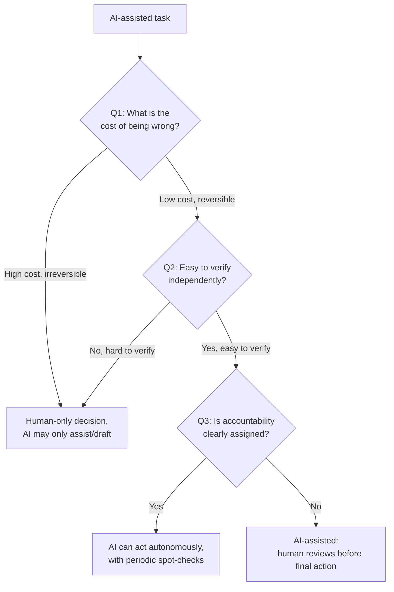

# Unit 9 — Human Judgment and AI Oversight
## Topic 3: The Judgment Framework

*(Covers: Q1 — What is the cost of this being wrong? · Q2 — Can I verify this without the AI? · Q3 — Who is accountable if this fails?)*

---

## 1. Learning Objectives

By the end of this topic, you will be able to:

1. **Explain** the purpose of the Judgment Framework and why it exists as a structured decision tool.
2. **Describe** each of the three questions in the framework and what it is designed to reveal.
3. **Apply** the Judgment Framework to a real AI-system scenario to decide the right level of human oversight.
4. **Differentiate** between situations suited to fully autonomous AI, AI-assisted human decisions, and human-only decisions.
5. **Evaluate** a proposed AI feature and justify, using the framework, how much human oversight it needs.

---

## 2. Overview

You've now learned that human thinking has two speeds (Topic 1) and that both speeds — and the AI systems built on human data — are vulnerable to predictable biases (Topic 2). So the natural next question is: **how much should a human check an AI's work, and when?**

Checking *everything* an AI does, all the time, defeats the purpose of using AI at all — you'd spend as much effort verifying as you would have spent just doing the task yourself. But checking *nothing* is how real, documented AI failures happen (you'll study several such case studies in Unit 10). The **Judgment Framework** is a simple, three-question tool that helps you decide, for any AI-assisted task, exactly how much human oversight is appropriate.

This is arguably the single most practical tool in this entire semester. Every time you build, specify, or use an AI system in your career, you will be able to run it through these three questions to decide: should this run fully automatically, should a human review it before it's final, or should a human make the decision entirely, with AI only assisting? This directly extends the "AI implements, you specify and verify" discipline into a repeatable, defensible decision process — something you can explain confidently in a job interview or a design review.

---

## 3. Description

### 3.1 The Three Questions

**Q1 — What is the cost of this being wrong?**

This question asks you to imagine the *worst case* if the AI's output is wrong and nobody catches it. Ask: What is lost — money, time, health, reputation, safety, legal standing? Is the mistake **reversible** (easy to undo) or **irreversible** (cannot be undone)?

- *Low cost example:* An AI recommends a wrong movie in a "you might also like" list. Worst case: the user ignores it. Fully reversible, low cost.
- *High cost example:* An AI wrongly approves a ₹10 lakh loan for a fraudulent applicant. Worst case: real financial loss, possibly unrecoverable.

**Q2 — Can I verify this without the AI?**

This question asks whether a human (or another independent system) can check the AI's answer using a source that does **not** depend on the AI itself — for example, an official record, a calculation, a policy document, or direct observation.

- *Easy to verify:* "What is my current UPI balance?" — can be checked instantly against the bank's ledger, independent of what any AI says.
- *Hard to verify:* "Will this patient's condition worsen in the next 48 hours?" — no simple independent check exists; it requires deep medical expertise and judgment.

**Q3 — Who is accountable if this fails?**

This question asks: if the AI's decision turns out to be wrong and causes harm, **whose name is on it?** Is there a clearly identified human or role responsible for the outcome — legally, professionally, or ethically — or does accountability simply "disappear" into "the algorithm did it"?

- *Clear accountability:* A loan officer reviews and signs off on an AI-suggested loan decision — the officer is accountable.
- *Unclear/missing accountability:* An AI auto-rejects loan applications with no human sign-off at all — if this is later found to be unfairly biased, who is responsible? This gap itself is a governance failure (connecting back to the EU AI Act's human-oversight obligations from Unit 5).

**A Simple Decision Flow:**

**Comparison Table — Where Different Tasks Land**

| Task | Q1: Cost of Wrong | Q2: Verifiable Independently? | Q3: Accountability Clear? | Framework Outcome |
|---|---|---|---|---|
| AI suggests a Netflix-style recommendation | Very low | Not really needed | Not needed | Fully autonomous AI |
| AI drafts a customer support reply | Low–medium | Yes (check against policy docs) | Support agent reviews before sending | AI-assisted, human-reviewed |
| AI approves/denies a loan | High, hard to reverse | Yes (financial records exist) | Must be a named loan officer | AI-assisted, human sign-off required |
| AI suggests a medical diagnosis | Very high, life-affecting | Only by expert judgment | Must be a licensed doctor | Human-only decision; AI is advisory input |

> **Important Note:** The framework isn't a one-time checklist — it should be re-applied whenever the *scale*, *domain*, or *stakes* of an AI feature changes. A chatbot that only answered FAQs yesterday but is being expanded to authorize refunds today needs to be run through all three questions again.

**Best Practices:**

- Apply all three questions *together* — a task might look low-risk on Q1 but fail badly on Q3 (no accountable owner), which still means it needs stronger oversight.
- Document your answers to all three questions when designing an AI feature — this becomes evidence of responsible design (directly useful for your capstone in Week 15).
- Revisit the framework whenever an AI system's scope grows — oversight needs usually increase, not decrease, as capability increases.

**Common Beginner Mistakes:**

- Only asking Q1 (cost) and skipping Q2/Q3 — a low-cost task with *no way to verify it at all* can still be dangerous if it silently accumulates into a large-scale problem (e.g., thousands of slightly-wrong AI translations going unnoticed).
- Treating "the AI is usually right" as an answer to Q2 — statistical accuracy is not the same as independent verifiability.
- Assuming "a human is somewhere in the loop" automatically satisfies Q3 — accountability requires a *specific, named* responsible role, not a vague human presence.

---

## 4. Real World Application

- **Banking/FinTech:** Loan approval systems in India are required (by RBI guidance and general financial governance practice) to have a human loan officer accountable for high-value decisions — a direct real-world reflection of Q3.
- **Healthcare:** AI diagnostic-support tools are positioned as "decision support," not "decision makers" — doctors remain the accountable, verifying human, exactly matching Q2 and Q3.
- **E-commerce:** Automated refund approval below a small threshold (say ₹500) is often left fully automated (low cost, easily reversible), while high-value refunds require manual approval — a live example of the framework's cost-based branching.
- **Content Moderation:** Platforms often auto-remove clearly rule-violating content (low ambiguity, easy to verify) but route borderline cases to human reviewers (Q2 fails — hard to verify automatically).
- **AI Agents Using Tools:** An agent that can only *read* data might be allowed to act autonomously; the moment it's given the ability to *send money* or *delete records*, Q1's cost changes drastically, requiring human sign-off (foreshadowing "When NOT to use agents" in Unit 14).

---

## 5. Worked Example

**Scenario:** Your capstone team is designing an AI feature for a college's admissions portal: *"AI Assistant that shortlists applicants for interview based on their application form."*

**Applying the Judgment Framework:**

**Q1 — Cost of being wrong?**
If the AI wrongly rejects a genuinely strong candidate, that student loses a fair shot at admission — a real, hard-to-reverse harm to an individual's opportunity. **Cost: high.**

**Q2 — Can I verify this without the AI?**
Yes, partially — a human admissions officer *can* review the original application form independently and check whether the AI's shortlisting matches what a human evaluator would decide. But full re-evaluation of every applicant defeats the purpose of using AI in the first place. **Verifiable: yes, but only through deliberate spot-checks, not automatically for every case.**

**Q3 — Who is accountable if this fails?**
If a wrongly rejected student later complains or appeals, the college needs a named admissions officer (not "the AI system") who reviewed and approved the shortlist. **Accountability: must be explicitly assigned to a human role.**

**Framework Outcome:** This is **not** a candidate for a fully autonomous AI decision. Given the high cost (Q1) and the need for an accountable human decision-maker (Q3), the correct design is: **AI assists by pre-scoring and ranking applicants, but a human admissions committee makes the final shortlist decision**, with a documented process for how borderline cases are escalated for human review (connecting directly to "designing human-in-the-loop checkpoints," which you'll study in Unit 10).

---

## 6. Key Takeaways

- The **Judgment Framework** is a 3-question tool to decide how much human oversight an AI-assisted task needs.
- **Q1 — Cost of being wrong:** how bad is it, and is it reversible?
- **Q2 — Can I verify independently:** is there a way to check the AI's answer without just trusting the AI itself?
- **Q3 — Who is accountable:** is there a specific, named human responsible if it fails?
- Low cost + easy to verify + clear accountability → AI can often act autonomously (with spot-checks).
- High cost, hard to verify, or unclear accountability → human must be in the loop, sometimes as the final decision-maker.
- The framework must be **re-applied** whenever an AI feature's scope, scale, or stakes change.
- **Interview tip:** Being able to walk an interviewer through all three questions for a real feature (like the college admissions example) demonstrates mature, production-ready AI judgment — far beyond "I'll just add a human review step somewhere."
- This framework connects directly to Unit 10 (designing human-in-the-loop checkpoints) and to your Week 15 capstone, where you must document the human override point for every component you build.

---

## 7. Reference Links

- [NIST AI Risk Management Framework](https://www.nist.gov/itl/ai-risk-management-framework) — the "Govern" and "Manage" functions map closely onto accountability and oversight concepts in this framework.
- [EU AI Act — Official Text](https://artificialintelligenceact.eu/) — Article provisions on human oversight for high-risk AI systems, directly relevant to Q3.
- [Google Machine Learning Crash Course — Responsible AI](https://developers.google.com/machine-learning/crash-course) — practical grounding in designing oversight into AI-powered products.
