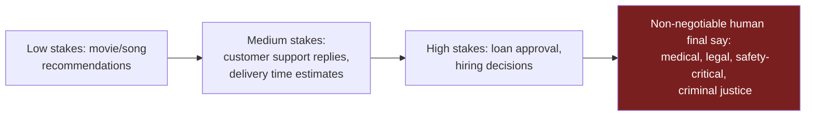

# Unit 9 — Human Judgment and AI Oversight
## Topic 4: Defining Safe Boundaries

*(Covers: Acceptable error — defining the failure threshold tolerable for a use case · High-stakes domains where AI must not have the final word — medical, legal, safety)*

---

## 1. Learning Objectives

By the end of this topic, you will be able to:

1. **Explain** what "acceptable error" means in the context of an AI system.
2. **Describe** how the tolerable failure threshold differs from one use case to another.
3. **Identify** high-stakes domains where AI must never be allowed to make the final, unreviewed decision.
4. **Differentiate** between domains where occasional AI mistakes are tolerable and domains where they are not.
5. **Evaluate** a proposed AI system and determine the acceptable error boundary and required human checkpoint for it.

---

## 2. Overview

You now have two powerful tools: an understanding of how human judgment works (Topics 1–2) and a structured framework for deciding oversight levels (Topic 3). This final topic in Unit 9 makes those ideas concrete by asking a very direct engineering question: **exactly how wrong is "too wrong," and for which systems is even one mistake unacceptable?**

Every AI system will make mistakes sometimes — this is a mathematical certainty you'll quantify precisely in Unit 7 and Unit 8 (accuracy, precision, recall never reach 100% in real systems). The professional skill is not eliminating all error — that's impossible — but **defining, in advance, how much error is acceptable for a given use case**, and drawing a hard line for domains where AI must never have the final say. This topic gives you the language to set that boundary clearly, which is a core deliverable in your Week 15 capstone (documenting the human override point for every component you build).

---

## 3. Description

### 3.1 Acceptable Error — Defining the Failure Threshold

**Definition:** Acceptable error is the **maximum rate or severity of mistakes a system is allowed to make** before it is considered unfit for a given use case, deliberately decided in advance rather than discovered after something goes wrong.

**Why this matters:** Different tasks can tolerate very different amounts of error. A movie-recommendation AI being "wrong" 20% of the time is a minor annoyance. A medical-diagnosis AI being wrong even 1% of the time, undetected, could mean real harm to real people. The number itself ("how much error is okay?") must be **decided deliberately, by humans, before deployment** — not left as an accident of how the system happens to perform.

**How to define an acceptable error threshold — key questions to ask:**

1. What does "wrong" mean for this specific task? (A late reply? An incorrect fact? A financial loss? A missed diagnosis?)
2. What is the real-world impact of each type of error? (Some errors are embarrassing; others are dangerous.)
3. What is the current best human-only performance in this task? (An AI shouldn't necessarily need to be perfect — often it only needs to be at least as reliable as the human process it is replacing or assisting.)
4. What monitoring will detect it if the error rate is exceeded in the real world, after deployment?

**Worked mini-example:** A food-delivery app builds an AI to estimate delivery time. The team decides: *"An estimate is acceptable if it is within ±10 minutes of the actual delivery time, at least 90% of the time."* This is a clearly defined, testable acceptable-error threshold — very different from vaguely saying "the AI should be pretty accurate."

---

### 3.2 High-Stakes Domains Where AI Must Not Have the Final Word

**Definition:** Certain domains carry consequences so severe, irreversible, or ethically significant that **no acceptable error threshold is low enough to justify letting an AI make the final, unsupervised decision.** In these domains, a human must always review, confirm, or retain override authority before the decision takes real-world effect.

**Why these domains are different:** In a recommendation system, a wrong suggestion just gets ignored. In these domains, a wrong AI decision can cause **irreversible harm to a real person's health, freedom, finances, or safety** — harm that cannot be "undone" the way a bad movie recommendation can be shrugged off.

**Classic high-stakes domains:**

| Domain | Example AI Use | Why AI Cannot Have Final Word |
|---|---|---|
| **Medical** | AI suggests a diagnosis or treatment plan | A missed or wrong diagnosis can cause irreversible harm or death; only a licensed doctor can be legally and ethically accountable for treatment decisions |
| **Legal** | AI drafts a contract clause or predicts a case outcome | Legal consequences are binding and can affect a person's rights, freedom, or finances for years; a qualified human (lawyer/judge) must review and decide |
| **Safety-Critical Systems** | AI controls machinery, vehicles, or industrial processes | A malfunction can cause physical injury or death; human override capability must always exist |
| **Criminal Justice** | AI risk-scoring for bail or sentencing decisions | Directly affects a person's liberty; historically shown to encode bias (Topic 2) with life-altering consequences |
| **Large-Scale Financial Decisions** | AI auto-approving large loans or investment moves | Irreversible financial harm at scale; regulatory frameworks (e.g., RBI/financial governance norms) typically require human accountability |

**A Simple Diagram — Where the Line Sits:**

> **Important Note:** "AI must not have the final word" does **not** mean "AI cannot be used at all" in these domains. AI can still draft, suggest, summarise, flag, or prioritise — it simply cannot be the last checkpoint before an action takes real-world effect. This mirrors the EU AI Act's "high-risk system" obligations from Unit 5, which require human oversight rather than banning AI outright.

**Best Practices:**

- Write down the acceptable error threshold for every AI feature **before** building it, not after a failure is discovered.
- For any high-stakes domain, design the system so a human checkpoint is *structurally required*, not just "recommended" — make it impossible to skip.
- Re-evaluate your acceptable error threshold periodically; what was acceptable during a small pilot may not be acceptable at national scale.

**Common Beginner Mistakes:**

- Assuming "high accuracy" (like 95%) automatically makes a system safe for a high-stakes domain — even 95% accuracy means 1 in 20 people affected gets a wrong outcome, which is unacceptable at scale in a domain like healthcare.
- Treating "human-in-the-loop" as a checkbox rather than genuinely designing what the human reviews, how, and with what authority to override.
- Forgetting that "no acceptable error is low enough" domains still need clearly defined error thresholds for the *supporting* AI (e.g., how accurate must the AI's diagnostic *suggestion* be before it's even useful input to the doctor)?

---

## 4. Real World Application

- **Healthcare:** India's growing tele-health and diagnostic AI tools (e.g., AI-assisted TB or diabetic retinopathy screening) are explicitly positioned as screening aids — flagging cases for a doctor's review, never issuing a final diagnosis alone.
- **Legal Tech:** AI contract-review tools used by law firms flag risky clauses for a lawyer's judgment; they do not finalize or sign any legal document.
- **Autonomous Vehicles / Industrial Safety:** Safety-critical systems are designed with mandatory human override controls (an emergency stop, a manual takeover) precisely because "high accuracy" is not the same as "acceptable in a safety-critical domain."
- **Banking:** Large-value transaction approvals in Indian banks typically require human sign-off above certain thresholds, exactly reflecting the acceptable-error-threshold principle from this topic.
- **Hiring:** Companies increasingly require a human HR reviewer as the final approver for AI-shortlisted candidates, given the real, life-altering impact of a wrongful rejection (connecting back to Topic 2's discussion of encoded bias).

---

## 5. Worked Example

**Scenario:** A hospital wants to deploy an AI tool that scans chest X-rays and flags possible signs of pneumonia.

**Step 1 — Define acceptable error:** The medical team decides the AI's flagging must achieve at least 95% **recall** (catching almost all real pneumonia cases — missing a real case is far worse than a false alarm here; recall as a concept is covered in depth in Unit 7–8). They accept a lower precision (some false alarms) as a reasonable trade-off, because a false alarm simply leads to a doctor double-checking, while a missed case could be fatal.

**Step 2 — Classify the domain:** This is unambiguously a **medical, high-stakes domain**.

**Step 3 — Apply the "no final word" rule:** Regardless of how well the AI performs against its 95% recall target, it is never allowed to independently declare "this patient does or does not have pneumonia" as a final medical record entry. Every flagged (and even every not-flagged, spot-checked) scan is reviewed by a radiologist.

**Step 4 — Design the checkpoint:** The system is built so that the AI's output is clearly labelled "AI-assisted screening suggestion — pending radiologist confirmation," and the patient's official medical record is only updated after a named doctor signs off — creating exactly the accountability trail discussed in Topic 3's Q3.

**Conclusion:** Even a very high-performing AI (95%+ recall) does not earn the right to have the final word in a domain like this. The acceptable-error threshold shapes *how good the AI needs to be to be useful*, while the high-stakes-domain rule shapes *who is allowed to make the final call* — these are two separate, complementary decisions.

---

## 6. Key Takeaways

- **Acceptable error** is the maximum tolerable rate/severity of mistakes for a specific use case, decided deliberately in advance — not discovered after a failure occurs.
- Different tasks tolerate wildly different amounts of error: a wrong movie recommendation is trivial; a wrong medical or legal decision is not.
- **High-stakes domains** — medical, legal, safety-critical, criminal justice, large-scale financial decisions — require AI to never have the unsupervised final word, regardless of how accurate it is.
- High accuracy (e.g., 95%) is **not** the same as "safe for high-stakes use" — even small error rates translate into real harm at scale.
- AI can still assist in high-stakes domains (drafting, flagging, prioritising) — the rule is about **who makes the final call**, not whether AI can be involved at all.
- Design the human checkpoint to be **structurally required**, not an optional or easily-skipped step.
- **Interview tip:** Being able to state a concrete acceptable-error threshold (e.g., "95% recall, human-reviewed") for a hypothetical system shows far more engineering maturity than a vague "we'll keep humans in the loop."
- This topic closes Unit 9 by turning the Judgment Framework (Topic 3) into a concrete design rule you will apply directly in your Week 15 capstone documentation.

---

## 7. Reference Links

- [NIST AI Risk Management Framework](https://www.nist.gov/itl/ai-risk-management-framework) — "Measure" and "Manage" functions cover setting and monitoring acceptable risk/error thresholds.
- [EU AI Act — Official Text](https://artificialintelligenceact.eu/) — high-risk system obligations for domains including healthcare, legal, and safety-critical infrastructure.
- [Google Machine Learning Crash Course — Classification: Thresholding](https://developers.google.com/machine-learning/crash-course/classification/thresholding) — technical grounding for how error thresholds are defined and tuned in real ML systems.
