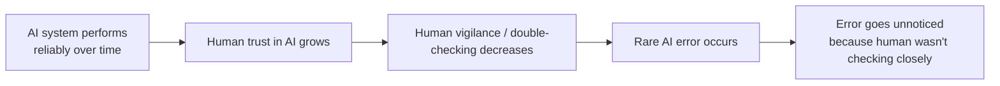

# Unit 10 — Cognition in Practice — Case Studies
## Topic 2: Automation Complacency

*(Covers: Automation complacency — how high accuracy makes humans less vigilant)*

---

## 1. Learning Objectives

By the end of this topic, you will be able to:

1. **Explain** what automation complacency is and why it happens even to careful, well-trained professionals.
2. **Describe** the relationship between an AI system's accuracy and how vigilant its human overseers remain over time.
3. **Identify** early warning signs of automation complacency in a real workflow.
4. **Analyze** a scenario to determine whether complacency is likely to develop.
5. **Design** simple safeguards that keep human oversight active even when an AI system is highly reliable.

---

## 2. Overview

Here is a strange and important truth: **the better an AI system gets, the more dangerous it can become — not because it makes more mistakes, but because humans stop watching for them.** This effect is called **automation complacency**, and it is one of the most well-documented human-factors problems in aviation, healthcare, and — increasingly — AI-powered software.

This topic connects directly to what you learned in Unit 9 about **System 1 vs System 2 thinking** and **automation bias**. Automation complacency is what happens *over time*, across repeated use, when automation bias is allowed to run unchecked: a human's fast, instinctive (System 1) trust in the system grows, while their slower, effortful (System 2) habit of double-checking fades away.

For an AI-Native Engineer, this matters enormously, because you will often be the person **designing the interface and workflow** that a human reviewer uses to oversee AI decisions. If you design that workflow badly — for example, making the "approve AI's suggestion" button one lazy click, with no friction, no information, and no incentive to actually look — you are engineering complacency into the system, even if that was never your intention. This topic teaches you to recognise the pattern and design against it.

---

## 3. Description

### Definition

**Automation complacency** is the tendency for a person overseeing an automated system to become progressively less alert and less likely to catch errors, *because* the system has proven reliable in the past.

### Why This Happens (the psychology)

- **Reduced perceived need for vigilance:** If a system was correct the last 50 times, a human's brain (quite reasonably, from an energy-saving point of view) starts predicting it will be correct the 51st time too — and stops checking as carefully.
- **Vigilance is mentally expensive:** Sustained, careful attention (System 2 thinking, from Unit 9) is tiring. Humans naturally default back to fast, low-effort System 1 processing whenever they believe it's "safe" to do so.
- **Rare errors are the most dangerous:** Ironically, the safer and more accurate an AI system becomes, the *rarer* its mistakes are — and rare events are exactly the kind of event human attention is worst at catching, because there's very little recent experience of "what a mistake looks like" to stay alert for.

### Key Terminology

| Term | Simple Meaning |
|---|---|
| **Automation complacency** | Reduced vigilance in a human overseer, caused by a track record of the automated system being reliable. |
| **Vigilance decrement** | The well-documented tendency for sustained attention to decline over time, especially when the thing being watched for occurs rarely. |
| **Skill fade** | Over time, if a human stops actively practising a judgment (because the AI usually handles it), their own ability to make that judgment independently can weaken. |

### A Simple Diagram

### Best Practices

- **Vary the checkpoint, not just its frequency.** A human review step that is always "click approve" trains the reviewer to click approve on autopilot. Occasionally injecting a genuinely wrong AI suggestion into a review queue (a known aviation safety technique) keeps reviewers actively evaluating rather than rubber-stamping.
- **Show the AI's reasoning or confidence, not just its answer.** A reviewer who sees "72% confidence — borderline case" is more likely to look closely than one who sees only a final "Approved" label.
- **Track review time, not just review outcome.** If a human is approving cases in half a second each, that's a measurable sign vigilance has collapsed, even if the approval rate looks fine.
- **Rotate reviewers and require periodic manual-only practice**, so core judgment skills don't fade from disuse (protecting against skill fade).

### Common Beginner Mistakes

- Believing that automation complacency is a sign of a "lazy" or "careless" person — it is a well-documented, near-universal cognitive pattern, not a personal failing.
- Assuming that adding a human reviewer automatically solves an oversight problem — if the reviewer workflow is badly designed, complacency can make the human checkpoint effectively worthless.
- Only measuring an AI system's accuracy, and never measuring whether its human overseers are still actually paying attention.

> **Important Note:** Automation complacency is *not* an argument against automation — it is an argument for **deliberately designing** the human-in-the-loop experience so that vigilance is supported, not silently eroded, by good UX and workflow design.

---

## 4. Real World Application

- **Aviation (the origin of this research):** Autopilot systems are extremely reliable, which is precisely why airlines mandate manual-flying practice hours for pilots — to prevent both complacency and skill fade.
- **Healthcare:** Radiologists reviewing AI-flagged scans have been shown, in published studies, to spend less time on cases the AI marks as "low risk" — exactly the automation complacency pattern, applied to Unit 10's medical triage case study.
- **Content Moderation:** Human moderators reviewing AI-flagged content can become desensitised to rapid "approve the AI's call" review queues, missing the rare genuinely harmful post that the AI mis-classified.
- **Banking Fraud Review:** Analysts reviewing AI-flagged suspicious transactions may start rubber-stamping "not fraud" recommendations after months of the AI being right — precisely when a new fraud pattern the AI hasn't seen before starts slipping through.
- **Software Code Review with AI Copilots:** Developers reviewing AI-generated code can become complacent about reading every line carefully, once the AI has "usually been right" for weeks — a very relevant risk for you, as a future AI-Native Engineer using AI coding assistants daily.

---

## 5. Worked Example

**Scenario:** A bank's fraud team uses an AI model that flags suspicious UPI transactions for human review. Over six months, analysts start approving ("not fraud") the AI's "low risk" recommendations in under 2 seconds per case, compared to 45 seconds when the tool was first introduced.

**Step-by-step diagnosis:**

1. **Is this automation complacency?** Yes — the sharp drop in review time (45s → 2s), with no corresponding drop in AI error rate reported, is a textbook vigilance-decrement signal.
2. **What is the risk?** A new fraud pattern the model hasn't seen (e.g., a new UPI scam technique) will most likely be scored "low risk" incorrectly, and the desensitised review process will approve it without catching the error.
3. **What safeguard would you design?**
   - Track and alert on review-time drop as a metric, the same way you'd track model accuracy.
   - Periodically inject a small number of known-fraudulent test cases into the "low risk" review queue to verify analysts are still genuinely evaluating, not rubber-stamping.
   - Require analysts to write one line of justification for each "not fraud" decision — a small amount of forced System 2 engagement that meaningfully reduces pure autopilot clicking.
4. **Outcome:** These changes restore genuine vigilance without discarding the efficiency benefit of the AI system — the goal is never to remove automation, but to keep the human checkpoint real.

---

## 6. Key Takeaways

- **Automation complacency**: vigilance drops as trust in a reliable AI system grows — a well-documented human-factors effect, not a personal flaw.
- The safer an AI system becomes, the rarer its errors are — and rare errors are exactly what human attention is worst at catching.
- **Vigilance decrement** and **skill fade** are the two specific mechanisms behind complacency: reduced attention, and reduced independent capability from disuse.
- Track *review time* and *review depth*, not just AI accuracy, as a signal of whether human oversight is still real.
- Good safeguards: vary checkpoints, show confidence/reasoning (not just the final answer), inject occasional known-wrong test cases, require brief justification for decisions.
- **Interview tip:** If asked "does adding a human reviewer solve an AI oversight problem?", the strong answer is "only if the review workflow is specifically designed to resist complacency — otherwise the human checkpoint can become a rubber stamp."
- This topic is the psychological "why" behind Unit 9's automation bias, and sets up Topic 3's practical checkpoint-design skills in this unit.

---

## 7. Reference Links

- [NIST AI Risk Management Framework](https://www.nist.gov/itl/ai-risk-management-framework) — Manage function covers human oversight effectiveness over time.
- [Google SRE Postmortem Culture](https://sre.google/sre-book/postmortem-culture/) — industry documentation on why rare, high-impact failures require deliberately designed vigilance.
- [DeepLearning.AI — AI For Everyone](https://www.deeplearning.ai/courses/ai-for-everyone/) — accessible grounding on human-AI collaboration and oversight design.
