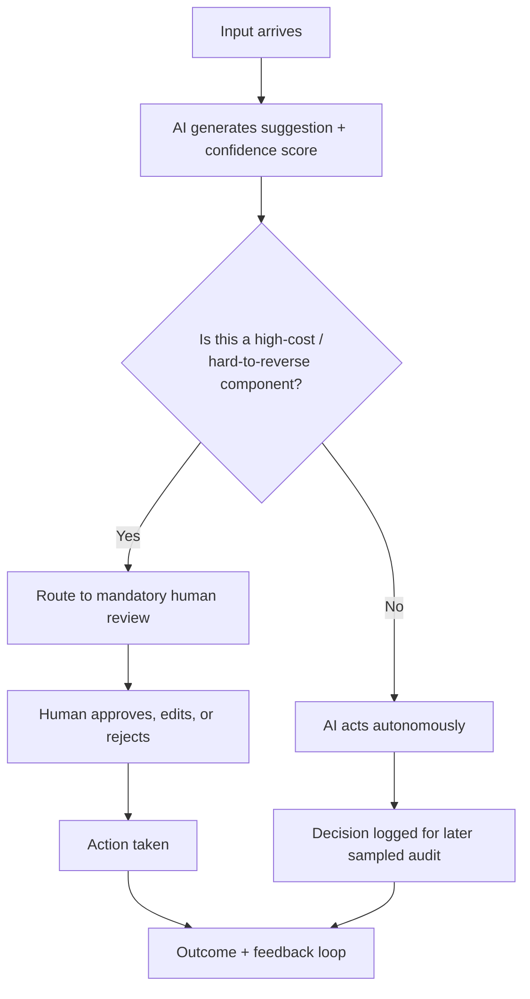

# Unit 10 — Cognition in Practice — Case Studies
## Topic 3: Designing Human Oversight

*(Covers: Designing human-in-the-loop checkpoints — when to require sign-off vs allow autonomous action · Identifying which components in your system need a mandatory human checkpoint)*

---

## 1. Learning Objectives

By the end of this topic, you will be able to:

1. **Explain** what a human-in-the-loop checkpoint is and why it must be a designed system feature, not an informal habit.
2. **Differentiate** between AI system components that can safely run autonomously and those that require mandatory human sign-off.
3. **Apply** the Judgment Framework (Unit 9) to decide, component by component, where checkpoints belong.
4. **Design** a complete human-oversight map for a realistic multi-step AI pipeline.
5. **Evaluate** a given pipeline design and identify any missing or weak checkpoints.

---

## 2. Overview

You've now seen, through three case studies and the automation-complacency effect, exactly what goes wrong when human oversight is missing, unenforced, or eroded over time. This topic turns that understanding into a concrete engineering skill: **designing where, exactly, a human-in-the-loop checkpoint belongs inside an AI-powered system.**

Most real AI-native systems are not a single AI call — they are a **pipeline** of several steps (for example: gather data → AI generates a recommendation → check confidence → take action). Not every step needs a human. Requiring sign-off on everything is slow and impractical; requiring sign-off on nothing is dangerous, as you saw in Unit 10 Topic 1. The professional skill is knowing **which specific components** need a mandatory checkpoint, and which can run autonomously.

This is one of the most practical, portfolio-relevant skills in this program: in your Capstone project (Unit 15), you will be required to explicitly document the human override point for every component of your own AI system. This topic gives you the method to do that well, before you need it for real.

---

## 3. Description

### Definition

A **human-in-the-loop (HITL) checkpoint** is a specific, designed point in an AI system's pipeline where a human must review, approve, or can override the AI's output *before* it is allowed to take effect in the real world.

### The Decision Rule: When Does a Component Need a Mandatory Checkpoint?

Ask these three questions (built directly on Unit 9's Judgment Framework) about *each individual component* of your pipeline — not the system as a whole:

1. **What is the cost if this specific component is wrong?** (Not the whole system — just this one step.)
2. **Is the error easily reversible, or does it cause immediate, hard-to-undo real-world harm?**
3. **Can a human realistically verify this step's output, at the volume/speed required?**

**Rule of thumb table:**

| Answer pattern | Checkpoint type |
|---|---|
| High cost + hard to reverse + human can verify | **Mandatory human sign-off before action** |
| High cost + hard to reverse + human CANNOT verify at required speed/volume | **Mandatory sampled statistical audit + a named accountable owner** (as in Unit 10 Topic 1's loan case) |
| Low cost + easily reversible | **Autonomous action allowed**, with logging for later review |
| Medium cost, reversible, but affects trust/experience | **Autonomous action with a fast, easy human override available on request** |

### A Simple Diagram — Generic Human-in-the-Loop Pipeline

### Best Practices

- Design the checkpoint **at the component level**, not the whole-system level — one AI pipeline can (and usually should) mix mandatory checkpoints for some steps with full autonomy for others.
- Make the checkpoint **impossible to silently skip** — Case Study A (Unit 10 Topic 1) failed precisely because its "checkpoint" had no system enforcement.
- Always name **one specific accountable role** for each mandatory checkpoint — not "the team," a specific title or person.
- Log every autonomous decision, even when no human reviews it live, so a sampled audit is possible later.
- Design against automation complacency (Topic 2) directly into the checkpoint UI — show confidence scores and reasoning, not just a one-click "approve" button.

### Common Beginner Mistakes

- Treating "add a human reviewer" as a single, whole-system decision, instead of analysing each pipeline component separately.
- Putting a mandatory checkpoint on a low-stakes, easily-reversible step (wasting human time and encouraging rubber-stamping elsewhere) while leaving a high-stakes step fully autonomous.
- Forgetting that "human can't verify at scale" does not mean "skip oversight" — it means "shift to sampled audit," as covered in Unit 10 Topic 1.

---

## 4. Real World Application

- **Healthcare triage pipeline:** Symptom intake (autonomous) → AI priority score (autonomous) → "emergency" or "urgent" label (**mandatory nurse checkpoint**, per Unit 10 Topic 1's medical case) → treatment action (always human-led).
- **Loan approval pipeline:** Document collection (autonomous) → AI credit score (autonomous) → auto-approve small loans (autonomous, with **sampled fairness audit** by a named model-risk officer) → large loan decision (**mandatory human sign-off**).
- **Content moderation pipeline:** AI flags a post (autonomous) → high-confidence clear violations removed (autonomous, logged) → borderline/low-confidence cases (**mandatory human moderator review**) → appeals (**always human**).
- **AI coding copilot workflow (relevant to your own future work):** AI suggests code (autonomous generation) → merging into production (**mandatory human code review checkpoint** — never auto-merge AI-generated code into a live system without review).
- **RAG-based document assistant (Unit 14 preview):** Retrieving and summarising a policy document (autonomous) → using that summary to auto-approve a customer refund (**mandatory human checkpoint**, because the action has direct financial and hard-to-reverse impact).

---

## 5. Worked Example

**Task:** Design the human-oversight map for an **AI-powered hospital triage assistant** pipeline with these components: (1) Patient symptom intake form, (2) AI urgency score (1–5), (3) Bed/queue assignment, (4) Discharge summary draft, (5) Prescription suggestion.

| Component | Cost if wrong | Reversible? | Human can verify? | Checkpoint decision |
|---|---|---|---|---|
| 1. Symptom intake | Low (just data collection) | Yes | N/A | Autonomous |
| 2. AI urgency score | Very high (Unit 10 Topic 1 medical case) | No — a missed emergency can be fatal | Yes — nurse can check vitals fast | **Mandatory human checkpoint before acting on "routine" label** |
| 3. Bed/queue assignment | Medium | Yes, can be reassigned | Yes | Autonomous, with easy human override available |
| 4. Discharge summary draft | Medium-high (medical record accuracy) | Partially — affects future care decisions | Yes | **Mandatory human review before finalising** |
| 5. Prescription suggestion | Very high (direct physical harm risk) | No — a wrong medication can cause serious harm | Yes — doctor must prescribe | **Mandatory human sign-off — AI may only suggest, never dispense** |

**Reasoning summary:** Three of the five components (2, 4, 5) require mandatory human checkpoints because they combine high cost, low reversibility, and feasible human verification — matching the "top row" of the decision rule table above. Component 1 is safely autonomous (low stakes). Component 3 gets autonomy with an easy override, since it's reversible and medium-stakes. This mixed design is exactly what a real, professionally-specified AI system should look like — not "all autonomous" or "all human," but a deliberate, component-by-component map.

---

## 6. Key Takeaways

- A **human-in-the-loop checkpoint** must be a designed, system-enforced feature — never an informal habit (this is the direct fix for Unit 10 Topic 1's college admissions failure).
- Analyse **each pipeline component separately** — a single AI system can, and usually should, mix mandatory checkpoints with autonomous steps.
- Decision rule: high cost + hard to reverse + human can verify → **mandatory checkpoint**; high cost + can't verify at scale → **sampled audit with a named owner**; low cost + reversible → **autonomous**.
- Every mandatory checkpoint needs one specific, named accountable role — not a vague "the team."
- Design the checkpoint UI itself to resist automation complacency (Topic 2) — show reasoning and confidence, not just a one-click approve button.
- **Interview tip:** When asked to "design an AI system," always sketch the pipeline as components and explicitly state, for each one, whether it's autonomous or has a mandatory human checkpoint, and why.
- This exact skill — a component-by-component human-oversight map — is a required deliverable in your Unit 15 Capstone project.

---

## 7. Reference Links

- [NIST AI Risk Management Framework](https://www.nist.gov/itl/ai-risk-management-framework) — Govern and Manage functions on human oversight design.
- [EU AI Act — official text](https://artificialintelligenceact.eu/) — Article on human oversight requirements for high-risk AI systems.
- [Google SRE Postmortem Culture](https://sre.google/sre-book/postmortem-culture/) — on designing accountable ownership for system checkpoints.
