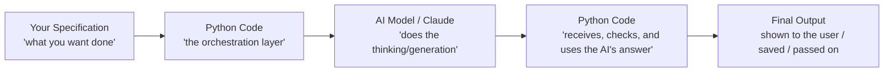

# Unit 11 — Python Foundations I
## Topic 1: Getting Started with Python

*(Covers: Python's role — the orchestration layer connecting your specification to an AI system · Setting up Google Colab — no installation, runs in the browser)*

---

## 1. Learning Objectives

By the end of this topic, you will be able to:

1. **Explain** what Python is and why it is the language of choice for AI-native software development.
2. **Describe** the role Python plays as the "orchestration layer" that connects your specification to an AI system like Claude.
3. **Identify** the difference between writing a specification, writing code, and calling an AI model.
4. **Create** a Google Colab notebook and run your very first line of Python code in it.
5. **Explain** why beginners use Google Colab instead of installing Python on their own laptop.

---

## 2. Overview

Until now, in Weeks 1–10, you have been thinking like a computer scientist — understanding computation, writing specifications, learning how AI systems work, and learning how to judge AI output responsibly. But so far, you have not written a single line of code. That changes today.

**Python** is a programming language — a way of writing instructions that a computer can follow exactly, step by step. Out of all the programming languages in the world (and there are hundreds), Python is the one most widely used for AI-native software development, because it is simple to read, forgiving for beginners, and has excellent support for talking to AI models like Claude.

In this program, you will not use Python to "build AI" from scratch — you will use Python as the **orchestration layer**: the glue code that takes your specification (what you want done), sends the right request to an AI model, receives the AI's response, checks that response, and does something useful with it (like saving it to a file, showing it to a user, or feeding it into the next step). Think of Python as the "manager" — it does not do the creative thinking (the AI does that), but it decides *when* to ask the AI, *what* to ask, and *what to do* with the answer. This is exactly the "AI implements, you specify and verify" philosophy from Week 2 — and Python is the tool you will use to enforce that verification.

By the end of this topic, you will have your first working Python environment — Google Colab — open in your browser, with your first line of code executed successfully.

---

## 3. Description

### 3.1 What Is Python, and What Is "Code"?

**Definition:** Python is a **programming language** — a set of written instructions, following strict rules, that tells a computer exactly what steps to perform.

Remember from Unit 1: a computer does not "think," it follows instructions. **Code** (also called a "program" or a "script") is simply the *text* you write containing those instructions, in a language the computer's Python interpreter can understand and execute one line at a time, from top to bottom (with some exceptions we'll learn later, like loops and conditions, which can repeat or skip lines).

**Why Python specifically?**

| Reason | What it means for you |
|---|---|
| **Readable syntax** | Python code looks close to plain English (e.g., `if amount > 5000:` reads almost like a sentence), making it the easiest widely-used language for absolute beginners. |
| **Huge ecosystem for AI** | Anthropic (the company that builds Claude), OpenAI, Google, and almost every AI company provide official Python libraries to call their models — you will use this directly in Week 12. |
| **Widely used in industry** | Python is one of the most in-demand languages for data science, AI engineering, and backend development in the Indian IT industry today. |

**Key Terminology:**

| Term | Simple Meaning |
|---|---|
| **Code / Program / Script** | The written text of instructions you give the computer. |
| **Line of code** | One single instruction, usually written on its own line (e.g., `age = 20`). |
| **Run / Execute** | The act of telling the computer "now follow these instructions." |
| **Interpreter** | The program that reads your Python code and actually carries out the instructions, line by line. Python is an "interpreted" language — you don't need a separate step to convert it into another format before running it (unlike some other languages). |
| **Comment** | A line in your code that the computer *ignores* — it is written only for humans to read, usually to explain *why* a piece of code exists. In Python, a comment starts with a `#` symbol. |
| **Syntax** | The strict grammar rules of a programming language. Just like English has grammar rules (a sentence needs a subject and a verb), Python has syntax rules (e.g., you cannot leave out a colon `:` where Python expects one). Break the syntax, and Python will refuse to run your code and show you an error. |

### 3.2 Python's Role: The Orchestration Layer

Here is the key mental model for this entire program:



Notice that Python appears **twice** in this diagram — before the AI call and after it. This is deliberate:

- **Before the call:** Python prepares the exact question/instructions (built from your specification) to send to the AI.
- **After the call:** Python receives the AI's raw response and decides what to do with it — check if it's in the right format, extract just the part you need, handle it if something went wrong, and so on.

The AI itself does not "run" on its own — something has to invoke it, and that "something" is almost always a small piece of orchestration code. In Weeks 12–15, you will write exactly this kind of code, calling Claude's API from Python.

> **Important Note:** You do not need Python to *use* an AI chatbot casually (like typing a question into Claude.ai in your browser). You need Python when you want to **build a system** that uses AI as one component among several — checking inputs, handling errors, combining multiple AI calls, storing results, and so on. That is the difference between being an *AI user* and an *AI-native engineer*.

**Comparison Table — Writing a Specification vs Writing Code vs Calling an AI Model**

| Activity | What you are doing | Example |
|---|---|---|
| Writing a specification | Describing, in plain English, exactly what a system should do, its inputs, outputs, and failure conditions (Week 2) | "Given a list of exam marks, calculate the average and flag if any mark is below 35 (fail)." |
| Writing Python code | Turning some of that specification into precise, deterministic instructions a computer can execute exactly | `average = sum(marks) / len(marks)` |
| Calling an AI model | Asking an AI system to generate a response for a task that doesn't have one fixed, calculable answer | "Write an encouraging one-line message for a student who scored 32/100." |

### 3.3 Setting Up Google Colab

**Why Google Colab, and not installing Python on your own laptop?**

Normally, to write Python code, you would need to *install* Python on your computer, plus an editor to write code in. This can be slow and sometimes tricky for absolute beginners (different steps for Windows/Mac, version conflicts, and so on). **Google Colab** solves this by giving you a ready-to-use Python environment that runs entirely in your web browser — no installation needed, and it's free.

**What Colab actually is:** Colab (short for "Colaboratory") is a **notebook** — a document made of "cells," where each cell can contain either Python code or plain text/notes. You write code into a cell and click "Run" (or press `Shift + Enter`), and Google's servers execute your code and show you the result directly below the cell — all inside your browser, with nothing installed on your machine.

**Step-by-step: Your First Colab Notebook**

1. Open your browser and go to **colab.research.google.com**.
2. Sign in with any Google account (the same one you might use for Gmail).
3. Click **"New Notebook"** (usually a button in the bottom-right of the welcome screen, or under File → New Notebook).
4. You will see a blank notebook with one empty **code cell** — a grey box with a "play" (▶) icon on its left.
5. Click inside that code cell and type:
   ```python
   print("Hello, AI-Native Engineer!")
   ```
6. Run the cell by pressing **Shift + Enter** (or clicking the ▶ play icon).
7. Below the cell, you will see the output appear:
   ```
   Hello, AI-Native Engineer!
   ```

**Line-by-line explanation of what you just wrote:**

- `print(...)` — `print` is a built-in Python **function** — a ready-made instruction that already knows how to do one job: display whatever you give it on the screen. We will study functions properly in Week 12, but for now, just know: `print()` shows things to you.
- `(` and `)` — the round brackets (parentheses) tell Python "here is the information I am giving to the `print` function." Whatever is inside these brackets is called an **argument**.
- `"Hello, AI-Native Engineer!"` — this is a **string** (a piece of text) — you'll learn this term formally in the next topic. In Python, text must be wrapped in quotation marks (`"..."` or `'...'`) so Python knows "this is text, not an instruction."
- There is no semicolon or full stop at the end — Python simply ends a line of code at the end of the line (unlike some other languages that require a `;`).

**Why it worked:** Python's interpreter read your line, recognised `print` as a valid function name, saw the string inside the brackets, and displayed exactly that string as output. There was no ambiguity — this is why we call code execution **deterministic** (Unit 1): the same code, run again, will always print the exact same line.

---

## 4. Real World Application

- **AI-native product teams (2026 landscape):** Almost every production AI feature you interact with — a banking chatbot, an e-commerce recommendation box, a healthcare triage assistant — has a Python (or similar) orchestration layer behind the scenes, deciding when to call the AI model, what to send it, and how to handle its response safely.
- **Education / EdTech:** An AI-native tutoring app for Indian students might use Python to check a student's uploaded answer sheet format (deterministic validation) before sending the actual answer text to an AI model for evaluation (probabilistic).
- **Banking / FinTech:** A Python script might validate that a UPI transaction request has a valid amount and account number (deterministic checks) before ever involving any AI-based fraud-detection model.
- **Google Colab in the industry:** Many data scientists and AI engineers use Colab (or similar notebooks like Jupyter) for quick experiments, prototyping AI prompts, and testing code — before that code is turned into a production application. Learning Colab now is learning a genuine industry habit, not just a classroom tool.

---

## 5. Worked Example

**Scenario:** You want to verify that your Colab environment is working, and get a first feel for "specification → code → output."

**Specification (plain English):** "Display a welcome message that includes my name."

**Step 1 — Open a new Colab notebook** (as described in section 3.3).

**Step 2 — Write the code in a new cell:**

```python
# This program displays a personalised welcome message
name = "Priya"
print("Welcome to AI-Native Engineering,", name, "!")
```

**Step 3 — Run the cell (Shift + Enter). Expected output:**

```
Welcome to AI-Native Engineering, Priya !
```

**Line-by-line explanation:**

- `# This program displays a personalised welcome message` — this entire line is a **comment**. Because it starts with `#`, Python completely ignores it when running the code. It exists only so a human reading the code understands its purpose.
- `name = "Priya"` — this creates a **variable** called `name` and stores the text `"Priya"` inside it. (We study variables formally, in full depth, in the next topic — Topic 2.)
- `print("Welcome to AI-Native Engineering,", name, "!")` — the `print` function here is given **three arguments**, separated by commas: the text `"Welcome to AI-Native Engineering,"`, the variable `name` (which Python replaces with the text it's storing, `"Priya"`), and the text `"!"`. When `print` receives multiple arguments like this, it prints them all on one line, automatically separated by a single space — which is exactly why you see a space before the `!` in the output.

**Try it yourself:** Change `"Priya"` to your own name, run the cell again, and observe that the output changes — but only in the one part driven by the `name` variable. This is your first hands-on proof of the input → process → output model from Unit 1, now happening inside real, runnable code.

---

## 6. Key Takeaways

- **Python** is a programming language: precise, written instructions a computer executes exactly, line by line.
- Python is the dominant language for AI-native engineering because of its readable syntax and strong official support from AI companies (including Anthropic).
- Python's core job in this program is to act as the **orchestration layer**: preparing requests to an AI model and safely handling its responses — not doing the "thinking" itself.
- A **comment** (`#`) is ignored by Python and exists purely to explain code to human readers.
- **Google Colab** gives you a free, ready-to-use Python environment in your browser — no installation required — made of "cells" you run one at a time.
- `print()` is your first Python function: it displays whatever text or values you give it, separated by commas, as output.
- Code execution is deterministic: the same code, run again unchanged, always produces the exact same output.
- **Interview tip:** Be ready to explain, in one sentence, why Python (and not the AI model itself) is responsible for validation, error-handling, and orchestration in a real AI-powered application.
- From this point in the program, every topic will include real, runnable Python code — build the habit now of typing every example yourself in Colab, not just reading it.

---

## 7. Reference Links

- [Python Official Documentation — The Python Tutorial](https://docs.python.org/3/tutorial/) — the authoritative, official introduction to Python.
- [Google Colab — Welcome Notebook](https://colab.research.google.com/) — the official Colab landing page with its own built-in "Welcome to Colab" guide.
- [W3Schools — Python Introduction](https://www.w3schools.com/python/python_intro.asp) — beginner-friendly supplementary reading.
- [GeeksforGeeks — Python Comments](https://www.geeksforgeeks.org/python-comments/) — supplementary reading on comment syntax.
