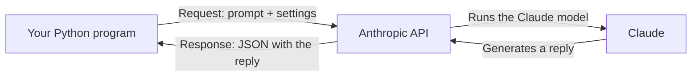

# Unit 12 — Python Foundations II + Calling an LLM
## Topic 3: Calling an LLM from Python

*(Covers: What an API is · The Anthropic API · Making the first API call · Parsing the JSON response · Handling API errors · Every API call is a design decision)*

---

## 1. Learning Objectives

By the end of this topic, you will be able to:

1. **Explain** what an API is, using the analogy of a door between two systems.
2. **Describe** the shape of the Anthropic API — model, messages array, system prompt, user prompt, and authentication.
3. **Implement** a working Python program that sends a prompt to Claude and prints its reply.
4. **Implement** code that correctly extracts the reply text from the API's JSON response.
5. **Implement** `try` / `except` around an API call to handle failures gracefully.
6. **Evaluate** the latency, cost, and reliability trade-offs involved in a given API call design.

---

## 2. Overview

This is the moment everything in Units 11 and 12 has been building toward: writing the Python code that actually **talks to an AI model**. Until now, "AI" has been something you used through a chat window in a browser. From here on, you will call it directly from your own code — the foundational skill for every AI-native engineer, whether they're building a chatbot, a document assistant, or an autonomous agent.

An **API** (Application Programming Interface) is simply a defined way for one piece of software to ask another piece of software to do something, and get a result back — you'll see the simple "door" analogy below. The **Anthropic API** is the specific door into Claude, Anthropic's family of AI models. Learning its exact shape — what to send, and what comes back — turns Claude from "a chatbot I type into" into "a building block I can wire into any program I write."

This topic sits at the exact center of the "AI implements, you specify and verify" discipline you'll formalize in Week 13. Every single API call you write is also a **design decision** — about cost, speed, and reliability — and you, the human engineer, are responsible for making that decision well, and for handling it when it fails. That is the mindset this topic is building, one small, fully-explained code example at a time.

---

## 3. Description

### 3.1 What an API Is — A Door Into Another System

**Definition:** An **API (Application Programming Interface)** is an agreed-upon way for one program to send a **request** to another program, and receive a **response** back — without needing to know how that other program works internally.

**Analogy:** Think of a restaurant. You (your program) don't walk into the kitchen and cook your own food. You give your order to a waiter (the API) using the restaurant's menu format (the API's rules — you can only order what's on the menu, in the way the menu describes). The kitchen (Anthropic's servers, running the Claude model) prepares your order, and the waiter brings back your food (the response). You never needed to know how the kitchen worked — you just needed to know how to order correctly.

In software terms:



- **Request** — what your program sends: your prompt, which model you want, and other settings.
- **Response** — what comes back: the AI's generated reply, packaged in a structured format called **JSON** (a way of organising data using labelled key-value pairs — you already met this exact idea as Python dictionaries in Topic 1).

---

### 3.2 The Anthropic API — Model, Messages Array, System Prompt, User Prompt, Authentication

Before writing any code, you need to understand the five key pieces that make up every call to Claude:

| Piece | What it means |
|---|---|
| **Model** | Which specific Claude model you want to use (e.g., `"claude-sonnet-4-5"`). Different models trade off speed, cost, and capability. |
| **Messages array** | A **list** (from Topic 1!) of the conversation so far — each entry says who is "speaking" (`"user"` or `"assistant"`) and what they said. |
| **System prompt** | Instructions that set the AI's role, tone, and rules **before** the conversation starts (e.g., "You are a helpful customer support assistant for an Indian railway booking app"). You'll go much deeper into system prompts in Week 13. |
| **User prompt** | The actual question or instruction from the user, placed inside the messages array with the role `"user"`. |
| **Authentication** | Proving to Anthropic's servers that this request is coming from you (a legitimate, paying/permitted account), using a secret **API key**. |

**Why authentication matters:** An **API key** is like a password that identifies your account to Anthropic's servers. Anyone who has your API key can make calls "as you" — and since API usage is billed, a leaked key can lead to unwanted charges. This is why, in Week 13, you will learn about `.gitignore` — a way to make sure your API key is **never accidentally uploaded to GitHub**. For now, remember this simple rule: **never write your real API key directly in code you might share.**

**Best practice — reading the key from an environment variable, instead of hardcoding it:**

```python
import os
api_key = os.environ.get("ANTHROPIC_API_KEY")
```

- `import os` — brings in Python's built-in `os` module, which lets your program talk to the operating system.
- `os.environ` — a dictionary-like object (remember dictionaries from Topic 1!) holding all your computer's **environment variables** — settings stored outside your code.
- `.get("ANTHROPIC_API_KEY")` — looks up the value stored under that name. If you have set this environment variable (in Google Colab, this is usually done through Colab's "Secrets" panel), this line retrieves your key **without ever typing it into your code**.

---

### 3.3 Making the First API Call — Install the Library, Write the Call, Run in Colab

**Step 1 — Install the Anthropic Python library** (run once, in a Google Colab cell):

```python
!pip install anthropic
```

- `!pip install anthropic` — the `!` at the start tells Colab "run this as a system command, not as Python code." `pip` is Python's package installer; `install anthropic` downloads and sets up Anthropic's official Python library, which contains all the ready-made code for talking to the API correctly.

**Step 2 — Write the call:**

```python
import anthropic

client = anthropic.Anthropic(api_key="YOUR_API_KEY_HERE")

response = client.messages.create(
    model="claude-sonnet-4-5",
    max_tokens=1024,
    system="You are a helpful assistant for an Indian railway booking app. Keep answers short and simple.",
    messages=[
        {"role": "user", "content": "My PNR shows waitlisted. What does that mean?"}
    ]
)

print(response.content[0].text)
```

Let's go through every single line:

- `import anthropic` — loads the library you just installed, giving your program access to its tools.
- `client = anthropic.Anthropic(api_key="YOUR_API_KEY_HERE")` — creates a **client object**: your program's connection point to the Anthropic API. `"YOUR_API_KEY_HERE"` must be replaced with your actual key (ideally loaded via `os.environ.get(...)` as shown above, never typed in plainly — this is a **placeholder to show the shape of the code**, not a real key).
- `client.messages.create(...)` — the actual function call that sends your request to Claude and waits for the response. `.messages` is the part of the library dealing with conversations; `.create(...)` builds and sends a new one.
- `model="claude-sonnet-4-5"` — tells Anthropic's servers which model should generate the reply.
- `max_tokens=1024` — a **token** is roughly a small chunk of text (often close to a word or part of a word). `max_tokens` sets the maximum length of Claude's reply, as a safety limit and a cost control (longer replies generally cost more and take longer).
- `system="..."` — the system prompt: instructions that shape *how* Claude should behave for this entire conversation, set once, separately from the user's actual question.
- `messages=[ {"role": "user", "content": "..."} ]` — the **messages array** you learned about above: a list containing one dictionary, which says the "user" role said this particular piece of content.
- `response = ...` — the entire reply from Anthropic's servers is stored in the variable `response`, ready to be examined (Topic 3.4, next).
- `print(response.content[0].text)` — displays just the actual reply text (explained fully below).

**Expected Output (wording will vary slightly, since Claude is a probabilistic system — see Unit 1!):**

```
A waitlisted PNR means your ticket has not yet been confirmed because all seats
were full when you booked. You are on a waiting list — if confirmed passengers
cancel, your ticket may get confirmed before departure. You can check your
live status closer to the travel date.
```

---

### 3.4 Parsing the JSON Response — Extracting the Text You Need

**Definition:** **JSON** (JavaScript Object Notation) is a widely used way of structuring data using labelled key-value pairs — the exact same idea as a Python dictionary. Anthropic's API sends its response back as data shaped this way, and the Anthropic Python library automatically converts it into a Python object you can work with directly.

The `response` object contains more than just the reply text — it includes details like which model replied, why it stopped, and the content itself. The actual reply text is inside `response.content`, which is a **list** (Topic 1 again!) — because a response could, in principle, contain multiple pieces of content. Almost always, for a simple text reply, you want the very first item:

```python
print(response.content[0].text)
```

- `response.content` — the list of content pieces in the reply.
- `[0]` — list indexing (remember, Python counts from 0!) to grab the *first* item in that list.
- `.text` — the actual generated text stored inside that content piece.

**Important Note:** Beginners very commonly write `print(response)` and are confused by a large block of technical-looking output. Always remember: the human-readable reply is at `response.content[0].text` — the rest is metadata useful for debugging and logging, not for showing to an end user.

---

### 3.5 Handling API Errors — What to Do When the Call Fails

Just like the file operations in Topic 2, an API call can fail for reasons outside your control: no internet connection, an invalid API key, or Anthropic's servers being temporarily overloaded. A professional AI-native engineer **always** wraps an API call in `try`/`except`:

```python
try:
    response = client.messages.create(
        model="claude-sonnet-4-5",
        max_tokens=1024,
        messages=[{"role": "user", "content": "What is the capital of India?"}]
    )
    print(response.content[0].text)

except anthropic.APIError as error:
    print("The AI service could not be reached right now. Please try again later.")
    print("Technical detail:", error)
```

- `except anthropic.APIError as error:` — the Anthropic library provides its own specific error type, `APIError`, covering problems like connection failures or invalid requests. Catching this specific type (rather than only the generic `Exception`) lets you respond in a way tailored to "the AI call didn't work," while still letting truly unexpected errors surface separately for debugging.
- Showing the user a **friendly message** while separately logging the **technical detail** is standard professional practice — end users should never see raw error text.

---

### 3.6 Every API Call Is a Design Decision — Latency, Cost, and Reliability

Every time you write an API call, you are making trade-off decisions, even if you don't realise it:

| Design Choice | Effect on Latency (speed) | Effect on Cost | Effect on Reliability |
|---|---|---|---|
| Choosing a larger, more capable model | Usually slower per reply | Usually higher cost per reply | Often more reliable/accurate answers |
| Choosing a smaller, faster model | Usually faster per reply | Usually lower cost per reply | May be less reliable for complex tasks |
| Longer prompts / more context | Slower (more to process) | Higher (billing is based on the amount of text processed) | Can improve accuracy if the extra context is relevant |
| Setting a low `max_tokens` | Faster (reply is capped short) | Lower | Risk of the reply being cut off before finishing |
| No `try`/`except` around the call | No effect on speed | No effect on cost | Very poor — one failed call can crash your whole program |

**Best Practices:**

- Always wrap API calls in `try`/`except` — networks and servers can fail.
- Never hardcode your real API key in code, especially code you might commit to GitHub — use environment variables (foreshadowing Week 13's `.gitignore` lesson).
- Choose `max_tokens` deliberately: large enough for a complete answer, but not wastefully large.
- Log both the request and the response somewhere (a file, using Topic 2's skills) when you're testing or evaluating an AI system — you cannot improve what you don't measure.

**Common Beginner Mistakes:**

- Printing the entire `response` object instead of `response.content[0].text`.
- Forgetting `try`/`except`, so the whole program crashes the first time the network hiccups.
- Committing an API key directly into code that gets pushed to a public GitHub repository (a serious real-world security mistake — never do this).
- Assuming the reply will always be identical to a previous run — remember, Claude is a **probabilistic system** (Unit 1)!

---

## 4. Real World Application

- **Customer Support Chatbots:** An e-commerce or banking app's support widget is, underneath, a Python (or similar) backend calling the Anthropic API with a system prompt describing the company's tone and policies.
- **Vernacular AI Translation:** A government or NGO tool that calls Claude with a system prompt like "Translate the following English text into simple Hindi" to help rural users access information.
- **Healthcare Triage Assistants:** A pre-screening tool that calls Claude to summarise a patient's described symptoms in plain language for a nurse to review — always with a human making the final call (tying back to the Judgment Framework in Week 9).
- **Education:** An automated doubt-solving assistant for students, built by calling the Anthropic API with a system prompt instructing Claude to explain concepts simply, step by step.
- **RAG-based Document Assistants (forward look to Week 14):** The exact `client.messages.create(...)` call you learned here becomes the final step of a RAG pipeline, after relevant document content has been retrieved and inserted into the prompt.

---

## 5. Worked Example

**Scenario:** Write a complete, robust Python program that builds a prompt using a function (from Topic 1), calls Claude with proper error handling (from Topic 2 and this topic), and logs the question and answer to a file.

```python
import os
import anthropic

def build_prompt(user_question):
    return user_question.strip()

def call_claude(prompt):
    client = anthropic.Anthropic(api_key=os.environ.get("ANTHROPIC_API_KEY"))
    try:
        response = client.messages.create(
            model="claude-sonnet-4-5",
            max_tokens=500,
            system="You are a friendly assistant helping first-year engineering students in India understand basic tech concepts. Keep answers under 100 words.",
            messages=[{"role": "user", "content": prompt}]
        )
        return response.content[0].text
    except anthropic.APIError as error:
        return "Sorry, the AI service is unavailable right now. (" + str(error) + ")"

def log_interaction(question, answer):
    with open("chat_log.txt", "a") as file:
        file.write("Q: " + question + "\n")
        file.write("A: " + answer + "\n\n")

question = "What is an API, in one simple sentence?"
prompt = build_prompt(question)
answer = call_claude(prompt)
print(answer)
log_interaction(question, answer)
```

**Explanation of the overall design (tying together the whole unit):**

- `build_prompt(user_question)` — Topic 1's "one function = one job": its only responsibility is preparing the text to send.
- `call_claude(prompt)` — a separate function, responsible only for talking to the API, including its own `try`/`except` so a failure here doesn't crash the whole program.
- `log_interaction(question, answer)` — Topic 2's file-writing skills, in **append mode** (`"a"`), so every question-and-answer pair is added to a permanent record without erasing previous logs.
- The main flow at the bottom reads almost like plain English: build the prompt, call Claude, print the answer, log it. This readability is the direct payoff of following "one function = one job" from Topic 1.

**Try it yourself:** Modify `log_interaction` to also write the exact timestamp of each question (you'll need to explore Python's `datetime` module for this — a good independent-research exercise).

---

## 6. Key Takeaways

- An **API** is a defined "door" that lets your program request something from another system and get a structured response back.
- The Anthropic API call needs: a **model**, a **messages array** (list of role + content dictionaries), an optional **system prompt**, and **authentication** via an API key.
- Always load your API key from an **environment variable**, never hardcode it directly — protecting it is a serious professional responsibility.
- `client.messages.create(...)` sends the request; the reply text is found at **`response.content[0].text`**.
- Always wrap API calls in `try` / `except anthropic.APIError` — networks and servers fail, and your program should respond gracefully, not crash.
- Every API call is a **design decision**: model choice, prompt length, and `max_tokens` all affect latency, cost, and reliability.
- Claude's replies are **probabilistic** (Unit 1) — don't expect word-for-word identical output on repeated runs.
- **Interview tip:** Be ready to describe, in your own words, the full request→response cycle of an Anthropic API call, and to explain why error handling around it is non-negotiable in production code.
- This exact pattern — build prompt, call API safely, parse response, log the result — is the skeleton of nearly every AI-powered system you will build for the rest of this program.

---

## 7. Reference Links

- [Anthropic Documentation — Messages API](https://docs.claude.com/en/api/messages)
- [Anthropic Documentation — Getting Started / Client SDKs](https://docs.claude.com/en/docs/get-started)
- [Python Official Documentation — os.environ](https://docs.python.org/3/library/os.html#os.environ)
- [GeeksforGeeks — Working with JSON Data in Python](https://www.geeksforgeeks.org/python-json/)
