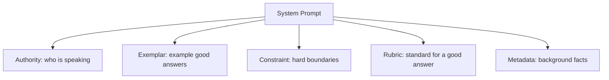

# Unit 13 — Prompt Engineering + Version Control
## Topic 2: The 5-Role Context Framework

*(Covers: The 5-role context framework — Authority, Exemplar, Constraint, Rubric, Metadata)*

---

## 1. Learning Objectives

By the end of this topic, you will be able to:

1. **Explain** what the 5-Role Context Framework is and why it exists.
2. **Identify** the Authority, Exemplar, Constraint, Rubric, and Metadata roles inside a real system prompt.
3. **Differentiate** between what each of the 5 roles contributes to a prompt.
4. **Create** a complete, professional system prompt that uses all 5 roles together for a real scenario.
5. **Evaluate** an existing prompt and identify which of the 5 roles are missing from it.

---

## 2. Overview

In Topic 1 of this unit, you learned six separate prompting techniques — role assignment, few-shot examples, chain-of-thought, constraints, and output format control. In real professional work, you don't apply these one at a time and hope they fit together nicely — you use a **repeatable framework** so that every system prompt you write, for any project, has the same reliable structure.

The **5-Role Context Framework** is exactly that: a checklist of five categories of information that a high-quality system prompt should almost always contain — **Authority, Exemplar, Constraint, Rubric, and Metadata**. Think of it as a form you fill in every time you write a system prompt, so you never forget an important piece of context. This is the exact framework you will be expected to apply when you write your **Capstone project's system prompt** in Unit 15, so mastering it now, on smaller examples, will make that final project far easier.

---

## 3. Description

### 3.1 What Is the 5-Role Context Framework?

**Definition:** The 5-Role Context Framework is a structured way of writing a system prompt by explicitly including five categories of context:

| Role | What It Answers | Simple Meaning |
|---|---|---|
| **Authority** | "Who is the AI, and on whose behalf is it speaking?" | The role/persona and the organisation or context it represents. |
| **Exemplar** | "What does a good answer look like?" | One or more example inputs and outputs (few-shot). |
| **Constraint** | "What must it never do?" | Hard boundaries and rules it must always respect. |
| **Rubric** | "How will the answer be judged as good or bad?" | The criteria/standard the output should be measured against. |
| **Metadata** | "What extra facts does it need to know?" | Background facts, current date, user details, business data. |

**Why this framework exists:** When you write prompts ad-hoc, it's very easy to forget one important piece — most commonly, people forget to state constraints or give the model any way to judge its own quality (the Rubric). The 5-Role Framework forces you to deliberately think through each of the five categories every time, the same way a pilot runs through a pre-flight checklist instead of relying on memory.

---

### 3.2 The Five Roles, One at a Time

**1. Authority — "Who is speaking, and for whom?"**
This is the role assignment you learned in Topic 1, extended slightly: it should state *whose* voice the AI is using (a specific company, product, or persona), not just a generic role.
> Example line: *"You are Bank of India's official WhatsApp support assistant, SahayakAI."*

**2. Exemplar — "What does good output look like?"**
This is the few-shot technique from Topic 1: one or more worked examples showing exactly the input-output pattern expected.
> Example line: *"Example — Customer: 'What is my account balance?' → Reply: 'For your security, I can't share balance details here. Please check the app or call 1800-XXX-XXXX.'"*

**3. Constraint — "What must it never do?"**
The hard boundaries from Topic 1 — things the model is absolutely forbidden from doing, regardless of how the conversation goes.
> Example line: *"Never share OTPs, PINs, or full account numbers. Never confirm or deny whether a specific person holds an account."*

**4. Rubric — "How will its answer be judged?"**
This is new: a clear standard describing what makes an answer *good* versus *bad*, so the model can self-check before finalising its response.
> Example line: *"A good reply is under 3 sentences, uses simple English, and always ends by pointing the customer to a safe next step (app, branch, or helpline)."*

**5. Metadata — "What background facts does it need?"**
Also new: real, specific facts about the current situation — the kind of information a human agent would have in front of them on their screen.
> Example line: *"Today's date is 22 July 2026. Current known service outage: UPI payments delayed in Maharashtra circle since 10 AM."*



---

### 3.3 A Complete Worked System Prompt Using All 5 Roles

**Scenario:** A railway-enquiry AI assistant for an Indian Railways passenger app.

```python
import anthropic

client = anthropic.Anthropic()

system_prompt = """
[AUTHORITY]
You are "RailMitra", the official AI enquiry assistant for the Indian Railways passenger app.
You represent Indian Railways and must always sound professional, calm, and helpful.

[EXEMPLAR]
Example 1 —
Passenger: "Is train 12622 running late today?"
Good reply: "Train 12622 (Tamil Nadu Express) is running approximately 25 minutes late as of the last update. Please check the live status page for the most current timing."

Example 2 —
Passenger: "Can you book a ticket for me right now?"
Good reply: "I'm not able to book tickets directly here. Please use the 'Book Ticket' section of the app or visit irctc.co.in to complete your booking."

[CONSTRAINT]
- Never invent a specific train delay, platform number, or seat availability you were not given as Metadata below.
- Never process payments or claim to have booked/cancelled a ticket.
- Never share another passenger's personal booking details.

[RUBRIC]
A good reply:
- Is 1-3 sentences long, in simple English.
- Clearly states if information is unavailable, instead of guessing.
- Points the passenger to the correct official next step (app section, helpline, or website) when you cannot fully resolve the query yourself.

[METADATA]
- Today's date: 22 July 2026.
- Known current disruption: Northern Railway zone reporting fog-related delays this week.
- Passenger enquiry helpline: 139.
"""

response = client.messages.create(
    model="claude-sonnet-4-5",
    max_tokens=200,
    system=system_prompt,
    messages=[{"role": "user", "content": "My train hasn't arrived and it's been 40 minutes, what should I do?"}]
)

print(response.content[0].text)
```

**Why each labelled section matters:**
- `[AUTHORITY]` fixes the persona ("RailMitra") and organisation it represents, so tone stays consistent.
- `[EXEMPLAR]` shows two realistic Q&A pairs so the model matches that same style and honesty level.
- `[CONSTRAINT]` blocks the exact failure modes railway apps must avoid — inventing delay times, faking a booking, or leaking another passenger's data.
- `[RUBRIC]` gives the model an internal "quality bar" to self-check against before answering.
- `[METADATA]` supplies real, current facts (today's date, a known disruption, the helpline number) so the model isn't forced to guess or hallucinate this information.

> **Important Note:** You don't always need all five roles in every single prompt — a very simple, low-stakes task might only need Authority and Constraint. But for any prompt going into a real, customer-facing, or high-stakes system, running through all five is the professional discipline expected of you.

**Best Practices:**
- Write the five sections in the same order every time (Authority → Exemplar → Constraint → Rubric → Metadata) so your prompts are easy to review and maintain across a team.
- Keep Metadata current and specific — stale or vague metadata is often *worse* than no metadata, because it can mislead the model.
- Use clear section labels (like `[AUTHORITY]`) in your actual prompts — this also makes it easy for a human reviewer or teammate to spot which role is missing.

**Common Beginner Mistakes:**
- Writing a long, unstructured system prompt paragraph that mixes all five roles together, making it hard to spot what's missing.
- Skipping the Rubric entirely — many students only think of Authority, Exemplar, and Constraint (matching what they learned in Topic 1), and forget that "what counts as good" also needs to be stated.
- Putting real, sensitive metadata (like a customer's actual account number) directly into a system prompt that gets logged — sensitive per-user metadata should usually be inserted into the *user* message at runtime, not hardcoded into a shared system prompt.

---

## 4. Real World Application

- **Banking/FinTech chat assistants:** Authority (which bank/product), Constraint (never share OTPs), and Metadata (current known outages) together keep a banking assistant both on-brand and safe.
- **Healthcare triage bots:** Rubric ("always recommend seeing a doctor for anything outside these listed symptoms") keeps a health-information assistant appropriately cautious, tying back to the Judgment Framework from Unit 9.
- **E-commerce / food delivery support bots:** Exemplar examples train consistent tone across thousands of daily conversations; Metadata (today's ongoing promotions, known delivery delays in a city) keeps answers current.
- **Government/Railway/Public-service AI assistants:** Constraint and Metadata are especially critical here — citizens need accurate, non-hallucinated information, and the assistant must never fabricate official data (train times, scheme eligibility, deadlines).
- **Capstone project (Unit 15):** You will be required to write your own 5-role system prompt for your capstone AI system — this topic is the direct foundation for that deliverable.

---

## 5. Worked Example

**Scenario:** You are asked to review the following weak system prompt for a college helpdesk assistant, and identify which of the 5 roles are missing.

**Weak prompt (given):**
```
You are a helpful assistant. Answer student questions about the college.
```

**Analysis using the framework:**

| Role | Present in weak prompt? | What's missing |
|---|---|---|
| Authority | Partially — says "assistant" but not *which* college or its exact persona name | Needs: which specific college, and a named persona |
| Exemplar | Missing | No example of what a good answer looks like |
| Constraint | Missing | No boundary — could confidently invent a wrong exam date or fee amount |
| Rubric | Missing | No definition of what a "good" answer looks like (length, tone, honesty about unknowns) |
| Metadata | Missing | No current facts — e.g., today's date, current semester, actual fee/exam schedule |

**Improved version, applying all 5 roles:**
```
[AUTHORITY] You are "CampusMitra", the official student helpdesk assistant for ABC Engineering College.
[EXEMPLAR] Student: "When does the semester end?" → Good reply: "According to the academic calendar, this semester ends on 28 November 2026. Please confirm with the exam cell for any last-minute changes."
[CONSTRAINT] Never invent a specific exam date, fee amount, or result if it was not provided to you as Metadata. Never guarantee admission, grade, or exam outcomes.
[RUBRIC] A good reply is short, states the source of the information (calendar/notice), and tells the student where to double-check if it's a high-stakes matter (exam cell, admin office).
[METADATA] Today's date: 22 July 2026. Semester end date: 28 November 2026. Exam cell contact: examcell@abccollege.edu.
```

This is the exact review-and-improve exercise you should practise before writing your own capstone system prompt.

---

## 6. Key Takeaways

- The **5-Role Context Framework** = Authority, Exemplar, Constraint, Rubric, Metadata — a checklist for writing complete, reliable system prompts.
- **Authority** = who the AI is and who it represents.
- **Exemplar** = worked examples of a good answer (few-shot, from Topic 1).
- **Constraint** = hard boundaries the AI must never cross.
- **Rubric** = the standard used to judge whether an answer is good.
- **Metadata** = real, current background facts the model needs to avoid guessing/hallucinating.
- Not every prompt needs all 5 in full depth, but high-stakes, customer-facing, or capstone-grade prompts should include all five deliberately.
- **Interview tip:** Being able to say "I structure my system prompts using Authority, Exemplar, Constraint, Rubric, and Metadata" is a strong, structured answer to "how do you write prompts professionally?"
- This framework is the direct foundation for your **Capstone system prompt** in Unit 15 — practise it now on small examples.

---

## 7. Reference Links

- [Anthropic Documentation — System Prompts](https://docs.claude.com/) — official guidance on structuring system prompts.
- [Anthropic Documentation — Prompt Engineering Overview](https://docs.claude.com/) — official best practices that this framework builds on.
- [Google Machine Learning Crash Course — Prompt Engineering](https://developers.google.com/machine-learning/crash-course) — supplementary background on structuring prompts for reliability.
