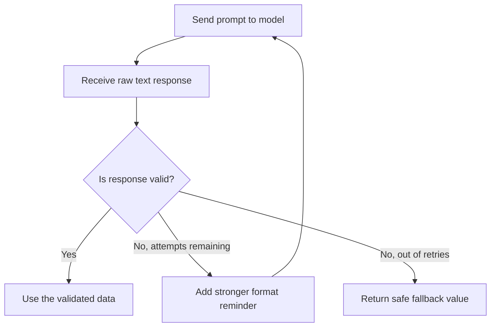

# Unit 13 — Prompt Engineering + Version Control
## Topic 3: Output Validation and Retry

*(Covers: Output validation — checking the AI's response meets the required format · Retry logic — what to do when validation fails)*

---

## 1. Learning Objectives

By the end of this topic, you will be able to:

1. **Explain** why an LLM's output must always be validated before being trusted by your program.
2. **Implement** a Python function that checks whether an LLM's JSON response contains the required fields.
3. **Create** a retry loop that re-prompts the model when validation fails.
4. **Debug** a validation failure by inspecting the model's raw output.
5. **Evaluate** how many retries are reasonable before failing gracefully instead of retrying forever.

---

## 2. Overview

Back in **Unit 1**, you learned that LLMs are **probabilistic systems** — the same prompt can occasionally produce a slightly different, or even malformed, response. In Topic 1 of this unit, you learned **output format control** — instructing the model to reply in strict JSON. But an instruction is not a guarantee. Sometimes the model will still add an extra sentence, misspell a key, or leave out a field.

This is exactly why professional AI-native applications never blindly trust raw LLM output. Instead, they **validate** it — check that it actually matches the expected shape — and if it doesn't, they **retry**: ask the model again, sometimes with a clearer reminder of the required format. This topic teaches you to build that safety net in Python, directly connecting back to the `try` / `except` error handling you learned in **Unit 12**, and to the professional discipline of "AI implements, you verify" from Week 2.

---

## 3. Description

### 3.1 Output Validation

**Definition:** Output validation means writing code that checks whether an AI's response actually contains everything your program expects — the right structure, the right fields, and sensible values — **before** you use that response anywhere important.

**Why this exists:** If your code assumes `data["status"]` always exists and the model forgot to include it, your program will crash with a `KeyError`. In a live customer-facing app, that crash could mean a failed order update or an unhandled error shown to a real user. Validation catches the problem *before* it causes damage.

```python
import json
import anthropic

client = anthropic.Anthropic()

REQUIRED_KEYS = {"order_id", "status"}
VALID_STATUSES = {"delayed", "delivered", "cancelled", "unknown"}

def is_valid_response(raw_text):
    """Returns True if raw_text is valid JSON with the fields we need, else False."""
    try:
        data = json.loads(raw_text)               # Step 1: try to parse it as JSON
    except json.JSONDecodeError:
        return False                                # Not even valid JSON — fails immediately

    if not REQUIRED_KEYS.issubset(data.keys()):     # Step 2: check both required keys exist
        return False

    if data["status"] not in VALID_STATUSES:        # Step 3: check the value is one we recognise
        return False

    return True                                     # All checks passed
```

**Line-by-line:**
- `REQUIRED_KEYS = {"order_id", "status"}` — a Python **set** listing the field names that must be present in the model's JSON reply.
- `VALID_STATUSES = {...}` — a set of the only acceptable values for `"status"`, so a made-up value like `"probably delayed"` is rejected.
- `def is_valid_response(raw_text):` — defines a function (Unit 12) that takes the model's raw text reply and returns `True` or `False`.
- `try: / except json.JSONDecodeError:` — the `try`/`except` block from Unit 12: if `json.loads()` fails because the text isn't valid JSON at all, we catch that specific error and immediately return `False` instead of crashing.
- `REQUIRED_KEYS.issubset(data.keys())` — checks that *every* key we require is present among the keys the model actually returned.
- `data["status"] not in VALID_STATUSES` — checks the *value* is one of the four we defined as acceptable, guarding against the model inventing a new, unexpected status word.
- `return True` — only reached if all three checks pass.

> **Important Note:** Validation is not just "is it valid JSON?" — that is only step one. You must also check the *content* makes sense (correct keys, sensible values) for the validation to actually be useful.

---

### 3.2 Retry Logic

**Definition:** Retry logic means: if the model's response fails validation, **ask the model again** — often with a stronger reminder of the exact format required — instead of giving up or crashing on the first bad response. This is usually done a limited number of times, not forever.

**Why this exists:** Because LLM output is probabilistic, a single failed attempt does not mean the model "can't" produce a valid response — trying again, sometimes with a clarified prompt, very often succeeds. But retrying *forever* would waste time and money if something is fundamentally wrong (e.g., a broken prompt), so professional retry logic always has a maximum number of attempts.

```python
MAX_RETRIES = 3

def get_validated_order_status(customer_message):
    prompt_template = """Extract the order status from the customer message below.
Return ONLY valid JSON in exactly this shape, with no extra text before or after it:
{{"order_id": "<string or null>", "status": "<one of: delayed, delivered, cancelled, unknown>"}}

Customer message: "{message}"
"""

    for attempt in range(1, MAX_RETRIES + 1):          # attempt = 1, 2, 3
        prompt = prompt_template.format(message=customer_message)

        if attempt > 1:
            # On retries, add an extra, firmer reminder about the format.
            prompt += "\nIMPORTANT: Your previous reply did not match the required JSON format. Return ONLY the JSON object, nothing else."

        response = client.messages.create(
            model="claude-sonnet-4-5",
            max_tokens=100,
            messages=[{"role": "user", "content": prompt}]
        )
        raw_text = response.content[0].text

        if is_valid_response(raw_text):
            return json.loads(raw_text)               # success — return the parsed dictionary

        print(f"Attempt {attempt} failed validation. Raw output was: {raw_text!r}")

    # If we reach here, every attempt failed.
    return {"order_id": None, "status": "unknown"}     # safe fallback — never crash the caller
```

**Line-by-line (new parts):**
- `MAX_RETRIES = 3` — a fixed limit. This is a deliberate engineering decision: retry a few times, but not forever.
- `for attempt in range(1, MAX_RETRIES + 1):` — loops through attempt numbers 1, 2, 3.
- `if attempt > 1:` — only adds the extra, firmer reminder from the *second* attempt onward, since the first attempt should already have a clear prompt.
- `if is_valid_response(raw_text):` — reuses the validation function from Section 3.1. If it passes, we immediately `return` the parsed data and stop retrying.
- `print(f"Attempt {attempt} failed...")` — logs what went wrong, which is essential for debugging (Learning Objective 4) — you can see exactly what the model returned instead of guessing.
- `return {"order_id": None, "status": "unknown"}` — the **safe fallback**: if all retries fail, the function still returns a predictable, safe result instead of crashing your whole application.



**Best Practices:**
- Always cap the number of retries — never build an infinite retry loop.
- Log the raw failed output every time — you cannot fix what you cannot see.
- Always have a safe, sensible fallback value for when all retries are exhausted, so your application degrades gracefully instead of crashing.
- Make your retry prompt *stronger*, not just identical — repeating the exact same prompt often produces the exact same mistake.

**Common Beginner Mistakes:**
- Assuming `json.loads()` succeeding means the response is "correct" — valid JSON can still be missing required fields or contain nonsense values (Section 3.1's deeper checks are still needed).
- Writing a retry loop with no maximum count, risking a program that hangs (and a bill that keeps growing) if the model keeps failing.
- Not logging or printing the failed raw output, making it impossible to later understand why validation kept failing.

---

## 4. Real World Application

- **Food delivery / e-commerce:** Validating that an AI's extracted order status is one of a known, finite set of values before updating a live order-tracking database.
- **Banking/FinTech:** Retrying a request for a structured transaction summary if the model's JSON is malformed, since a broken field could otherwise silently corrupt a financial report.
- **Healthcare:** Validating that an AI-generated structured triage note contains all required fields (symptom, duration, severity) before it's shown to a nurse, per the human-oversight principles from Unit 9.
- **Government/education helpdesks:** Ensuring a chatbot's structured "next step" recommendation always matches one of the platform's actual valid actions, instead of an invented one.
- **Capstone project (Unit 15):** You will be explicitly required to build a validation-and-retry safety net around your capstone's AI output — this topic is direct preparation for that requirement.

---

## 5. Worked Example

**Scenario:** Combine validation and retry into one complete, runnable mini-program that safely handles a batch of customer messages, even if some of the model's replies are malformed.

```python
import json
import anthropic

client = anthropic.Anthropic()

REQUIRED_KEYS = {"order_id", "status"}
VALID_STATUSES = {"delayed", "delivered", "cancelled", "unknown"}
MAX_RETRIES = 3


def is_valid_response(raw_text):
    try:
        data = json.loads(raw_text)
    except json.JSONDecodeError:
        return False
    if not REQUIRED_KEYS.issubset(data.keys()):
        return False
    if data["status"] not in VALID_STATUSES:
        return False
    return True


def get_validated_order_status(customer_message):
    prompt_template = (
        "Extract the order status from the customer message below.\n"
        'Return ONLY valid JSON in exactly this shape: {{"order_id": "<string or null>", '
        '"status": "<one of: delayed, delivered, cancelled, unknown>"}}\n\n'
        'Customer message: "{message}"'
    )

    for attempt in range(1, MAX_RETRIES + 1):
        prompt = prompt_template.format(message=customer_message)
        if attempt > 1:
            prompt += "\nIMPORTANT: Return ONLY the JSON object, nothing else."

        response = client.messages.create(
            model="claude-sonnet-4-5",
            max_tokens=100,
            messages=[{"role": "user", "content": prompt}]
        )
        raw_text = response.content[0].text

        if is_valid_response(raw_text):
            return json.loads(raw_text)

        print(f"Attempt {attempt} failed. Raw: {raw_text!r}")

    return {"order_id": None, "status": "unknown"}


customer_messages = [
    "Where is my order #4521? It's been 2 hours!",
    "Please cancel my order #7788, I don't need it anymore.",
]

for message in customer_messages:
    result = get_validated_order_status(message)
    print(f"Message: {message}\n  -> Validated result: {result}\n")
```

**Expected behaviour:** For each customer message, the function tries up to 3 times to get a valid, correctly-shaped JSON reply. If the model returns something malformed (extra text, missing field, invalid status word), the program logs it and retries with a firmer instruction — and even in the worst case, the loop still ends safely with `{"order_id": None, "status": "unknown"}` rather than crashing.

---

## 6. Key Takeaways

- Never trust raw LLM output directly — always **validate** it against the exact structure and values your program expects.
- Validating "is it JSON?" is not enough — also check required keys exist and values are within an expected set.
- **Retry logic** re-prompts the model (with a firmer reminder) when validation fails, taking advantage of the model's probabilistic nature — a different attempt often succeeds.
- Always cap retries at a sensible maximum (e.g., 3) and always provide a **safe fallback value** for when all retries fail.
- Log every failed raw response — this is essential for debugging prompts that keep failing.
- This validate-then-retry pattern is the standard professional safety net around any LLM call whose output feeds into other code.
- **Interview tip:** If asked "how do you make LLM output reliable for a production system?", a strong answer names both **output format control** (Topic 1) *and* **validation + retry with a capped limit and fallback** (this topic) — one alone is not enough.
- This exact pattern is required in your **Capstone project's evaluation harness** (Unit 15).

---

## 7. Reference Links

- [Python Official Docs — json module](https://docs.python.org/3/library/json.html) — for `json.loads()` and `JSONDecodeError`.
- [Python Official Docs — Errors and Exceptions](https://docs.python.org/3/tutorial/errors.html) — official reference for `try`/`except`, built on in Unit 12.
- [Anthropic Documentation — Increase Output Consistency](https://docs.claude.com/) — official guidance on getting reliable, structured output from Claude.
