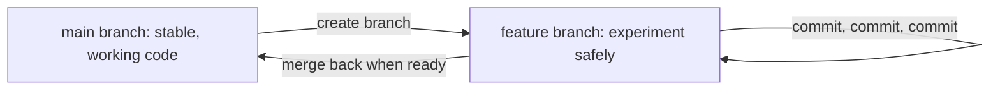

# Unit 13 — Prompt Engineering + Version Control
## Topic 4: Version Control with Git and GitHub

*(Covers: Why version control matters · Git fundamentals · GitHub workflow · Folder structure and README · .gitignore · Commit discipline)*

---

## 1. Learning Objectives

By the end of this topic, you will be able to:

1. **Explain** why version control matters for anyone building AI-powered software.
2. **Describe** the core Git concepts: repository, commit, branch, and merge.
3. **Implement** a basic GitHub workflow: clone, add, commit, push.
4. **Create** a professional folder structure and README for a small project.
5. **Implement** a `.gitignore` file that keeps API keys and secrets out of a public repository.
6. **Apply** good commit discipline — one logical change per commit, with a meaningful message.

---

## 2. Overview

Every project you have built so far in this program — from your first Python script in Unit 11 to your first Anthropic API call in Unit 12 — has lived only on your own computer (or your Colab notebook). That's fine for learning, but it is *not* how real software is built. Real AI-native engineering teams need a way to: save every version of their work permanently, undo mistakes, work together without overwriting each other's changes, and keep secrets (like API keys) out of code that others can see.

**Version control** — and specifically the tool called **Git**, together with the hosting platform **GitHub** — solves exactly this problem. This topic teaches you the essential Git and GitHub skills every AI-native engineer uses daily: recording your work as a history of "commits," organising a project professionally, and — critically — never leaking your Anthropic API key into a public repository (directly connecting back to the API key security warning from Unit 12). Your entire **Capstone project** (Unit 15) will be submitted as a GitHub repository, so the habits you build here are not optional — they are the delivery format for your final grade.

---

## 3. Description

### 3.1 Why Version Control Matters

**Definition:** Version control is a system that records changes to a set of files over time, so you can recall any earlier version, see exactly what changed and when, and safely experiment without fear of permanently breaking your working code.

**Why this exists:** Imagine you're editing a Python script and it was working perfectly yesterday. Today, you make five changes and now it crashes — but you don't remember exactly what you changed. Without version control, you might have to rewrite everything from memory. With version control, you can see the exact difference between yesterday's working version and today's broken one, line by line, and undo just the part that broke it.

**Everyday analogy:** Think of version control like the "Track Changes" and version history in Google Docs, but far more powerful — it tracks changes across your *entire project* (many files and folders), lets multiple people work on the same project without overwriting each other, and keeps a permanent, searchable history forever.

---

### 3.2 Git Fundamentals

**Definition:** **Git** is the most widely used version control software. Four core concepts form its foundation:

| Term | Simple Meaning |
|---|---|
| **Repository ("repo")** | A folder that Git is tracking — it contains your project files plus a hidden history of every saved version. |
| **Commit** | A saved "snapshot" of your project at a specific point in time, with a short message describing what changed. |
| **Branch** | A separate, independent line of work — you can experiment on a branch without affecting the main, working version of your project. |
| **Merge** | Combining the changes from one branch back into another (usually back into the main branch) once you're happy with them. |



**Analogy:** Think of `main` as your final, submitted assignment. A `branch` is like a rough-draft notebook where you try out risky changes — if the experiment fails, you simply throw away the rough-draft notebook; your final assignment (`main`) was never touched. Once the experiment succeeds, you copy the good parts back into your final assignment — that's a `merge`.

**Setting up a repository (typical first commands on your own computer):**
```bash
git init                     # Turns the current folder into a new Git repository
git status                   # Shows which files have changed and are or aren't yet tracked
git add README.md            # Stages README.md — marks it as "ready to be saved" in the next commit
git commit -m "Initial commit: add project README"   # Saves a permanent snapshot with a message
```

**Line-by-line:**
- `git init` — creates a hidden `.git` folder here that will store your project's entire history from now on.
- `git status` — a "what's changed?" check; always safe to run, it doesn't change anything.
- `git add README.md` — moves `README.md` into the "staging area," Git's waiting room for changes about to be committed. (`git add .` stages *all* changed files at once.)
- `git commit -m "..."` — permanently records the staged changes as a new snapshot in your project's history, labelled with the message in quotes.

---

### 3.3 GitHub Workflow

**Definition:** **GitHub** is a website that *hosts* Git repositories online, so your code has a permanent home in the cloud, can be shared with others, and can be backed up beyond just your own laptop.

**The core workflow — clone, add, commit, push:**
```bash
git clone https://github.com/your-username/your-repo.git   # Step 1: download an existing repo to your computer
cd your-repo                                                 # Step 2: move into the downloaded project folder

# ... you make changes to some files here ...

git add .                                                     # Step 3: stage all your changed files
git commit -m "Add order-status validation function"        # Step 4: save a snapshot with a clear message
git push                                                      # Step 5: upload your new commit(s) to GitHub
```

**Line-by-line:**
- `git clone <url>` — makes a full copy of a GitHub repository (code + entire history) onto your own computer. You only do this once per project.
- `cd your-repo` — changes your terminal's current folder into the newly downloaded project (a command from your operating system, not Git itself).
- `git add .` — the `.` means "everything in this folder that has changed" — stages all of it at once.
- `git commit -m "..."` — saves your staged changes locally, on your own computer, as a new point in history.
- `git push` — uploads your local commits to GitHub, so they are now visible and backed up online, and available to teammates.

> **Important Note:** `git commit` only saves the snapshot *on your own computer*. Nothing is shared with anyone else — including your teammates or GitHub itself — until you run `git push`.

**Comparison Table — Local Git vs GitHub**

| Aspect | Git (local) | GitHub (cloud) |
|---|---|---|
| What is it? | Software installed on your computer | A website that hosts Git repositories |
| Where does history live? | On your own machine | Also stored online, shareable |
| Key commands | `init`, `add`, `commit`, `branch`, `merge` | `clone`, `push`, `pull`, pull requests |
| Works without internet? | Yes | No (needs internet to sync) |

---

### 3.4 Folder Structure and README

**Definition:** A well-organised project folder, with a clear **README** file at the top, is what makes your project understandable to anyone (a teacher, a recruiter, a teammate) who opens it for the first time — including your future self, six months later.

**Example professional folder structure for a small AI-native project:**
```
my-food-delivery-assistant/
├── README.md                 # Explains what the project is and how to run it
├── requirements.txt          # Lists the Python packages needed (e.g., anthropic)
├── .gitignore                 # Tells Git which files to never track (see 3.5)
├── src/
│   ├── main.py                # The main program
│   └── validators.py          # Helper functions, e.g., output validation from Topic 3
└── examples/
    └── sample_conversation.md # A sample run, useful for demonstrating the project
```

**What a good README typically includes:** a one-line description of the project, setup/installation steps, how to run it, and any important notes (like "you must set your own `ANTHROPIC_API_KEY`").

```markdown
# Food Delivery Support Assistant

A small AI-powered assistant that classifies customer support messages
and drafts replies, built with the Anthropic API.

## Setup
1. Install dependencies: `pip install anthropic`
2. Set your API key as an environment variable: `ANTHROPIC_API_KEY`
3. Run: `python src/main.py`
```

---

### 3.5 .gitignore — Keeping Secrets Out of Public Repositories

**Definition:** A `.gitignore` file tells Git a list of files and folders it should **never** track or upload — even if they exist in your project folder.

**Why this matters — critically:** In **Unit 12**, you were warned to never hardcode your Anthropic API key directly into your Python code. `.gitignore` is the other half of that safety habit: even if you *do* keep your key in a separate file (like a `.env` file) instead of your main script, you must make sure Git never uploads that file to a public GitHub repository — because once a secret is pushed to a public repo, anyone (including bots that scan GitHub 24/7 for exposed keys) can find and misuse it.

**Example `.gitignore` file:**
```
# Never track environment/secret files
.env
*.key

# Never track Python's auto-generated cache files
__pycache__/
*.pyc

# Never track local notebook checkpoints
.ipynb_checkpoints/
```

**Line-by-line:**
- `.env` — a common filename convention for storing secrets like `ANTHROPIC_API_KEY=sk-ant-...`; listing it here means Git will always ignore this file.
- `*.key` — the `*` is a wildcard meaning "any filename ending in `.key`" — ignores any file matching that pattern.
- `__pycache__/` and `*.pyc` — Python's own automatically-generated temporary files, which don't need to be saved in version control at all.
- `.ipynb_checkpoints/` — Jupyter/Colab's auto-save folder, also unnecessary to track.

> **Important Note:** `.gitignore` only prevents *future* commits from including these files. If a secret file was already committed and pushed *before* you added it to `.gitignore`, it is still exposed in your project's history — you would need to remove it from history entirely and, most importantly, treat that key as compromised and generate a brand-new one immediately.

---

### 3.6 Commit Discipline

**Definition:** Commit discipline means making each commit represent **one clear, logical change**, described with a **meaningful commit message** — rather than one giant, vague commit that bundles many unrelated changes together.

**Why this matters:** A good commit history is like a clear lab notebook — anyone (including you, later) can scan through it and understand exactly what changed and why, without having to re-read every line of code.

**Comparison Table — Good vs Bad Commit Messages**

| Bad commit message | Why it's bad | Good commit message | Why it's good |
|---|---|---|---|
| `"update"` | Says nothing about what changed | `"Add retry logic for LLM JSON validation"` | States exactly what changed |
| `"fixed stuff"` | Vague, no context for later readers | `"Fix KeyError when order_id is missing from response"` | Names the specific bug fixed |
| `"final version 2 final FINAL"` | Suggests messy, undisciplined history | `"Add .gitignore to exclude .env file"` | Clear, single, logical change |

**Best Practices:**
- One commit = one logical change (e.g., "add feature X" or "fix bug Y" — not both at once).
- Write commit messages in the present tense, as an instruction: "Add", "Fix", "Update" — not "Added" or "Fixing".
- Commit often — small, frequent commits are much easier to review and undo than one giant commit at the end of the day.
- Always double-check `git status` before committing, to ensure you're not accidentally including a secret file.

**Common Beginner Mistakes:**
- Committing a `.env` file or hardcoded API key before setting up `.gitignore` — always set up `.gitignore` at the very start of a new project, before your first commit.
- Writing a single massive commit at the end of a multi-hour session, mixing five unrelated changes together, making it impossible to undo just one of them later.
- Forgetting `git push` — believing your work is "saved to GitHub" when it has only been committed locally.

---

## 4. Real World Application

- **Team AI projects:** Multiple engineers use branches to build different features (e.g., one branch for a new RAG pipeline, another for a UI fix) without breaking each other's work, then merge once tested.
- **API key safety:** Every professional AI-native project uses `.gitignore` to keep API keys, database passwords, and other secrets out of the shared, often-public codebase — directly protecting against the costly mistake of a leaked Anthropic API key running up unexpected charges.
- **Open-source AI tooling:** Popular AI libraries and demo projects on GitHub rely entirely on clear README files and folder structures so thousands of unfamiliar developers can understand and use them quickly.
- **Portfolio building (for placements):** Recruiters and interviewers for AI-native engineering roles routinely check a candidate's GitHub — clean commit history, a clear README, and no leaked secrets are strong, direct signals of professional discipline.
- **Capstone submission (Unit 15):** Your final capstone project must be submitted as a well-structured GitHub repository — this topic's skills are directly graded there.

---

## 5. Worked Example

**Scenario:** Starting a brand-new AI-native mini-project from scratch, the professional way.

```bash
# Step 1: Create and enter a new project folder
mkdir food-delivery-assistant
cd food-delivery-assistant

# Step 2: Initialise Git BEFORE writing any code (so secrets are never at risk)
git init

# Step 3: Create a .gitignore FIRST, before adding an API key anywhere
echo ".env" >> .gitignore
echo "__pycache__/" >> .gitignore

# Step 4: Create your secret file (never to be committed)
echo "ANTHROPIC_API_KEY=sk-ant-your-real-key-here" >> .env

# Step 5: Create your README
echo "# Food Delivery Assistant" >> README.md

# Step 6: Check status - .env should NOT appear as something Git wants to track
git status

# Step 7: Stage and commit only the safe files
git add README.md .gitignore
git commit -m "Initial commit: add README and .gitignore"

# Step 8: Connect to GitHub and push
git remote add origin https://github.com/your-username/food-delivery-assistant.git
git push -u origin main
```

**Step-by-step reasoning:**
1. `.gitignore` is created **before** the `.env` secret file even exists — this is the single most important habit in this whole topic, since it guarantees the secret can never be accidentally committed.
2. `git status` after Step 6 is where you **verify** your safety net worked — `.env` should not be listed under files Git wants to add.
3. Only `README.md` and `.gitignore` are staged and committed — the secret file is deliberately left out.
4. `git remote add origin <url>` links your local repository to an empty repository you created on GitHub (done once, the first time).
5. `git push -u origin main` uploads your commit and, from now on, lets you simply type `git push` for future updates.

---

## 6. Key Takeaways

- **Version control** records your project's history, letting you undo mistakes and collaborate safely — essential for any real engineering work, not just AI projects.
- **Git fundamentals:** repository (tracked folder), commit (saved snapshot), branch (independent line of work), merge (combining branches back together).
- **GitHub workflow:** `clone` (download), `add` (stage), `commit` (save locally), `push` (upload to GitHub).
- A clear **folder structure and README** make your project understandable to anyone opening it for the first time.
- **`.gitignore`** must be set up *before* any secret file is created, to guarantee API keys never get committed — this directly protects the Anthropic API key safety habit from Unit 12.
- **Commit discipline**: one logical change per commit, with a clear, present-tense message.
- **Interview tip:** Interviewers often ask "how do you handle secrets in your codebase?" — a strong, specific answer is: "environment variables plus a `.gitignore` entry set up from the very first commit."
- Your **Capstone project (Unit 15)** must be submitted as a properly structured, securely committed GitHub repository — every skill in this topic is directly assessed there.

---

## 7. Reference Links

- [Git Official Documentation](https://git-scm.com/doc) — the authoritative reference for all Git commands.
- [GitHub Docs — Getting Started](https://docs.github.com/en/get-started) — official GitHub guide to repositories, cloning, and pushing.
- [GitHub Docs — Ignoring Files](https://docs.github.com/en/get-started/getting-started-with-git/ignoring-files) — official guidance on `.gitignore`.
- [GeeksforGeeks — Git Commit Best Practices](https://www.geeksforgeeks.org/) — supplementary reading on commit discipline.
