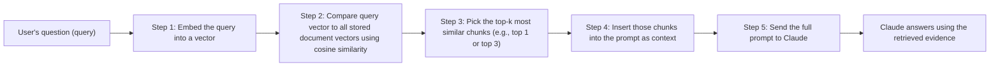

# Unit 14 — RAG, Vectors, Agents and Production AI
## Topic 1: Retrieval-Augmented Generation (RAG)

*(Covers: Vector databases · The RAG retrieval pipeline · Why RAG reduces hallucination · When to use RAG)*

---

## 1. Learning Objectives

By the end of this topic, you will be able to:

1. **Explain** what a vector database is and why it is needed to search embeddings at scale.
2. **Describe** the full RAG pipeline: query → embed → similarity search → top-k → inject into prompt.
3. **Differentiate** between an LLM answering "from memory" and an LLM answering "from retrieved evidence."
4. **Identify** when a task genuinely needs RAG versus when a plain prompt is enough.
5. **Implement** a small, working, in-memory RAG pipeline in Python that retrieves the most relevant document and passes it to Claude.
6. **Evaluate** whether a RAG-based answer is actually grounded in the retrieved text, or whether the model has ignored it.

---

## 2. Overview

By now you have built the two core skills of an AI-Native Engineer: writing good specifications and calling Claude from Python with well-engineered prompts. But there is a hard limit to what a prompt alone can do — Claude was trained on data up to a certain point, and it has never seen your company's internal policy document, today's train schedule, or your college's fee-refund rules. If you simply ask it about these things, it will either say it doesn't know, or worse, **hallucinate** a plausible-sounding but wrong answer (a failure mode you studied in Unit 5 and Unit 3).

**Retrieval-Augmented Generation (RAG)** is the standard production pattern that solves this. Instead of expecting the model to "know" everything, you first **retrieve** the most relevant piece of real information from your own documents, and then **hand that information to the model inside the prompt**, asking it to answer using only that evidence. This is exactly how you, as a student, would answer an exam question about a case study: you don't answer purely from memory — you look up the case study text and quote from it.

RAG sits at the centre of the "2026 AI stack" you first met conceptually in Unit 4. Here in Unit 14, you will build a real, working RAG pipeline in Python — connecting the embeddings and cosine similarity maths from Unit 6 and Unit 8 directly to the Anthropic API calls you learned in Unit 12. This is one of the most important, in-demand skills for an entry-level AI-native engineer, because almost every real business use case ("answer questions about our own documents/policies/products") is solved with RAG, not by fine-tuning or by hoping the model already knows.

---

## 3. Description

### 3.1 Vector Databases

**Definition:** A **vector database** is a specialised storage system designed to hold large numbers of **embeddings** (the numeric vectors you studied in Unit 6, which capture the *meaning* of a piece of text) and to very quickly find which stored vectors are most similar to a new query vector.

**Why this exists:** Recall from Unit 6 that we can compare the meaning of two sentences using **cosine similarity** between their embeddings. That works fine for comparing 5 sentences by hand. But a real company might have 50,000 support documents, each broken into paragraphs — that could be millions of embedding vectors. Comparing a query against millions of vectors one by one, in a simple loop, would be far too slow for a live chatbot. A vector database uses clever indexing techniques (for example, algorithms like HNSW — Hierarchical Navigable Small World graphs) to find the closest vectors in a fraction of a second, even among millions of entries.

**Key Terminology:**

| Term | Simple Meaning |
|---|---|
| **Embedding** | A list of numbers representing the meaning of a piece of text (studied in Unit 6). |
| **Vector database** | A database built specifically to store embeddings and search them by similarity, not by exact keyword match. |
| **Index** | An internal data structure the vector database builds so it can search quickly instead of comparing against every single vector one by one. |
| **Chunk** | A small piece of a larger document (e.g., one paragraph) that gets its own embedding — documents are usually split into chunks before storing, because embedding an entire 50-page PDF as one vector would lose too much detail. |

> **Important Note:** For learning purposes, in this topic we will build a **tiny in-memory vector store using a plain Python list** — no real vector database software. This lets you see and control every single step. In a real production system, you would use a dedicated vector database (e.g., Pinecone, Weaviate, Chroma, or Postgres with the `pgvector` extension) — but the underlying *idea* is identical to what you will build by hand below.

---

### 3.2 The RAG Retrieval Pipeline

**Definition:** The RAG pipeline is the sequence of steps: **query → embed → similarity search → top-k → inject into prompt.**



**Explanation of each step:**

1. **Query:** the user's question, exactly as typed (e.g., "What is the refund policy for a cancelled order?").
2. **Embed:** convert that question into an embedding vector, using the same embedding process used to embed the stored documents (both must use the same embedding model, or the comparison is meaningless).
3. **Similarity search:** compare the query's embedding to every stored document-chunk embedding using cosine similarity (Unit 6, Unit 8) and rank them from most similar to least similar.
4. **Top-k:** keep only the best few matches — "k" is just a variable name for "how many." Top-1 means keep only the single best match; top-3 means keep the three best. Picking too few risks missing the answer; picking too many wastes prompt space and can confuse the model with irrelevant text.
5. **Inject into prompt:** paste the retrieved chunk(s) directly into the prompt you send to Claude, along with an instruction like "answer using only the information below."

**Worked Example — A Tiny, Fully Working RAG Pipeline in Python:**

```python
import math
from anthropic import Anthropic

# --- Step 0: Our "knowledge base" — a tiny set of documents ---
# In a real system these would be thousands of chunks from real PDFs/policies.
documents = [
    "Refunds for cancelled train tickets are processed within 7 working days to the original payment method.",
    "UPI transactions above Rs. 2,000 require a one-time PIN confirmation for security.",
    "College hostel fee refunds are only processed if the cancellation request is made within 15 days of payment.",
]

# --- Step 1: A tiny "embedding" function ---
# NOTE: This is a simplified teaching version, not a real embedding model.
# A real system would call an embedding API (e.g., Claude/OpenAI embeddings)
# to get a proper high-dimensional vector. Here, we build a simple word-count
# vector so you can see the maths clearly, reusing the vector idea from Unit 6.
def simple_embed(text, vocabulary):
    text_words = text.lower().split()
    return [text_words.count(word) for word in vocabulary]

# Build a shared vocabulary from all documents + the query, so every vector
# has the same length and same word-order (a requirement for comparing vectors).
def build_vocabulary(texts):
    vocab = set()
    for t in texts:
        vocab.update(t.lower().split())
    return sorted(vocab)

# --- Step 2: Cosine similarity function (from Unit 6/Unit 8) ---
def cosine_similarity(vec_a, vec_b):
    dot_product = sum(a * b for a, b in zip(vec_a, vec_b))
    magnitude_a = math.sqrt(sum(a * a for a in vec_a))
    magnitude_b = math.sqrt(sum(b * b for b in vec_b))
    if magnitude_a == 0 or magnitude_b == 0:
        return 0.0
    return dot_product / (magnitude_a * magnitude_b)

# --- Step 3: Retrieval function — the heart of RAG ---
def retrieve_top_match(query, documents):
    vocabulary = build_vocabulary(documents + [query])
    query_vector = simple_embed(query, vocabulary)

    best_score = -1
    best_document = None
    for doc in documents:
        doc_vector = simple_embed(doc, vocabulary)
        score = cosine_similarity(query_vector, doc_vector)
        if score > best_score:
            best_score = score
            best_document = doc

    return best_document, best_score

# --- Step 4: Ask the user's question ---
user_question = "How long does a train ticket refund take?"

retrieved_text, similarity_score = retrieve_top_match(user_question, documents)
print(f"Retrieved chunk (similarity {similarity_score:.2f}): {retrieved_text}")

# --- Step 5: Inject the retrieved evidence into the prompt and call Claude ---
client = Anthropic(api_key="YOUR_API_KEY")

response = client.messages.create(
    model="claude-sonnet-4-5",
    max_tokens=200,
    system=(
        "You are a helpful assistant. Answer the user's question using ONLY "
        "the context provided below. If the context does not contain the answer, "
        "say 'I don't have that information.'"
    ),
    messages=[
        {
            "role": "user",
            "content": f"Context:\n{retrieved_text}\n\nQuestion: {user_question}"
        }
    ]
)

print(response.content[0].text)
```

**Line-by-line explanation of the important parts:**

- `documents = [...]` — our tiny knowledge base. In production this list would instead be loaded from real files/database rows, split into chunks.
- `simple_embed(text, vocabulary)` — turns text into a list of numbers by counting how many times each vocabulary word appears in it. This is a deliberately simplified stand-in for a real embedding model, chosen so every number in the vector is easy to trace by hand — a real embedding model (as used by Claude or dedicated embedding APIs) produces much richer vectors that capture meaning, not just word counts, but the *shape* of the pipeline is identical.
- `build_vocabulary(texts)` — collects every unique word across all documents and the query so all vectors have matching positions (position 0 always means the same word for every vector — required for cosine similarity to make sense).
- `cosine_similarity(vec_a, vec_b)` — the exact formula from Unit 6/Unit 8: dot product divided by the product of magnitudes. Returns a number between -1 and 1; higher means more similar in meaning/word overlap.
- `retrieve_top_match(query, documents)` — loops through every document, computes its similarity to the query, and keeps track of the single best (`top-k` with k=1 here).
- `client.messages.create(...)` — the same real Anthropic API call structure from Unit 12: `model`, `max_tokens`, `system` (sets the assistant's behaviour and grounding rule), and `messages` (the user's actual request).
- `f"Context:\n{retrieved_text}\n\nQuestion: {user_question}"` — this is the **injection step**: the retrieved evidence is pasted directly into the user message, ahead of the actual question, so Claude has the real facts in front of it rather than guessing.

**Expected output:** The retrieval step correctly picks the train-refund sentence (highest word overlap with the question), and Claude's final answer will state "within 7 working days," grounded in that retrieved text — not invented from its own training data.

---

### 3.3 Why RAG Reduces Hallucination

**Why this matters:** In Unit 3 and Unit 5 you learned that LLMs hallucinate — they generate fluent, confident text that can be factually wrong, because they are predicting *likely* text, not looking up *verified* facts (Unit 1's deterministic vs probabilistic distinction is the root cause here). RAG directly attacks this problem by changing **what the model is asked to do**:

| Without RAG | With RAG |
|---|---|
| Model answers purely from patterns learned during training | Model answers using text retrieved from your actual documents |
| No way to trace *where* the answer came from | You can show the exact retrieved chunk the answer is based on |
| Model may confidently state outdated or wrong facts | Model is instructed to say "I don't know" if the retrieved context doesn't contain the answer |
| Cannot be updated without retraining the whole model | Update instantly by adding/editing documents in your knowledge base — no retraining needed |

**Important Note:** RAG *reduces* hallucination — it does not make it mathematically impossible. The model can still occasionally ignore the retrieved context or misread it. This is why, as you learned in Unit 9 (Human Judgment and AI Oversight), a human must still verify high-stakes RAG answers, and why Unit 15's evaluation harness will test RAG answers specifically for "did it actually use the retrieved evidence."

---

### 3.4 When to Use RAG

**Rule of thumb:** Use RAG when the correct answer **depends on information the model was not trained on** — your own private, current, or frequently changing data.

**Use RAG when:**
- The answer lives in your organisation's own documents (policies, product catalogues, internal wikis).
- The information changes often (today's train delays, current stock levels, this week's exam timetable).
- You need to cite/trace exactly where an answer came from (compliance, legal, healthcare).

**Don't need RAG when:**
- The task is general knowledge or general reasoning the model already learned during training (e.g., "explain photosynthesis," "write a poem").
- The task is a fixed calculation better done with deterministic code (Unit 1's lesson again — a bill calculator doesn't need RAG or even an LLM).

**Best Practices:**
- Keep chunks small and focused (one idea per chunk) so retrieval is precise.
- Always instruct the model explicitly to say "I don't know" when the retrieved context doesn't answer the question — this alone prevents a large share of RAG hallucinations.
- Log which chunk was retrieved for every real answer, so a human reviewer can audit it later.

**Common Mistakes:**
- Retrieving too many chunks "just in case" — this dilutes the prompt and can confuse the model about which piece of evidence actually answers the question.
- Using two *different* embedding methods for the documents and the query — similarity scores become meaningless if the vectors aren't built the same way.
- Forgetting to actually instruct the model to rely on the context — without that instruction, the model may ignore the retrieved text and answer from memory anyway.

---

## 4. Real World Application

- **Vernacular / Indian-language document assistants:** A farmer asks an agri-advisory chatbot about a government scheme in Hindi; RAG retrieves the exact scheme document paragraph before answering, instead of the model guessing scheme details from memory.
- **Banking/FinTech:** A UPI support bot answering "why did my transaction fail?" retrieves the bank's actual current failure-code documentation rather than inventing a plausible-sounding but wrong reason.
- **Healthcare:** A hospital's internal assistant retrieves the actual current treatment protocol document before summarising it for a nurse — critical, since Unit 9 taught you that medical decisions need a traceable, verifiable source.
- **Railway booking systems:** An IRCTC-style enquiry assistant retrieves today's actual train status/refund-policy text instead of relying on the model's (possibly outdated) training knowledge.
- **Education:** A college helpdesk chatbot retrieves the actual current fee-refund clause from the student handbook before answering a student's query.
- **E-commerce:** A shopping assistant retrieves the specific product's actual return policy chunk rather than a generic, possibly wrong, one.

---

## 5. Worked Example

See the complete, fully-explained Python RAG pipeline in section 3.2 above — from tiny knowledge base, to embedding, to cosine-similarity retrieval, to injecting the retrieved evidence into a real Anthropic API call. Try modifying `user_question` to `"What happens if I cancel my UPI payment above Rs 2000?"` and re-run it — verify that the retrieval step now correctly picks the UPI document instead of the train-refund one, and that Claude's answer changes accordingly, grounded in the newly retrieved text.

**Try it yourself:** Add a fourth document to the `documents` list about a topic not covered by any question you ask, then ask a question unrelated to all four documents — confirm that Claude (correctly instructed) responds with "I don't have that information" rather than hallucinating an answer.

---

## 6. Key Takeaways

- **Vector databases** store embeddings and search them by similarity, at a scale where a simple loop-through-everything approach would be too slow.
- The **RAG pipeline**: query → embed → similarity search → top-k → inject into prompt → generate.
- RAG reduces hallucination by making the model answer from **retrieved evidence**, not from memory alone — but it does not eliminate hallucination entirely; human oversight (Unit 9) still matters.
- Use RAG when the answer depends on **your own, current, or private data** — not for general knowledge or fixed calculations.
- A real, working RAG pipeline can be built with nothing more than: an embedding function, the cosine similarity formula (Unit 6/8), and the same Anthropic API call you already know (Unit 12) — just with retrieved text inserted into the prompt.
- Always instruct the model to say "I don't know" when context doesn't answer the question — this single instruction meaningfully reduces hallucination.
- **Interview tip:** Be ready to explain the full pipeline by name (query → embed → similarity search → top-k → inject) and to explain *why* RAG helps with hallucination in terms of "evidence vs. memory," not just "it makes AI more accurate."

---

## 7. Reference Links

- [Anthropic Documentation — Messages API](https://docs.claude.com/) — official reference for the API call shape used above.
- [Anthropic Documentation — Embeddings and Retrieval Guidance](https://docs.claude.com/) — official guidance on building retrieval-based systems with Claude.
- [Google Machine Learning Crash Course — Embeddings](https://developers.google.com/machine-learning/crash-course) — supplementary grounding in embeddings and similarity search.
