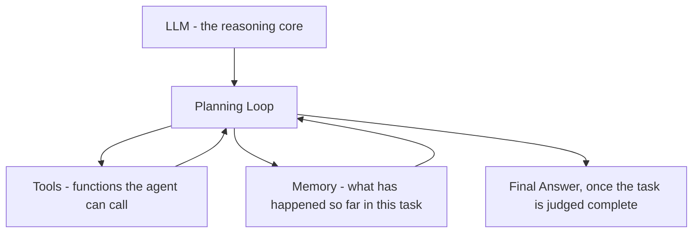
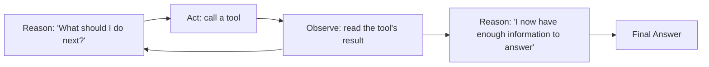

# Unit 14 — RAG, Vectors, Agents and Production AI
## Topic 2: AI Agents

*(Covers: Agent anatomy · The ReAct pattern · Agent vs simpler flow · When NOT to use agents)*

---

## 1. Learning Objectives

By the end of this topic, you will be able to:

1. **Explain** the anatomy of an AI agent: an LLM combined with memory, tools, and a planning loop.
2. **Describe** the ReAct pattern (Reason, Act, Observe, Repeat) and trace it through a worked example.
3. **Differentiate** between a direct API call, a chained sequence of calls, a RAG pipeline, and a full agent.
4. **Identify** which of those four patterns fits a given real-world task.
5. **Implement** a small illustrative Python sketch of an agent choosing and calling a tool.
6. **Evaluate** when an agent's autonomy is inappropriate and human oversight must be kept in the loop instead.

---

## 2. Overview

You were introduced to agents conceptually back in Unit 4 — "an LLM plus memory, tools, and a planning loop." Now that you know how to call the Anthropic API (Unit 12), engineer prompts carefully (Unit 13), and retrieve evidence with RAG (this unit's Topic 1), you have every building block needed to actually understand — and sketch — how an agent works underneath.

An agent is the most powerful, and most risky, pattern in the AI-native engineer's toolkit. Instead of answering one question in one shot, an agent can **decide for itself** what to do next: look something up, run a calculation, call another tool, and only then answer — repeating this loop until it believes the task is done. This is enormously useful for multi-step tasks ("check today's train status, then check the refund policy, then draft a reply"), but it also means the AI is making more decisions with less direct human control per step — which is exactly why the Judgment Framework from Unit 9 and the human-oversight design principles from Unit 10 become critical again here. This topic teaches you both how agents work, and — just as importantly — when *not* to reach for one.

---

## 3. Description

### 3.1 Agent Anatomy

**Definition:** An **AI agent** is a system built from four parts working together in a loop: an **LLM** (the reasoning engine, e.g., Claude), **memory** (what it remembers from earlier in the task), **tools** (functions it is allowed to call, like a calculator, a database lookup, or a web search), and a **planning loop** (the repeating cycle that lets it decide what to do next based on what just happened).



**Key Terminology:**

| Term | Simple Meaning |
|---|---|
| **Tool** | A function the agent is allowed to call — e.g., a calculator function, a database-lookup function, or the RAG retrieval function from Topic 1. |
| **Tool use / function calling** | The mechanism by which the model outputs a structured request like "call the `get_refund_policy` tool with these arguments," which your Python code then actually executes. |
| **Memory** | The running record of what has already happened in the current task (previous questions, previous tool results) so the agent doesn't repeat itself or lose track. |
| **Planning loop** | The repeating cycle: think → act → observe the result → think again → ... → decide the task is finished. |

---

### 3.2 The ReAct Pattern

**Definition:** **ReAct** stands for **Reason + Act** — a pattern where the model alternates between *reasoning* about what to do next and *acting* by calling a tool, then *observing* the tool's result before reasoning again.



**Worked Example — Tracing ReAct by hand:**

> **User question:** "What is 18% GST on the cost of my train ticket, which was Rs. 850?"

| Step | Reason | Act | Observe |
|---|---|---|---|
| 1 | "I need to calculate 18% of 850. I should use the calculator tool rather than compute this myself, since arithmetic must be exact (Unit 1's deterministic-vs-probabilistic lesson)." | Call `calculate(850 * 0.18)` | Tool returns `153.0` |
| 2 | "I now have the GST amount. I can answer." | — (no further tool call) | — |
| 3 | Final answer: "18% GST on Rs. 850 is Rs. 153." | | |

**A Simplified Illustrative Python Sketch of an Agent Loop:**

> **Important Note:** The code below is a deliberately simplified teaching illustration of the *idea* of an agent loop — not a production agent framework. Real agent systems (including Claude's actual tool-use API) handle this more robustly, but the core shape — reason, decide to call a tool, observe the result, decide again — is exactly what is shown here.

```python
from anthropic import Anthropic

client = Anthropic(api_key="YOUR_API_KEY")

# --- Step 1: Define a simple "tool" the agent is allowed to use ---
def calculate_gst(amount, rate=0.18):
    return round(amount * rate, 2)

# --- Step 2: A simplified planning loop ---
def run_agent(user_question):
    memory = []  # keeps track of what has happened so far

    # Ask Claude to reason about what to do
    response = client.messages.create(
        model="claude-sonnet-4-5",
        max_tokens=200,
        system=(
            "You are an agent that can use a GST calculator tool. "
            "If the user's question requires a calculation, respond with exactly: "
            "CALL_TOOL: <amount>. Otherwise, answer directly."
        ),
        messages=[{"role": "user", "content": user_question}]
    )

    model_reply = response.content[0].text
    memory.append(model_reply)

    # Step 3: Check if the model asked to use the tool ("Act")
    if model_reply.startswith("CALL_TOOL:"):
        amount = float(model_reply.split(":")[1].strip())
        tool_result = calculate_gst(amount)   # "Observe"
        memory.append(f"Tool result: {tool_result}")

        # Step 4: Reason again, now with the tool's result available
        final_response = client.messages.create(
            model="claude-sonnet-4-5",
            max_tokens=200,
            system="Answer the user's original question using the tool result provided.",
            messages=[
                {"role": "user", "content": user_question},
                {"role": "assistant", "content": model_reply},
                {"role": "user", "content": f"Tool result: {tool_result}"}
            ]
        )
        return final_response.content[0].text

    return model_reply  # no tool was needed

print(run_agent("What is 18% GST on Rs. 850?"))
```

**Explanation of the important parts:**

- `calculate_gst(amount, rate=0.18)` — the "tool": a plain, deterministic Python function (Unit 1's lesson again — arithmetic should be deterministic code, not the model guessing).
- The `system` prompt tells the model the *rule* for deciding to call the tool (respond with `CALL_TOOL: <amount>`) — a simple, teaching-friendly stand-in for the real structured "tool use" feature in the Anthropic API.
- `if model_reply.startswith("CALL_TOOL:")` — this is the **"Act"** decision point: your Python code checks whether the model asked for a tool call, and only then actually runs `calculate_gst`.
- The second `client.messages.create(...)` call feeds the tool's result back in as part of the conversation (via the `messages` list, which now includes the assistant's request and the tool's answer) — this is the **"Observe → Reason again"** step.
- `memory` — a plain Python list recording what happened, standing in for the agent's "memory" component from section 3.1.

---

### 3.3 Agent vs Simpler Flow — Decision Matrix

**Why this matters:** Not every task needs an agent. Reaching for the most powerful (and most unpredictable) pattern when a simpler one would do is a common and costly beginner mistake.

| Pattern | What it is | Example scenario | Use when |
|---|---|---|---|
| **Direct call** | One prompt → one response, no tools, no retrieval | "Write a polite reply to a customer complaint" | The model already has everything it needs in the prompt itself |
| **Chained calls** | A fixed sequence of two or more prompts, each step's output feeding the next, decided by *your code*, not the model | "Summarise this document, then translate the summary to Tamil" | The steps are known in advance and always happen in the same order |
| **RAG** | Retrieve relevant evidence, then generate an answer grounded in it | "Answer this question using our policy documents" (Topic 1) | The answer depends on external/private/current data |
| **Agent** | The model itself decides, step by step, which tools to call and in what order, until it judges the task complete | "Check today's train status, then look up the refund policy, then draft a reply to the passenger" | The steps required aren't known in advance — the model must decide the plan itself based on what it discovers along the way |

**Rule of thumb:** Always start from the top of this table (direct call) and only move down to a more complex pattern if the simpler one genuinely cannot do the job. This mirrors the "don't force complexity" discipline you've been practising since Unit 1.

---

### 3.4 When NOT to Use Agents

**Why this matters:** An agent's defining feature — deciding its own sequence of actions — is also its biggest risk. If one of those actions is high-stakes or irreversible (sending money, cancelling a booking, sending an email to a customer, changing a medical record), letting the agent act fully autonomously removes the human checkpoint that the Judgment Framework (Unit 9) and human-oversight design (Unit 10) both insist on for such cases.

**Do NOT give an agent full autonomy when:**
- The action is **irreversible** (e.g., an agent that can actually issue a refund or send a payment, without a human confirming first).
- The action is **high-stakes** (medical, legal, financial decisions affecting a real person).
- The cost of a wrong autonomous action is high compared to the cost of adding a short human-approval step.

**Best Practice:** Give the agent the ability to *propose* a high-stakes action (e.g., "I recommend approving this refund of Rs. 2,400") and require a human to confirm before it is actually executed — this is a direct application of the human-in-the-loop checkpoint design from Unit 10.

**Common Beginner Mistakes:**
- Building an agent for a task that a single, well-specified prompt would have solved perfectly well.
- Letting an agent call a "send money" or "send email" tool with no human confirmation step.
- Assuming more tool calls automatically means a better answer — each extra step is also an extra chance for the model to go off track.

---

## 4. Real World Application

- **Customer support agents:** An agent that reads a customer's UPI complaint, looks up their transaction status (tool call), checks the refund policy (RAG), and drafts a reply — but requires human sign-off before actually issuing any refund.
- **Railway/travel assistants:** An agent that checks train status, checks seat availability, and checks refund rules across three separate lookups before answering a passenger's multi-part question.
- **Healthcare:** An agent that can look up a patient's prior records and relevant guidelines to help a doctor prepare — but is never allowed to autonomously decide or communicate a diagnosis (Unit 9's high-stakes-domain rule).
- **Education:** A study-assistant agent that looks up a student's weak topics (from quiz history) and then fetches matching practice questions before responding — a genuinely multi-step, plan-as-you-go task.
- **E-commerce:** An agent that checks stock, checks delivery estimates, and checks a discount-coupon's validity before confirming an order summary to the user, with final "place order" confirmation left to the human.

---

## 5. Worked Example

Walk through the full ReAct trace in section 3.2 by hand, then run the Python sketch with a different amount (e.g., `run_agent("What is 18% GST on Rs. 1,200?")`) and confirm the tool is called correctly and the final answer matches the calculator's output, not a value the model invented on its own.

**Try it yourself:** Modify the `system` prompt so the model can also be asked a question with *no* calculation required (e.g., "What does GST stand for?") and confirm the agent correctly skips the tool call and answers directly — this demonstrates the "Reason" step correctly deciding when *not* to act.

---

## 6. Key Takeaways

- An **agent** = LLM + memory + tools + a planning loop that repeats until the task is judged complete.
- **ReAct** = Reason → Act → Observe → repeat — the core loop most agents are built on.
- Always check the **decision matrix** first: direct call → chained calls → RAG → agent — start simple, escalate only when genuinely needed.
- Agents are powerful specifically because they decide their own next steps — which is exactly why they need tighter human oversight for high-stakes or irreversible actions.
- Never let an agent autonomously execute irreversible, high-stakes actions (payments, cancellations, medical/legal decisions) without a human-confirmation checkpoint.
- **Interview tip:** Be ready to explain, in one sentence, the difference between RAG and an agent: RAG retrieves evidence once before answering; an agent can decide to take multiple actions, in a self-chosen order, before answering.
- This topic connects directly back to Unit 9's Judgment Framework and Unit 10's human-oversight checkpoint design — agent design is oversight design.

---

## 7. Reference Links

- [Anthropic Documentation — Tool Use / Agents](https://docs.claude.com/) — official documentation on building agentic systems with Claude.
- [Anthropic Documentation — Messages API](https://docs.claude.com/) — reference for the API call shape used in the worked example.
